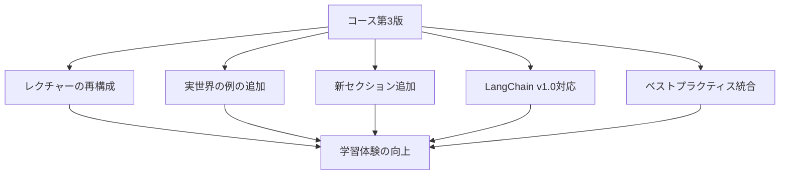

import Quiz from '@/components/content/Quiz.astro'

## 概要

このレクチャーでは，LangChainコースの全体像が紹介されます．コースが第3版として全面的に再録されていることが説明されます．200,000人以上の受講生と40,000件以上のレビューを基に，フィードバックを反映して継続的に改善されているコースです．

## コースの特徴

このコースは「LangChain - Develop AI Agents with LangChain & LangGraph」の第3版にあたります．LangChainのバージョン変更に伴い，全面的に再録画が行われました．再録画のメリットとして，受講生のフィードバックを統合し，以下の改善が加えられています．

- レクチャーの再構成と整理
- 実世界の例やディスカッションの追加（セキュリティ，プロダクション等）
- 新しいセクションとレクチャーの追加
- コード全体をLangChainの最新バージョン（v1.0）に対応
- ベストプラクティスの統合（コードの堅牢性，可用性，コンポーザビリティ向上）

## まとめ

- LangChainコースは第3版として全面再録されている
- 200,000人以上の受講生からのフィードバックを反映
- LangChain v1.0に完全対応したコード
- 機械学習の事前知識は不要

<Quiz questions={[
  {
    question: "このコースは第何版として再録されていますか？",
    options: [
      "第1版",
      "第2版",
      "第3版",
      "第4版"
    ],
    answer: 2,
    explanation: "このコースは第3版として全面的に再録されています．LangChainのバージョン変更に伴い，全面再録画が行われました．"
  },
  {
    question: "コースの受講生数はおよそ何人以上ですか？",
    options: [
      "50,000人",
      "100,000人",
      "200,000人",
      "500,000人"
    ],
    answer: 2,
    explanation: "200,000人以上の受講生がこのコースを受講しています．"
  },
  {
    question: "コースのコードはLangChainのどのバージョンに対応していますか？",
    options: [
      "v0.1",
      "v0.5",
      "v1.0",
      "v2.0"
    ],
    answer: 2,
    explanation: "コード全体がLangChainの最新バージョンであるv1.0に対応しています．"
  },
  {
    question: "コースの改善にあたり，主に何を基にフィードバックが反映されていますか？",
    options: [
      "講師自身の経験のみ",
      "受講生からのレビューとフィードバック",
      "出版社からの指示",
      "AIによる自動分析"
    ],
    answer: 1,
    explanation: "40,000件以上のレビューを基に，受講生からのフィードバックを反映して継続的に改善されています．"
  },
  {
    question: "このコースを受講するために機械学習の事前知識は必要ですか？",
    options: [
      "はい，高度な知識が必要",
      "はい，基本的な知識が必要",
      "いいえ，不要",
      "修士レベルの知識が推奨"
    ],
    answer: 2,
    explanation: "機械学習の事前知識は不要です．コース内で必要な知識はすべて教えてもらえます．"
  }
]} />
