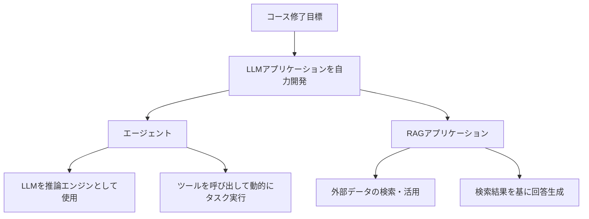
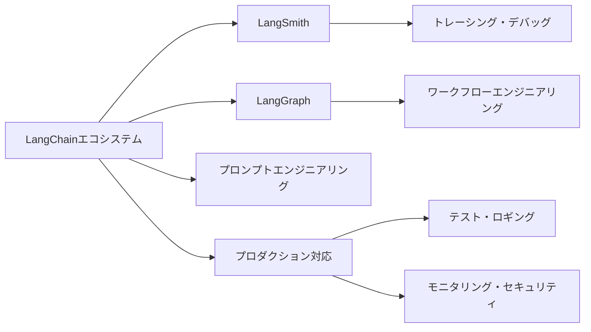

import Quiz from '@/components/content/Quiz.astro'

## 概要

このレクチャーでは，コースの学習目標，対象受講者，前提条件が詳しく説明されます．コース修了時にはLangChainを使ったLLMアプリケーションを自力で開発できるようになることが最大の目標です．

## コースの学習目標

このコースの最も重要なゴールは，コース修了時にLangChainを使用して自分自身のLLMパワードアプリケーションを開発できるようになることです．LLMアプリケーションは大きく2つのタイプに分類されます．

- エージェント（Agents）: LLMを推論エンジンとして使い，ツールを呼び出して動的にタスクを実行するアプリケーション
- RAGアプリケーション（Retrieval Augmented Generation）: LLMが学習していない外部データを検索・活用して回答を生成するアプリケーション

このコースでは両方のトピックを詳細にカバーし，実装方法だけでなく内部の仕組みを深く理解することを重視しています．LangChainのソースコードにも潜り込み，「魔法」のように見える部分を完全に理解できるようにします．

## LangChainエコシステム

ボーナスとして，LangChainエコシステム全体にも精通できるようになります．

- LangSmith: LLMアプリケーションのトレーシング・デバッグツール
- LangGraph: ワークフローエンジニアリングフレームワーク
- プロンプトエンジニアリング: 技法のベストプラクティスとプロンプティングの歴史
- プロダクション対応のトピック: テスト，ロギング，モニタリング，アラート，セキュリティ

## 対象受講者

主な対象受講者は以下の通りです．

- Generative AIに参入したいソフトウェアエンジニア
- LLMアプリケーションを構築したいデータサイエンティスト
- 機械学習の事前知識は不要（コース内で必要な知識を全て教える）

ただし，弁護士や医師など，技術的なバックグラウンドが少ない方でも楽しんで受講した例もあります．

## 前提条件

| 区分 | 項目 | 詳細 |
|---|---|---|
| 必須 | Python基本知識 | 関数・クラスの作成，プログラムの実行 |
| 必須 | Git基本操作 | git clone / git commit |
| 必須 | Python仮想環境の概念 | - |
| 必須 | 環境変数の設定方法 | - |
| 不要 | 機械学習の経験 | - |

以下の前提知識が必要です．

- Pythonの基本知識（関数，クラスの作成，プログラムの実行）
- 基本的なGitコマンド（git clone，git commit程度）
- Python仮想環境の概念
- 環境変数の設定方法

このコースはPythonの基礎コースではなく，LangChainの専門コースです．そのため，基礎的なPythonの説明は省略し，LangChainの深い部分に集中します．

## まとめ

- コースの最終目標はLangChainでLLMアプリケーションを自力開発できること
- エージェントとRAGの2大トピックを深くカバー
- LangSmith，LangGraphなどのエコシステムも習得
- Pythonの基本知識とGitの基本操作が前提条件
- 機械学習の事前知識は不要
- 30日間の返金保証あり

<Quiz questions={[
  {
    question: "このコースの最も重要な目標は何ですか？",
    options: [
      "Pythonの基礎を学ぶこと",
      "機械学習モデルを訓練できるようになること",
      "LangChainでLLMアプリケーションを自力開発できるようになること",
      "データベースの設計ができるようになること"
    ],
    answer: 2,
    explanation: "コースの最も重要なゴールは，コース修了時にLangChainを使用して自分自身のLLMパワードアプリケーションを開発できるようになることです．"
  },
  {
    question: "LLMアプリケーションの2大タイプはどれですか？",
    options: [
      "WebアプリとモバイルApp",
      "エージェントとRAGアプリケーション",
      "フロントエンドとバックエンド",
      "APIサーバーとバッチ処理"
    ],
    answer: 1,
    explanation: "LLMアプリケーションはエージェントとRAGアプリケーションの2つのタイプに大別されます．"
  },
  {
    question: "LangSmithの主な用途は何ですか？",
    options: [
      "コードの自動生成",
      "データベース管理",
      "LLMアプリケーションのトレーシング・デバッグ",
      "Webサイトのデプロイ"
    ],
    answer: 2,
    explanation: "LangSmithはLLMアプリケーションのトレーシングとデバッグのためのツールです．"
  },
  {
    question: "このコースの前提条件として含まれないものはどれですか？",
    options: [
      "Pythonの基本知識",
      "基本的なGitコマンド",
      "機械学習の経験",
      "環境変数の設定方法"
    ],
    answer: 2,
    explanation: "機械学習の事前知識は不要です．Python基本知識，Gitコマンド，仮想環境の概念，環境変数の設定方法が前提条件です．"
  },
  {
    question: "このコースの主な対象受講者はどのような人ですか？",
    options: [
      "高校生向けのプログラミング入門者",
      "Generative AIに参入したいソフトウェアエンジニアやデータサイエンティスト",
      "デザイナー向けのUI/UX講座受講者",
      "ネットワークエンジニア向けの受講者"
    ],
    answer: 1,
    explanation: "主な対象は，Generative AIに参入したいソフトウェアエンジニアやLLMアプリケーションを構築したいデータサイエンティストです．"
  }
]} />
