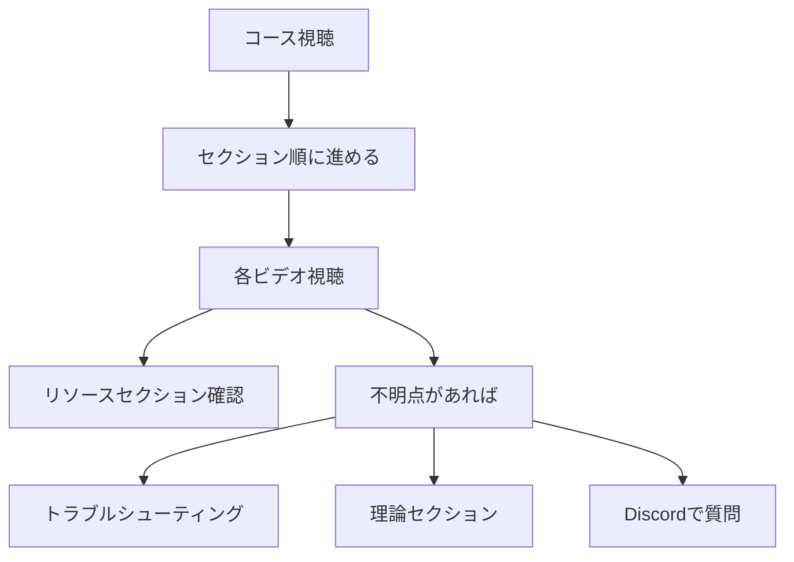

import Quiz from '@/components/content/Quiz.astro'

## 概要

このレクチャーでは，Udemyプラットフォームの効果的な活用方法と，コースの構成・リソースについて説明されます．再生速度の調整方法や，各ビデオのリソースセクションの活用法など，学習効果を最大化するための実践的なアドバイスが提供されます．

## Udemyプラットフォームの活用

Udemyには学習を効率化するための機能があります．

- 再生速度の調整: 講師の話すスピードが遅いと感じたら最大2倍速まで速くでき，速いと感じたら0.5倍速まで遅くできる
- レーティング: Udemyが評価を求めてきた際，準備ができていなければ「Ask me later」ボタンをクリック可能
- リソースセクション: 各ビデオにはDiscordサーバーへのリンク，Pythonコードスニペット，ドキュメントなどの有用なリンクが含まれる

## コースの進め方

コースはセクション順（1, 2, 3, 4...）に視聴することを推奨します．コース内では以下のセクションが特に重要です．

- リソースセクション: 各ビデオに付属するリンクや補足資料
- トラブルシューティングセクション: 問題が発生した際のヘルプ
- 理論セクション: Chain-of-Thoughtプロンプティング，ReActペーパーなどの理論的な概念を深く説明

## 講師との連絡方法

講師に直接連絡する方法は複数あります．

- UdemyプラットフォームのDM
- LinkedInでの接続・メッセージ
- コースのDiscordサーバー

特にDiscordサーバーは，つまづいた時のヘルプ，トラブルシューティング，理解が不十分なトピックの質問に最適です．多くの質問が既に投稿されているので，過去の質問を確認することも有用です．

## まとめ

- コースはセクション順に進めることを推奨
- 各ビデオのリソースセクションを必ず確認する
- Discordサーバーは質問やヘルプの主要な場所
- 再生速度の調整で学習効率を最適化できる
- フィードバックはコースの継続的な改善に活かされる

<Quiz questions={[
  {
    question: "コースの推奨される視聴順序はどれですか？",
    options: [
      "興味のあるセクションからランダムに",
      "セクション順に1, 2, 3, 4...と進める",
      "最終セクションから逆順に",
      "難易度の高いセクションから"
    ],
    answer: 1,
    explanation: "コースはセクション順に進めることが推奨されています．"
  },
  {
    question: "Udemyの再生速度は最大何倍まで速くできますか？",
    options: [
      "1.5倍",
      "2倍",
      "3倍",
      "4倍"
    ],
    answer: 1,
    explanation: "Udemyでは再生速度を最大2倍まで速くすることができます．"
  },
  {
    question: "各ビデオのリソースセクションに含まれないものはどれですか？",
    options: [
      "Discordサーバーへのリンク",
      "Pythonコードスニペット",
      "受講生の成績データ",
      "ドキュメントへのリンク"
    ],
    answer: 2,
    explanation: "リソースセクションにはDiscordサーバーへのリンク，Pythonコードスニペット，ドキュメントなどの有用なリンクが含まれますが，受講生の成績データは含まれません．"
  },
  {
    question: "講師に直接連絡する方法として挙げられていないものはどれですか？",
    options: [
      "UdemyのDM",
      "LinkedInでのメッセージ",
      "電話",
      "Discordサーバー"
    ],
    answer: 2,
    explanation: "講師への連絡方法はUdemy DM，LinkedIn，Discordサーバーの3つが挙げられています．電話は含まれていません．"
  },
  {
    question: "理論セクションで扱われるトピックの例はどれですか？",
    options: [
      "Pythonの基礎文法",
      "Chain-of-ThoughtプロンプティングやReActペーパー",
      "HTMLとCSSの基礎",
      "データベース設計パターン"
    ],
    answer: 1,
    explanation: "理論セクションではChain-of-Thoughtプロンプティング，ReActペーパーなどの理論的な概念が深く説明されます．"
  }
]} />
