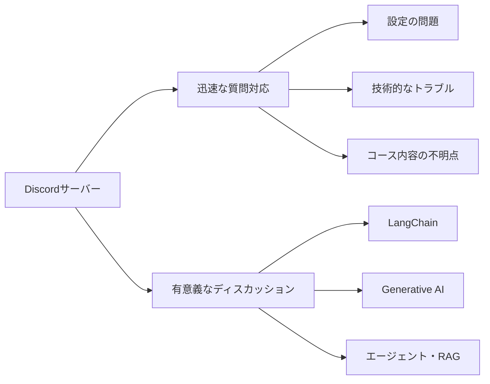

import Quiz from '@/components/content/Quiz.astro'

## 概要

このレクチャーでは，コースのDiscordサーバーについて詳しく紹介されます．Discordサーバーは受講生同士や講師とのコミュニケーションの場であり，質問やディスカッションを通じて学習体験を向上させるための重要なリソースです．

## Discordサーバーの目的

Discordサーバーには主に2つの目的があります．

- 迅速な質問対応: 設定の問題，技術的なトラブル，コース内容の不明点など，あらゆる質問に対して素早いサポートを受けられる場
- 有意義なディスカッション: LangChain，Generative AI，エージェント，RAG，プロンプトエンジニアリングなど，コースで扱うトピックについてアイデアを共有し，互いに学び合う場

## 講師の対応時間

講師の対応スケジュールは以下の通りです．

- 週末: 一日を通して定期的にチェック
- 平日: 朝と仕事終わりの夕方の1日2回チェック

## 質問することの重要性

講師は「質問をためらわないこと」を強く推奨しています．理由は以下の通りです．

- 「愚かな質問」は存在しない
- 一人が質問すれば，同じ疑問を持っていた多くの人の助けになる
- 設定の問題やエラーメッセージ，概念の理解など，あらゆるテーマが対象
- 迅速なサポートにより，何時間ものデバッグ作業を節約できる

## 連絡方法

- Discordサーバー（コース関連の質問に最適）
- LinkedIn
- Udemy DM

## まとめ

- Discordサーバーはコースの学習体験を大幅に向上させるリソース
- 質問やディスカッションの場として積極的に活用すべき
- 講師は週末は終日，平日は1日2回対応
- 質問をためらわず，積極的にコミュニティに参加することが重要
- Discordに参加できない場合はログイン状態を確認する

<Quiz questions={[
  {
    question: "Discordサーバーの2つの主な目的は何ですか？",
    options: [
      "コードレビューとデプロイ",
      "迅速な質問対応と有意義なディスカッション",
      "課題の提出と採点",
      "動画配信とライブ講義"
    ],
    answer: 1,
    explanation: "Discordサーバーは迅速な質問対応と有意義なディスカッションの2つを主な目的として設置されています．"
  },
  {
    question: "講師の平日の対応スケジュールはどうなっていますか？",
    options: [
      "終日対応",
      "朝の1回のみ",
      "朝と仕事終わりの夕方の1日2回",
      "対応なし"
    ],
    answer: 2,
    explanation: "平日は朝と仕事終わりの夕方の1日2回チェックするスケジュールです．"
  },
  {
    question: "講師が強く推奨していることは何ですか？",
    options: [
      "毎日必ず1時間以上学習すること",
      "質問をためらわずに積極的にすること",
      "他の受講生の質問に回答すること",
      "毎週レポートを提出すること"
    ],
    answer: 1,
    explanation: "講師は「質問をためらわないこと」を強く推奨しています．愚かな質問は存在しないと強調しています．"
  },
  {
    question: "Discordサーバーに参加できない場合のトラブルシューティングは？",
    options: [
      "ブラウザのキャッシュをクリアする",
      "VPNを使用する",
      "Discordにログイン状態であることを確認する",
      "講師にメールで連絡する"
    ],
    answer: 2,
    explanation: "Discordサーバーに参加できない場合は，Discordにログインした状態でリンクをクリックすることが推奨されています．"
  },
  {
    question: "講師への連絡方法として最も推奨されているのはどれですか？",
    options: [
      "Udemy DM",
      "LinkedIn",
      "Discordサーバー",
      "メール"
    ],
    answer: 2,
    explanation: "Discordサーバーがコース関連の質問に最適な場所として推奨されています．"
  }
]} />
