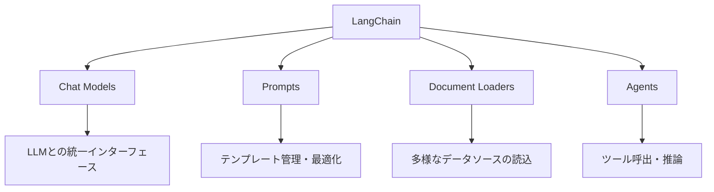
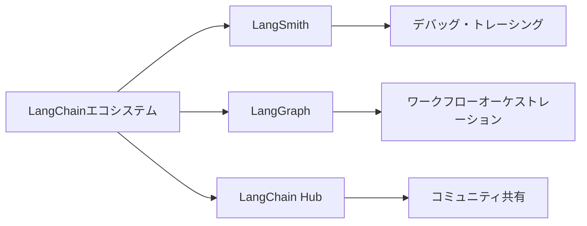

import Quiz from '@/components/content/Quiz.astro'

## 概要

このレクチャーでは，LangChainとは何かを6分で解説します．LangChainはLLMパワードアプリケーションの構築を簡素化するオープンソースフレームワークであり，エージェントやRAGアプリケーションの開発に広く採用されています．

## LangChainとは

LangChainは，大規模言語モデル（LLM）を活用したアプリケーション構築を簡素化するオープンソースフレームワークです．機械学習の仕組みやモデルの訓練方法を理解しなくても，LLMをブラックボックスとして活用してアプリケーションを構築したい開発者に広く採用されています．

現在，エージェントやRAGアプリケーションの開発において，最も人気のあるフレームワークの一つです．オープンソースのため，GitHubでコードを閲覧でき，プルリクエストの作成も可能です．活発なコントリビューターとクリエイターのコミュニティが存在します．

## LangChainの主要モジュール



### Chat Models（チャットモデル）

LLMとのインタラクションを抽象化し，モデルの切り替えを容易にします．すべてのLLMベンダーに対して同じインターフェースを提供するため，ベンダーロックインを避けることができます．

```python
from langchain_openai import ChatOpenAI
from langchain_anthropic import ChatAnthropic

# モデルの切り替えが容易
llm_openai = ChatOpenAI(model="gpt-4")
llm_anthropic = ChatAnthropic(model="claude-sonnet-4-20250514")
```

### Prompts（プロンプト）

プロンプトの管理，最適化，シリアライゼーションを支援します．テンプレートを作成し，ユーザー入力を動的に注入できます．

### Document Loaders（ドキュメントローダー）

Notionデータベース，PDFファイル，メールなど，さまざまなデータソースを読み込み，統一されたLangChain Documentインターフェースに変換します．

### Agents（エージェント）

LLMの推論能力を活用し，インターネット検索，データベースクエリ，メール送信などのツールを呼び出す機能を提供します．Tools，Agent Executor，LangGraphなどの抽象化により，複雑なロジックの実装が可能です．

## LangChainエコシステム



LangChainは単体のフレームワークではなく，以下のような包括的なエコシステムを形成しています．

- LangSmith: LLMアプリケーションのデバッグとトレーシング
- LangGraph: ワークフローオーケストレーション
- LangChain Hub: コミュニティ共有のプロンプトやチェーン

## まとめ

- LangChainはLLMアプリケーション構築を簡素化するオープンソースフレームワーク
- Chat Models，Prompts，Document Loaders，Agentsなどの主要モジュールを提供
- ベンダーロックインを避け，モデルの切り替えが容易
- エージェントやRAGアプリケーションの開発に最も広く採用されている
- LangSmith，LangGraphなどの充実したエコシステム

<Quiz questions={[
  {
    question: "LangChainの主な目的は何ですか？",
    options: [
      "機械学習モデルを訓練すること",
      "LLMを活用したアプリケーション構築を簡素化すること",
      "データベースを管理すること",
      "Webフレームワークを提供すること"
    ],
    answer: 1,
    explanation: "LangChainはLLMパワードアプリケーションの構築を簡素化するオープンソースフレームワークです．"
  },
  {
    question: "Chat Modelsモジュールの最大の利点は何ですか？",
    options: [
      "モデルの訓練が可能になる",
      "ベンダーロックインを避け，モデルの切り替えが容易になる",
      "無料でLLMを使用できる",
      "自動的にコードを生成できる"
    ],
    answer: 1,
    explanation: "Chat ModelsはすべてのLLMベンダーに対して同じインターフェースを提供するため，ベンダーロックインを避けてモデルの切り替えが容易です．"
  },
  {
    question: "Document Loadersの役割はどれですか？",
    options: [
      "ドキュメントを自動翻訳する",
      "さまざまなデータソースを読み込み統一インターフェースに変換する",
      "ドキュメントを暗号化する",
      "ドキュメントのバックアップを作成する"
    ],
    answer: 1,
    explanation: "Document LoadersはNotionデータベース，PDFファイル，メールなどさまざまなデータソースを読み込み，統一されたLangChain Documentインターフェースに変換します．"
  },
  {
    question: "LangSmithの主な機能は何ですか？",
    options: [
      "LLMモデルの訓練",
      "コードの自動生成",
      "LLMアプリケーションのデバッグとトレーシング",
      "データベースの管理"
    ],
    answer: 2,
    explanation: "LangSmithはLLMアプリケーションのデバッグとトレーシングのためのプラットフォームです．"
  },
  {
    question: "LangChainのAgentsモジュールが提供する機能はどれですか？",
    options: [
      "静的なWebページの生成",
      "LLMの推論能力を活用してツールを呼び出す機能",
      "データベースのバックアップ",
      "ファイルの圧縮・解凍"
    ],
    answer: 1,
    explanation: "AgentsモジュールはLLMの推論能力を活用し，インターネット検索，データベースクエリ，メール送信などのツールを呼び出す機能を提供します．"
  }
]} />
