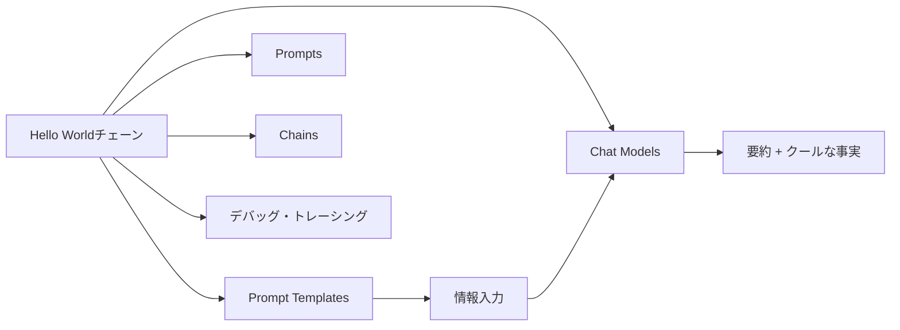

import Quiz from '@/components/content/Quiz.astro'

## 概要

このレクチャーでは，セクション2で作成するLangChain Hello Worldチェーンの概要を説明します．Elon Muskの情報をLLMに送り，要約とクールな事実を生成するシンプルなチェーンを構築します．

## セクションの目標

このセクションでは「学びながら作る」アプローチで，LangChainの基本構成要素を学びます．具体的には以下のトピックをカバーします．

- プロンプトテンプレート（Prompt Templates）
- プロンプト（Prompts）
- チャットモデル（Chat Models）
- チェーン（Chains）
- デバッグとトレーシング

## 使用するLLM

講師はOpenAIのGPTを使用しますが，受講生は以下の任意のLLMを使用可能です．

- Google Gemini
- Anthropic Claude
- Ollama経由のローカルモデル（Gemma 3など）

このセクションでは，Ollamaを使ってオープンウェイトモデルをローカルマシンで実行する方法も紹介されます．

## まとめ

- セクション2ではLangChainのHello Worldチェーンを構築する
- Elon Muskの情報を要約するシンプルなチェーンが題材
- Prompt Templates，Chat Models，Chainsなどの基本概念を学ぶ
- OpenAI以外のLLMも使用可能

<Quiz questions={[
  {
    question: "このセクションで構築するHello Worldチェーンは何をしますか？",
    options: [
      "画像を生成する",
      "Elon Muskの情報を要約しクールな事実を生成する",
      "Webサイトをスクレイピングする",
      "メールを自動送信する"
    ],
    answer: 1,
    explanation: "セクション2ではElon Muskの情報をLLMに送り，要約とクールな事実を生成するシンプルなチェーンを構築します．"
  },
  {
    question: "このセクションの学習アプローチは何ですか？",
    options: [
      "理論のみを学ぶ",
      "テストを先に書く",
      "学びながら作る",
      "既存コードを読むだけ"
    ],
    answer: 2,
    explanation: "このセクションでは「学びながら作る」アプローチで，LangChainの基本構成要素を実践的に学びます．"
  },
  {
    question: "講師がこのセクションで使用するLLMはどれですか？",
    options: [
      "Google Gemini",
      "Anthropic Claude",
      "OpenAI GPT",
      "Llama"
    ],
    answer: 2,
    explanation: "講師はOpenAIのGPTを使用しますが，受講生は任意のLLMを使用できます．"
  },
  {
    question: "Ollamaを使って実行するオープンウェイトモデルはどれですか？",
    options: [
      "Llama 3",
      "Mistral",
      "Gemma 3",
      "Falcon"
    ],
    answer: 2,
    explanation: "このセクションではOllamaを使ってGoogleのGemma 3をローカルマシンで実行する方法が紹介されます．"
  },
  {
    question: "セクション2でカバーしないトピックはどれですか？",
    options: [
      "プロンプトテンプレート",
      "チャットモデル",
      "RAGアプリケーション",
      "チェーン"
    ],
    answer: 2,
    explanation: "セクション2ではPrompt Templates，Chat Models，Chains，デバッグ・トレーシングをカバーしますが，RAGアプリケーションは後のセクションで扱います．"
  }
]} />
