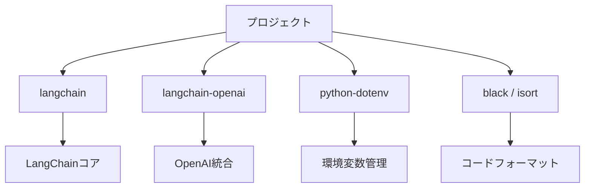

import Quiz from '@/components/content/Quiz.astro'

## 概要

このレクチャーでは，LangChainプロジェクトの環境をゼロから構築します．GitHubリポジトリのクローン，UVパッケージマネージャの利用，依存関係のインストール，APIキーの設定まで，ステップバイステップで進めます．

## リポジトリのクローン

まず，コースのGitHubリポジトリをクローンします．

```bash
git clone <repository-url>
cd langchain-course
```

新しいブランチを作成して作業を開始します．`--orphan`フラグでコミット履歴のない新しいブランチを作成します．

```bash
git checkout --orphan project/hello-world
```

## UVパッケージマネージャ

UVはRustで構築された高速なPythonパッケージマネージャです．pipよりも高速で，依存関係の解決とインストール，仮想環境の管理を効率的に行います．

```bash
# UVがインストールされているか確認
uv --help

# UVがない場合はインストール
pip3 install uv

# プロジェクトの初期化
uv init
```

## 依存関係のインストール



以下のパッケージをインストールします．

```bash
# LangChainのコアパッケージ
uv add langchain

# OpenAI統合パッケージ（プロバイダーごとに分離されている）
uv add langchain-openai

# 環境変数の読み込み用
uv add python-dotenv

# コードフォーマッター
uv add black isort
```

LangChainはプロバイダーごとに独立したパッケージとして分離されています．これにより各ベンダーが自身のパッケージを独立して管理でき，不要なプロバイダーをダウンロードする必要がなくなります．

## 環境変数の設定

| 重要度 | ガイドライン |
|---|---|
| 重要 | 他人と共有しない |
| 重要 | GitHubにコミットしない |
| 重要 | .gitignoreに.envを追加 |
| 推奨 | 予算制限を設定する |
| 注意 | 悪意あるスキャンに注意 |

`.env`ファイルを作成し，APIキーを設定します．

```bash
# .env ファイル
OPENAI_API_KEY=sk-...
```

APIキーの取り扱いに関する重要な注意事項があります．

- APIキーは絶対に他人と共有しない
- GitHubにコミットしない（`.gitignore`に`.env`を追加）
- 悪意のある人がGitHub上のAPIキーを自動スキャンしている
- OpenAIの利用には事前のクレジット購入が必要
- 予算制限を設定しておくことを推奨

## 環境変数の読み込み

`python-dotenv`を使用して`.env`ファイルから環境変数を読み込みます．

```python
from dotenv import load_dotenv
import os

load_dotenv()

# 環境変数にアクセスできることを確認
print(os.environ.get("OPENAI_API_KEY"))
```

## 他のLLMプロバイダー

Google Geminiを使用する場合は`GOOGLE_API_KEY`環境変数を設定し，`langchain-google-genai`パッケージをインストールします．Ollamaでローカルモデルを使用する場合は`langchain-ollama`パッケージを使用します．

## まとめ

- UVパッケージマネージャでPython環境を効率的に管理
- LangChainはプロバイダーごとに独立したパッケージとして分離されている
- `.env`ファイルでAPIキーを安全に管理
- APIキーのセキュリティには十分注意する
- `python-dotenv`で環境変数を簡単に読み込める

<Quiz questions={[
  {
    question: "UVパッケージマネージャはどの言語で構築されていますか？",
    options: [
      "Python",
      "Go",
      "Rust",
      "C++"
    ],
    answer: 2,
    explanation: "UVはRustで構築された高速なPythonパッケージマネージャです．"
  },
  {
    question: "LangChainがプロバイダーごとにパッケージを分離している理由は何ですか？",
    options: [
      "セキュリティを向上させるため",
      "各ベンダーが独立して管理でき，不要なプロバイダーをダウンロードしなくてよいため",
      "ライセンスの問題を回避するため",
      "インストール速度を遅くするため"
    ],
    answer: 1,
    explanation: "プロバイダーごとに分離することで，各ベンダーが独立してパッケージを管理でき，不要なプロバイダーをダウンロードする必要がなくなります．"
  },
  {
    question: "APIキーの管理で絶対にやってはいけないことは何ですか？",
    options: [
      ".envファイルに保存すること",
      "GitHubにコミットすること",
      "環境変数として設定すること",
      "python-dotenvで読み込むこと"
    ],
    answer: 1,
    explanation: "APIキーは絶対にGitHubにコミットしてはいけません．悪意のある人がGitHub上のAPIキーを自動スキャンしています．"
  },
  {
    question: "python-dotenvの役割は何ですか？",
    options: [
      "Pythonのバージョンを管理する",
      ".envファイルから環境変数を読み込む",
      "コードをフォーマットする",
      "テストを自動実行する"
    ],
    answer: 1,
    explanation: "python-dotenvは.envファイルから環境変数を読み込み，コード内からアクセスできるようにします．"
  },
  {
    question: "git checkout --orphanフラグの効果は何ですか？",
    options: [
      "既存のブランチを削除する",
      "コミット履歴のない新しいブランチを作成する",
      "リモートブランチを強制的に上書きする",
      "マージコンフリクトを解消する"
    ],
    answer: 1,
    explanation: "--orphanフラグはコミット履歴のない新しいブランチを作成します．完全に新しいスタートを切れます．"
  }
]} />
