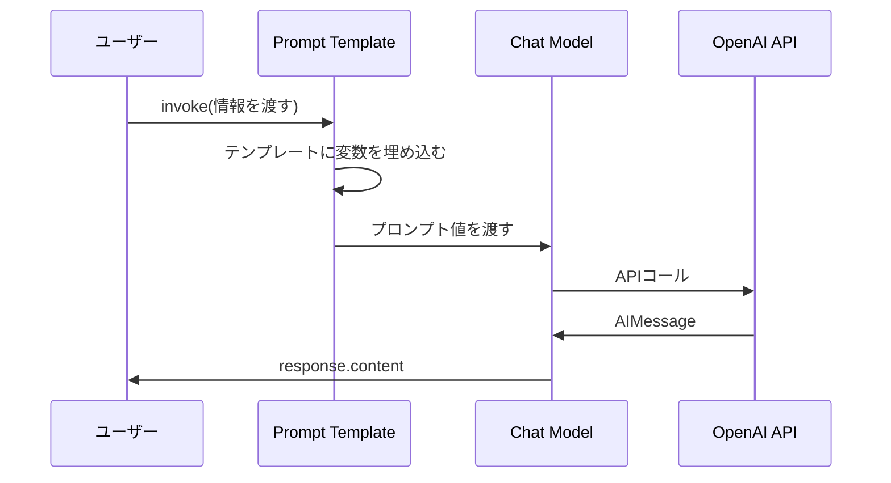

import Quiz from '@/components/content/Quiz.astro'

## 概要

このレクチャーでは，LangChainの3つの基本構成要素であるPrompt Templates，Chat Models，Chainsを学びます．これらを組み合わせて最初のLangChainチェーンを作成し，LangChain Expression Language（LCEL）のパイプ演算子について理解します．

## Prompt Templates（プロンプトテンプレート）

プロンプトテンプレートは，プロンプトにパラメータを追加するためのラッパークラスです．同じテンプレートを異なる入力で何度も実行できます．

```python
from langchain_core.prompts import PromptTemplate

summary_template = """
given the information {information} about a person
I want you to create:
1. A short summary
2. Two interesting facts about them
"""

summary_prompt_template = PromptTemplate(
    template=summary_template,
    input_variables=["information"]
)
```

f-stringではなくPromptTemplateを使用する理由は以下の通りです．

- 必要な変数が正確に供給されているかを検証し，欠落やスペルミスをエラーとして検出
- 他のLangChainチェーンで再利用可能
- LangChainの第一級市民として，ログやトレースに自動的に記録される
- プロンプトインジェクションに対する安全性を向上

## Chat Models（チャットモデル）

Chat Modelは，LLMとインタラクションするための標準インターフェースです．メッセージのリスト（システム指示，ユーザー質問，AI応答）を入力として受け取り，AIメッセージを出力します．

```python
from langchain_openai import ChatOpenAI

llm = ChatOpenAI(temperature=0, model="gpt-4o")
```

`temperature`パラメータは応答のランダム性を制御します．

- 0〜0.3: 決定論的で事実に基づいた応答（要約，コード，指示に最適）
- 0.8〜1.0: 創造的な応答（詩，フィクション，革新的アイデアに最適）

## Chains（チェーン）とLCEL

LangChain Chainは，複数のコンポーネントをシーケンスで接続するワークフローです．一つのステップの出力が次のステップの入力になります．



```python
# LangChain Expression Language（LCEL）でチェーンを作成
chain = summary_prompt_template | llm

# チェーンを実行
response = chain.invoke({"information": information})
print(response.content)
```

パイプ演算子（`|`）はLCELの構文で，左のコンポーネントの出力を右のコンポーネントの入力として接続する新しいRunnableチェーンを作成します．

### 実行の流れ

1. `chain.invoke()`を呼び出す
2. `summary_prompt_template`のinvokeメソッドが実行され，プロンプト値が生成される
3. そのプロンプト値が`llm`のinvokeメソッドに渡される
4. LLMがAPIコールを行い，応答を返す

## ソースコードの確認

フレームワークのソースコードを直接確認する習慣は，開発者として非常に有益です．IDEでCommand+クリックすると，クラスの実装を確認できます．

## まとめ

- Prompt Templateはプロンプトにパラメータと再利用性を追加するラッパー
- Chat ModelはLLMとの標準インターフェースで，ベンダー間の切り替えが容易
- ChainはLCELのパイプ演算子で複数コンポーネントを接続するワークフロー
- LCELはLangChainで最も理解が難しい概念の一つだが，左から右に読む
- temperatureパラメータで応答の創造性を制御

<Quiz questions={[
  {
    question: "Prompt Templateをf-stringの代わりに使う理由として正しくないものはどれですか？",
    options: [
      "必要な変数が正確に供給されているかを検証できる",
      "実行速度がf-stringより10倍速い",
      "他のLangChainチェーンで再利用可能",
      "ログやトレースに自動的に記録される"
    ],
    answer: 1,
    explanation: "Prompt Templateは変数の検証，再利用性，トレーシングへの自動記録などの利点がありますが，実行速度の向上は主な理由ではありません．"
  },
  {
    question: "temperatureパラメータの値が0に近いとき，応答はどうなりますか？",
    options: [
      "非常に創造的で多様な応答になる",
      "決定論的で事実に基づいた応答になる",
      "応答が返されなくなる",
      "エラーが発生する"
    ],
    answer: 1,
    explanation: "temperature 0〜0.3では決定論的で事実に基づいた応答が生成され，要約やコード生成に最適です．"
  },
  {
    question: "LCELのパイプ演算子の記号はどれですか？",
    options: [
      ">>",
      "->",
      "|",
      "+"
    ],
    answer: 2,
    explanation: "LCELではパイプ演算子 | を使って，左のコンポーネントの出力を右のコンポーネントの入力として接続します．"
  },
  {
    question: "chain.invoke()を実行した際の処理順序として正しいものはどれですか？",
    options: [
      "LLM呼出 → テンプレート適用 → 結果返却",
      "テンプレート適用 → LLM呼出 → 結果返却",
      "結果返却 → テンプレート適用 → LLM呼出",
      "LLM呼出 → 結果返却 → テンプレート適用"
    ],
    answer: 1,
    explanation: "まずPrompt Templateがテンプレートに変数を埋め込み，その結果がLLMに渡され，LLMがAPIコールを行い応答を返します．"
  },
  {
    question: "Chat Modelの入力として受け取るのはどのような形式ですか？",
    options: [
      "単一の文字列のみ",
      "メッセージのリスト（システム指示，ユーザー質問，AI応答）",
      "JSON形式のデータのみ",
      "バイナリデータ"
    ],
    answer: 1,
    explanation: "Chat Modelはメッセージのリスト（システム指示，ユーザー質問，AI応答）を入力として受け取り，AIメッセージを出力します．"
  }
]} />
