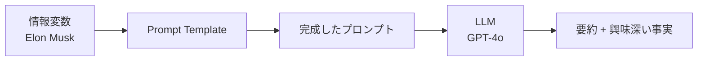

import Quiz from '@/components/content/Quiz.astro'

## 概要

このレクチャーでは，前のレクチャーで学んだPrompt Templates，Chat Models，Chainsの知識を使って，実際にElon Muskの情報を要約するLangChainチェーンを構築し，実行結果を確認します．

## 情報の準備

まず，要約対象となるElon Muskの情報をWikipediaから取得して変数に格納します．

```python
information = """
Elon Reeve Musk is a businessman and investor known for...
"""
```

## プロンプトテンプレートの作成

テンプレートには`{information}`プレースホルダーを含め，実行時にElon Muskの情報が動的に注入されるようにします．

```python
summary_template = """
given the information {information} about a person
I want you to create:
1. A short summary
2. Two interesting facts about them
"""

summary_prompt_template = PromptTemplate(
    template=summary_template,
    input_variables=["information"]
)
```

## チャットモデルの初期化

OpenAIのChat Modelを初期化します．`temperature=0`で決定論的な応答を得ます．

```python
llm = ChatOpenAI(temperature=0, model="gpt-4o")
```

LangChainは`OPENAI_API_KEY`環境変数を自動的に検索し，OpenAI APIとの認証に使用します．

## チェーンの作成と実行

LCELのパイプ演算子を使用してチェーンを作成し，実行します．



```python
chain = summary_prompt_template | llm

response = chain.invoke({"information": information})
print(response.content)
```

### 実行の流れ

1. `invoke`メソッドに`information`キーの値を渡す
2. Prompt Templateが情報をテンプレートに埋め込み，最終的なプロンプト文字列を生成
3. そのプロンプト文字列がLLMに送信される
4. LLMがElon Muskの要約と興味深い事実を生成して返す

結果として，Elon Muskの短い要約と2つの興味深い事実が生成されます．

## まとめ

- LCELのパイプ演算子で簡潔にチェーンを構築できる
- `invoke`メソッドでチェーンを実行し，入力変数を辞書で渡す
- Prompt Templateが入力をテンプレートに動的に埋め込む
- LLMの応答は`response.content`でアクセスできる
- 次のレクチャーでデバッグとトレーシングを行い，動作をさらに深く理解する

<Quiz questions={[
  {
    question: "チェーンの実行でinvokeメソッドに渡すデータの形式はどれですか？",
    options: [
      "文字列",
      "リスト",
      "辞書（dict）",
      "タプル"
    ],
    answer: 2,
    explanation: "invokeメソッドには入力変数を辞書形式で渡します．例: chain.invoke(dict型のデータ)"
  },
  {
    question: "LLMの応答テキストにアクセスするプロパティはどれですか？",
    options: [
      "response.text",
      "response.content",
      "response.output",
      "response.message"
    ],
    answer: 1,
    explanation: "LLMの応答テキストはresponse.contentでアクセスできます．"
  },
  {
    question: "プロンプトテンプレートのプレースホルダーの記法はどれですか？",
    options: [
      "<<information>>",
      "[[information]]",
      "$information",
      "中括弧で囲む"
    ],
    answer: 3,
    explanation: "Prompt Templateでは中括弧でプレースホルダーを定義し，実行時に動的に値が注入されます．"
  },
  {
    question: "チェーン実行時にPrompt Templateが行う処理は何ですか？",
    options: [
      "LLMのAPIキーを検証する",
      "情報をテンプレートに埋め込みプロンプト文字列を生成する",
      "応答をJSONに変換する",
      "エラーハンドリングを行う"
    ],
    answer: 1,
    explanation: "Prompt Templateは入力情報をテンプレートに埋め込み，最終的なプロンプト文字列を生成します．"
  },
  {
    question: "LangChainはOPENAI_API_KEY環境変数をどのように扱いますか？",
    options: [
      "手動でコード内に指定する必要がある",
      "自動的に検索しOpenAI APIとの認証に使用する",
      "別の設定ファイルから読み込む",
      "データベースに保存する"
    ],
    answer: 1,
    explanation: "LangChainはOPENAI_API_KEY環境変数を自動的に検索し，OpenAI APIとの認証に使用します．"
  }
]} />
