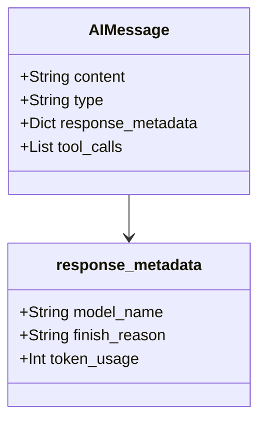

import Quiz from '@/components/content/Quiz.astro'

## 概要

このレクチャーでは，前のレクチャーで作成したチェーンをデバッグモードで実行し，AIMessageオブジェクトの構造と含まれる情報を詳しく確認します．

## デバッグによるオブジェクト確認

ブレークポイントを設定してデバッグモードで実行すると，LLMからの応答オブジェクトを詳細に確認できます．

### AIMessageオブジェクト



応答は`AIMessage`型のオブジェクトとして返されます．これはLLMの応答をラップするシンプルなクラスです．

```python
# responseはAIMessage型
response = chain.invoke({"information": information})

# content フィールドに生成されたテキストが格納
print(response.content)
```

AIMessageには以下の情報が含まれています．

- `content`: LLMが生成したテキスト
- `type`: メッセージの種類（"ai"）
- `response_metadata`: 使用したモデル名，終了理由（finish reason），消費トークン数などのメタデータ
- ツールコール関連の情報（エージェント機能で使用）

### レスポンスメタデータ

`response_metadata`には以下のような情報が含まれます．

- 使用されたモデル名
- finish reason（終了理由）: エージェントの実装で重要になる
- 消費されたトークン数
- デバッグやモニタリングに有用なその他のメタデータ

## まとめ

- LLMの応答はAIMessage型のオブジェクトとして返される
- `content`フィールドに生成テキストが格納される
- `response_metadata`にモデル情報やトークン使用量が含まれる
- ブレークポイントを使ったデバッグでオブジェクトの構造を確認できる
- メタデータはデバッグ，モニタリング，コスト分析に有用

<Quiz questions={[
  {
    question: "LLMの応答はどの型のオブジェクトとして返されますか？",
    options: [
      "String",
      "Dict",
      "AIMessage",
      "Response"
    ],
    answer: 2,
    explanation: "LLMの応答はAIMessage型のオブジェクトとして返されます．"
  },
  {
    question: "AIMessageのcontentフィールドには何が格納されていますか？",
    options: [
      "メタデータ",
      "LLMが生成したテキスト",
      "トークン数",
      "モデル名"
    ],
    answer: 1,
    explanation: "contentフィールドにはLLMが生成したテキストが格納されています．"
  },
  {
    question: "response_metadataに含まれない情報はどれですか？",
    options: [
      "使用されたモデル名",
      "消費されたトークン数",
      "ユーザーのIPアドレス",
      "finish reason（終了理由）"
    ],
    answer: 2,
    explanation: "response_metadataにはモデル名，トークン数，finish reasonなどが含まれますが，ユーザーのIPアドレスは含まれません．"
  },
  {
    question: "AIMessageのtypeフィールドの値は何ですか？",
    options: [
      "human",
      "system",
      "ai",
      "assistant"
    ],
    answer: 2,
    explanation: "AIMessageのtypeフィールドは'ai'という値を持ちます．"
  },
  {
    question: "finish reasonが特に重要になるのはどの場面ですか？",
    options: [
      "プロンプトテンプレートの作成時",
      "エージェントの実装時",
      "環境変数の設定時",
      "パッケージのインストール時"
    ],
    answer: 1,
    explanation: "finish reasonはエージェントの実装において特に重要になります．"
  }
]} />
