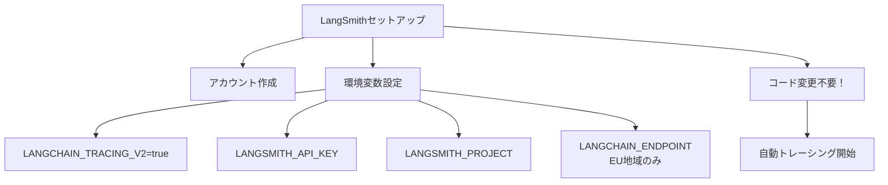

import Quiz from '@/components/content/Quiz.astro'

## 概要

このレクチャーでは，LangSmithをLangChainアプリケーションに統合し，チェーンの実行をトレーシングする方法を学びます．環境変数の設定だけで，自動的にトレースが記録されるようになります．

## LangSmithとは

LangSmithは，LLMベースアプリケーションのトレーシングプラットフォームです．チェーンやエージェントの実行を可視化し，デバッグやモニタリングに活用できます．

## セットアップ手順

### 1. LangSmithアカウントの作成

[LangSmith](https://smith.langchain.com)にアクセスしてアカウントを作成します．無料ティアが提供されており，コースの学習には十分です．

### 2. 環境変数の設定



`.env`ファイルに以下の環境変数を追加します．

```bash
LANGCHAIN_TRACING_V2=true
LANGSMITH_API_KEY=lsv2_...
LANGSMITH_PROJECT=hello-world
```

重要な注意点として，EU地域のユーザーは`LANGCHAIN_ENDPOINT`環境変数をEUエンドポイントに設定する必要があります．設定しないと認証エラーが発生します．

```bash
# EU地域の場合のみ必要
LANGCHAIN_ENDPOINT=https://eu.api.smith.langchain.com
```

### 3. コードの変更は不要

環境変数を設定するだけで，LangChainのオブジェクト（チェーン，Chat Model等）を使用するたびに自動的にトレースが記録されます．

## トレースの確認

LangSmithのダッシュボードで以下の情報を確認できます．

- Runnableシーケンスの実行フロー
- 各LLMコールの入力（Human Message）と出力（AI Message）
- 開始時刻，終了時刻，First Token Time
- 成功・失敗のステータス
- 消費トークン数
- Prompt TemplateとChat Modelの個別のステップ

### OllamaとOpenAIの比較

トレースを通じて，OllamaローカルモデルとOpenAI GPTの実行を比較できます．

- Ollama（ローカル）: 高速だが応答品質にトレードオフ
- OpenAI GPT: より高品質だが応答に時間がかかる

## LangSmithの機能

- エラーレートの統計
- トークン使用量のメディアン，P90，P50
- タグによるフィルタリング
- トレースの共有（公開リンクの生成）

エージェントの実装時にはLangSmithの価値がさらに明確になります．エージェントの実行フローを確認する際に非常に便利です．

## まとめ

- LangSmithは環境変数の設定だけで統合できる
- コードの変更なしに自動的にトレースが記録される
- EU地域のユーザーはエンドポイントの設定に注意が必要
- トレースではLLMコールの詳細（入力，出力，トークン数，実行時間）を確認できる
- エージェント実装時にデバッグで特に威力を発揮する

<Quiz questions={[
  {
    question: "LangSmithの統合に必要なコード変更はどの程度ですか？",
    options: [
      "大幅なリファクタリングが必要",
      "各チェーンにデコレータを追加する必要がある",
      "コード変更は不要で，環境変数の設定だけで統合できる",
      "専用のSDKをインポートする必要がある"
    ],
    answer: 2,
    explanation: "LangSmithは環境変数の設定だけで統合でき，コードの変更は一切不要です．"
  },
  {
    question: "EU地域のユーザーが追加で設定する必要がある環境変数は何ですか？",
    options: [
      "LANGSMITH_REGION",
      "LANGCHAIN_ENDPOINT",
      "LANGSMITH_EU_MODE",
      "LANGCHAIN_REGION"
    ],
    answer: 1,
    explanation: "EU地域のユーザーはLANGCHAIN_ENDPOINT環境変数をEUエンドポイントに設定する必要があります．"
  },
  {
    question: "LangSmithのダッシュボードで確認できない情報はどれですか？",
    options: [
      "消費トークン数",
      "LLMコールの入出力",
      "ユーザーの個人情報",
      "実行時間とFirst Token Time"
    ],
    answer: 2,
    explanation: "LangSmithではトークン数，入出力，実行時間などが確認できますが，ユーザーの個人情報は含まれません．"
  },
  {
    question: "LANGCHAIN_TRACING_V2環境変数に設定する値は何ですか？",
    options: [
      "enabled",
      "yes",
      "true",
      "1"
    ],
    answer: 2,
    explanation: "LANGCHAIN_TRACING_V2にはtrueを設定します．"
  },
  {
    question: "LangSmithが特に威力を発揮するのはどのような場面ですか？",
    options: [
      "パッケージのインストール時",
      "エージェントの実行フローの確認時",
      "コードのフォーマット時",
      "Gitコミット時"
    ],
    answer: 1,
    explanation: "エージェントの実装時にLangSmithの価値が特に明確になり，実行フローの確認に非常に便利です．"
  }
]} />
