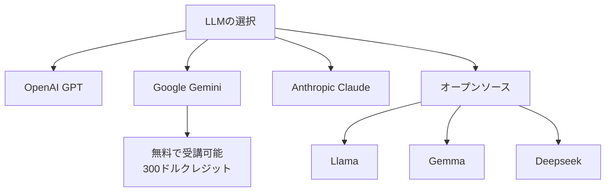

import Quiz from '@/components/content/Quiz.astro'

## 概要

このレクチャーでは，コースの各プロジェクトでどのLLMを使用すべきかのガイドを提供します．OpenAI，Gemini，Anthropic，Llama，Deepseekなどのモデルを比較し，最適な選択肢を紹介します．

## LLMの選択ガイド

コースリソースにリンクされたテーブルに，各プロジェクトごとの推奨LLMが記載されています．以下のモデルが主なテスト対象です．

- OpenAI GPTシリーズ
- Google Gemini
- Anthropic Claude
- オープンソースモデル（Llama，Gemma，Deepseek）

## 無料で受講する方法

コース全体を無料で受講したい場合，Google Gemini on Vertex AIが推奨されます．全プロジェクトで動作し，300ドル分のクレジットが付与されます．これはコースの学習には十分な量です．

## 講師の選択

講師はOpenAIを使用しますが，受講生は任意のLLMを選択可能です．

## まとめ

- 各プロジェクトごとに推奨されるLLMがテーブルにまとめられている
- Gemini on Vertex AIを使えば無料で全コースを受講可能
- 講師はOpenAIを使用するが，受講生は任意のLLMを使用できる
- モデルの選択はプロジェクトの要件（会話，RAG，エージェント等）に依存する

<Quiz questions={[
  {
    question: "コース全体を無料で受講したい場合に推奨されるLLMはどれですか？",
    options: [
      "OpenAI GPT",
      "Google Gemini on Vertex AI",
      "Anthropic Claude",
      "Llama"
    ],
    answer: 1,
    explanation: "Google Gemini on Vertex AIは全プロジェクトで動作し，300ドル分のクレジットが付与されるため，無料で全コースを受講できます．"
  },
  {
    question: "講師が使用するLLMはどれですか？",
    options: [
      "Google Gemini",
      "Anthropic Claude",
      "OpenAI",
      "Llama"
    ],
    answer: 2,
    explanation: "講師はOpenAIを使用しますが，受講生は任意のLLMを選択可能です．"
  },
  {
    question: "Google Gemini on Vertex AIで提供される無料クレジットはいくらですか？",
    options: [
      "50ドル",
      "100ドル",
      "300ドル",
      "500ドル"
    ],
    answer: 2,
    explanation: "Google Gemini on Vertex AIでは300ドル分のクレジットが付与されます．"
  },
  {
    question: "モデルの選択に影響する要因はどれですか？",
    options: [
      "講師の好みのみ",
      "プロジェクトの要件（会話，RAG，エージェント等）",
      "モデルの名前のアルファベット順",
      "リリース日の新しさのみ"
    ],
    answer: 1,
    explanation: "モデルの選択はプロジェクトの要件に依存します．各プロジェクトに適したLLMが異なります．"
  },
  {
    question: "コースで紹介されているオープンソースモデルに含まれないものはどれですか？",
    options: [
      "Llama",
      "Gemma",
      "GPT-4",
      "Deepseek"
    ],
    answer: 2,
    explanation: "GPT-4はOpenAIの商用モデルであり，オープンソースモデルではありません．Llama，Gemma，Deepseekがオープンソースモデルとして紹介されています．"
  }
]} />
