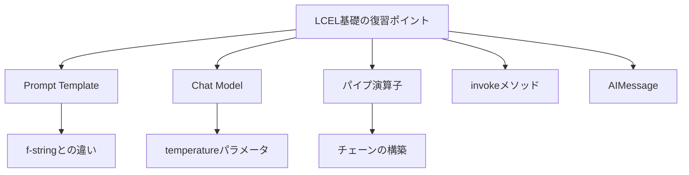

import Quiz from '@/components/content/Quiz.astro'

## 概要

このクイズでは，LangChain Expression Language（LCEL）の基礎知識を確認します．Prompt Templates，Chat Models，Chainsの基本概念，パイプ演算子の使い方，Runnableインターフェースなど，セクション2で学んだ内容が出題されます．

## 学習ポイント

クイズに取り組む前に，以下のポイントを復習しておくことを推奨します．

- Prompt Templateの役割とf-stringとの違い
- Chat Modelの初期化とtemperatureパラメータ
- LCELのパイプ演算子（`|`）によるチェーンの構築
- `invoke`メソッドによるチェーンの実行
- AIMessageオブジェクトの構造

## まとめ

- LCELはLangChainの核となるチェーン構築構文
- パイプ演算子でコンポーネントを左から右に接続
- Runnableインターフェースが統一的な実行方法を提供

<Quiz questions={[
  {
    question: "LCELの正式名称はどれですか？",
    options: [
      "LangChain Execution Language",
      "LangChain Expression Language",
      "LangChain Extension Language",
      "LangChain Evaluation Language"
    ],
    answer: 1,
    explanation: "LCELはLangChain Expression Languageの略称です．"
  },
  {
    question: "LCELのパイプ演算子でコンポーネントを読む方向はどちらですか？",
    options: [
      "右から左",
      "下から上",
      "左から右",
      "順不同"
    ],
    answer: 2,
    explanation: "LCELではパイプ演算子でコンポーネントを左から右に接続して読みます．"
  },
  {
    question: "Runnableインターフェースが提供するメソッドはどれですか？",
    options: [
      "run",
      "execute",
      "invoke",
      "call"
    ],
    answer: 2,
    explanation: "Runnableインターフェースはinvokeメソッドなどの統一的な実行方法を提供します．"
  },
  {
    question: "Prompt Templateがf-stringより優れている点はどれですか？",
    options: [
      "実行速度が速い",
      "変数の検証，再利用性，トレーシング対応",
      "構文がシンプル",
      "メモリ使用量が少ない"
    ],
    answer: 1,
    explanation: "Prompt Templateは必要な変数の検証，他チェーンでの再利用性，LangChainのトレーシングへの自動記録などの利点があります．"
  },
  {
    question: "temperatureが高い値の場合，応答はどうなりますか？",
    options: [
      "決定論的で事実に基づく",
      "エラーが発生する",
      "創造的で多様な内容になる",
      "応答速度が速くなる"
    ],
    answer: 2,
    explanation: "temperature 0.8〜1.0の高い値では創造的な応答が生成され，詩やフィクション，革新的アイデアに適しています．"
  }
]} />
