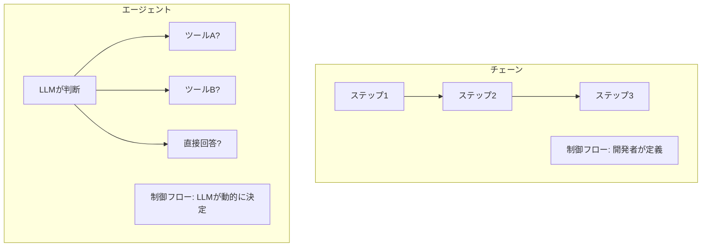
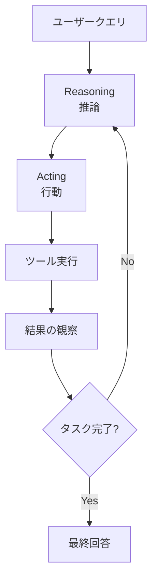

import Quiz from '@/components/content/Quiz.astro'

## 概要

このレクチャーでは，AIエージェントの定義とReActアーキテクチャの概要をハイレベルに説明します．エージェントとチェーンの根本的な違い，ツールの概念，そしてLangChainでのエージェント実装の基盤となる考え方を理解します．

## AIエージェントとは

AIエージェントとは，LLMを推論エンジンとして使用し，次に取るべきアクションを決定し，そのアクションを実行するソフトウェアシステムです．

### エージェントとチェーンの違い

- チェーン: アクションのシーケンスは開発者がハードコーディングする．LLMは1つのステップ（要約やテキスト生成など）で使用されるが，制御フロー全体は開発者が定義する
- エージェント: LLMが次に何をするかを動的に決定する．どのツールやステップが必要かをLLMが判断する

この「LLMが次のアクションを決定する」という点が，エージェントとチェーンの最も重要な違いです．

## ツールの概念

エージェントの核心は，LLMにツールを装備することです．ツールとは以下のような能力を指します．

- API呼び出し
- インターネット検索
- データベースへのクエリ
- メール送信
- コードの実行

ツールを与えることでLLMに「スーパーパワー」を付与でき，これまで自動化できなかった複雑なタスクを処理できるようになります．

## ReActエージェント

ReAct（Reasoning and Acting）エージェントは，特定のエージェントアーキテクチャです．

- Reasoning（推論）: Chain-of-Thoughtプロンプティングを用いてLLMが問題を考え抜く
- Acting（行動）: 推論結果に基づいてアクションを決定し，ツールを通じて実行する

このプロセスはタスクが完了するまで反復的に繰り返されます．LangChainとLangGraphは，カスタマイズ可能な構築済みReActエージェントを提供しています．

## まとめ

- AIエージェントはLLMを推論エンジンとして使い，動的にアクションを決定するシステム
- チェーンとの違いは，LLMが制御フローを決定する点
- ツールを装備することでLLMに検索やAPI呼び出しなどの能力を付与できる
- ReActはReasoning + Actingの反復ループによるエージェントアーキテクチャ
- このセクションではまずインターフェースの使い方を学び，次のセクションで内部実装に踏み込む

<Quiz questions={[
  {
    question: "AIエージェントとチェーンの最も重要な違いは何ですか？",
    options: [
      "エージェントのほうが実行速度が速い",
      "エージェントではLLMが次のアクションを動的に決定する",
      "チェーンはLLMを使用しない",
      "エージェントはツールを使用できない"
    ],
    answer: 1,
    explanation: "エージェントとチェーンの最も重要な違いは，エージェントではLLMが次のアクションを動的に決定する点です．チェーンでは開発者が制御フローをハードコーディングします．"
  },
  {
    question: "ReActの「Re」と「Act」はそれぞれ何を意味しますか？",
    options: [
      "Response と Action",
      "Reasoning と Acting",
      "Retrieve と Activate",
      "Record と Adapt"
    ],
    answer: 1,
    explanation: "ReActはReasoning（推論）とActing（行動）の略です．"
  },
  {
    question: "エージェントにおけるツールの例として正しくないものはどれですか？",
    options: [
      "インターネット検索",
      "データベースへのクエリ",
      "LLMモデルの再訓練",
      "メール送信"
    ],
    answer: 2,
    explanation: "ツールにはAPI呼び出し，インターネット検索，データベースクエリ，メール送信などが含まれますが，LLMモデルの再訓練はツールの典型的な用途ではありません．"
  },
  {
    question: "ReActエージェントの推論（Reasoning）ではどのような技法が使われますか？",
    options: [
      "Few-shotプロンプティング",
      "Chain-of-Thoughtプロンプティング",
      "Zero-shotプロンプティング",
      "テンプレートプロンプティング"
    ],
    answer: 1,
    explanation: "ReActエージェントの推論ではChain-of-Thoughtプロンプティングを用いてLLMが問題を考え抜きます．"
  },
  {
    question: "ReActエージェントのプロセスはどのように進行しますか？",
    options: [
      "1回の推論で完了する",
      "タスクが完了するまで推論と行動が反復的に繰り返される",
      "ランダムにツールを選択する",
      "開発者がステップを指定する"
    ],
    answer: 1,
    explanation: "ReActエージェントでは推論と行動のプロセスがタスク完了まで反復的に繰り返されます．"
  }
]} />
