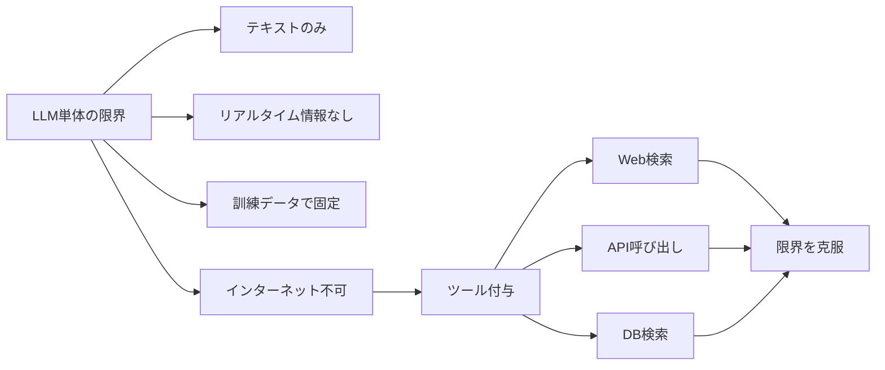

import Quiz from '@/components/content/Quiz.astro'

## 概要

このレクチャーでは，ChatGPTのWeb検索機能を使った実践的なデモを通じて，検索エージェントの動作を紹介します．このセクションで構築するエージェントの完成イメージを把握できます．

## デモ: ChatGPTの検索エージェント

ChatGPTにWeb検索ツールを追加した状態で，以下のようなクエリを実行します．

> Search for three job postings for an AI engineer using LangChain in the Bay area on LinkedIn and list their details.

### 検索の流れ

1. ChatGPTがWeb検索ツールを使用してリアルタイムの情報を取得
2. Generative UIにより，検索中のアイコンや進行状況が表示される
3. 各ポジションの詳細（タイトル，説明，URL）が返される
4. 各回答にはソースURLが付与される

### ソースの重要性

回答にソースURL（グラウンディング）が含まれることは非常に重要です．

- ユーザーとシステム間の信頼を構築する
- LLMのハルシネーション（幻覚）を検証できる
- ソースURLをブラウズして情報を確認できる
- ソースの信頼性を自分で判断できる

## LLMの限界とツール

大規模言語モデル単体では以下の制限があります．

- テキスト入力→テキスト出力のみ（マルチモーダルモデルは画像等も処理可能）
- リアルタイム情報にアクセスできない
- 訓練データの時点で情報が固定されている
- インターネットにアクセスする能力がない

これらの制限を克服するために，ツールを提供してエージェントとして機能させる必要があります．

## セクションの目標

このセクションでは，LangChainを使って上記のデモと同等の検索エージェントを実装します．LLMにWeb検索の能力を持たせ，リアルタイムの情報に基づいた回答を生成できるエージェントを構築します．

## まとめ

- 検索エージェントはLLMにWeb検索能力を付与したもの
- ソースURLのグラウンディングがユーザーの信頼構築に不可欠
- LLM単体ではリアルタイム情報にアクセスできない
- ツールを提供することでこの制限を克服できる
- このセクションでLangChainを使った検索エージェントを実装する

<Quiz questions={[
  {
    question: "検索エージェントの回答にソースURLが含まれることが重要な理由は何ですか？",
    options: [
      "SEO対策のため",
      "ユーザーとシステム間の信頼構築とハルシネーションの検証のため",
      "ページの読み込み速度を向上させるため",
      "著作権表示のため"
    ],
    answer: 1,
    explanation: "ソースURLの提示（グラウンディング）はユーザーの信頼構築とLLMのハルシネーション検証に不可欠です．"
  },
  {
    question: "LLM単体ではできないことはどれですか？",
    options: [
      "テキストの生成",
      "翻訳",
      "リアルタイムのインターネット検索",
      "文章の要約"
    ],
    answer: 2,
    explanation: "LLM単体ではリアルタイム情報にアクセスできません．ツールを提供してエージェントとして機能させる必要があります．"
  },
  {
    question: "このデモで使用されたツールは何ですか？",
    options: [
      "データベース検索",
      "Web検索",
      "メール送信",
      "コード実行"
    ],
    answer: 1,
    explanation: "デモではChatGPTにWeb検索ツールを追加して，リアルタイムの求人情報を検索しました．"
  },
  {
    question: "ハルシネーション（幻覚）とは何ですか？",
    options: [
      "LLMが正確な情報を返すこと",
      "LLMが事実ではない情報を生成すること",
      "ユーザーの入力ミス",
      "ネットワークエラー"
    ],
    answer: 1,
    explanation: "ハルシネーションはLLMが事実ではない情報を生成する現象です．ソースURLで検証することが重要です．"
  },
  {
    question: "このセクションの最終目標は何ですか？",
    options: [
      "チャットボットの作成",
      "LangChainを使った検索エージェントの実装",
      "データベースの構築",
      "Webサイトのデプロイ"
    ],
    answer: 1,
    explanation: "このセクションではLangChainを使って検索エージェントを実装し，リアルタイム情報に基づいた回答を生成できるようにします．"
  }
]} />
