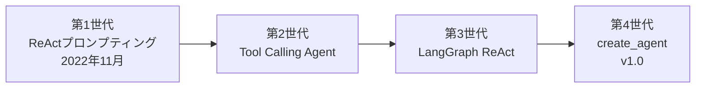

import Quiz from '@/components/content/Quiz.astro'

## 概要

このレクチャーでは，LangChainにおけるReActエージェントの歴史的な進化を時系列で説明します．最初のReActプロンプティングベースのエージェントから，現在の`create_agent`関数に至るまでの変遷を理解します．

## ReActエージェントの進化

### 第1世代: ReActプロンプティング（2022年11月〜）

LangChain初期のReActエージェントは，純粋にReActプロンプティングに基づいていました．モデルがテキストベースのフォーマットで推論（Reasoning）と行動（Acting）を記述する方式です．

### 第2世代: Tool Calling Agent

LLMがネイティブにFunction Calling（関数呼び出し）をサポートするようになると，プロンプトベースのツール選択から，構造化されたFunction Callingを活用するTool Callingエージェントへと進化しました．これにより，ツール実行の信頼性と効率性が向上しました．

### 第3世代: LangGraph ReAct Agent

Function Callingを維持しつつ，LangGraphの低レベルオーケストレーションフレームワーク上にエージェントを再構築しました．これにより，以下が実現されました．

- 耐久性のある実行（Durable Execution）
- 永続化機能（Persistence）
- 細かい粒度の制御
- プロダクショングレードのアプリケーション対応

### 第4世代: create_agent関数（LangChain v1.0）

`create_agent`関数は，クリーンでハイレベルなインターフェースを提供しつつ，内部では実績のあるLangGraph ReActエージェントを活用しています．

## コースでの学習順序

コースでは以下の順序で各イテレーションを学びます．

1. 最新の`create_agent`関数（このセクション: インターフェースの学習）
2. オリジナルのOG ReAct実装に遡る
3. 段階的にモダンなv1アーキテクチャへ向かって構築

これにより，単なる使い方だけでなく，各イテレーションが何を改善し，どのように進化してきたかを深く理解できます．

## まとめ

- ReActエージェントは4つの世代を経て進化してきた
- ReActプロンプティング → Tool Calling → LangGraph → create_agent
- 各進化はより信頼性が高く，より堅牢なエージェントを実現
- コースではインターフェースから始め，内部実装へ段階的に深掘りする
- 最終的にはプロダクションレディなエージェントアーキテクチャを理解する

<Quiz questions={[
  {
    question: "ReActエージェントの第1世代はどのような方式でしたか？",
    options: [
      "Function Callingベース",
      "LangGraphベース",
      "純粋なReActプロンプティングベース",
      "create_agent関数ベース"
    ],
    answer: 2,
    explanation: "第1世代は純粋にReActプロンプティングに基づいており，モデルがテキストベースのフォーマットで推論と行動を記述する方式でした．"
  },
  {
    question: "第2世代のTool Calling Agentの主な改善点は何ですか？",
    options: [
      "プロンプトが短くなった",
      "構造化されたFunction Callingの活用で信頼性と効率性が向上した",
      "実行速度が10倍になった",
      "無料で使えるようになった"
    ],
    answer: 1,
    explanation: "プロンプトベースのツール選択から構造化されたFunction Callingに移行し，ツール実行の信頼性と効率性が向上しました．"
  },
  {
    question: "第3世代のLangGraph ReAct Agentで実現されたことに含まれないものはどれですか？",
    options: [
      "耐久性のある実行",
      "永続化機能",
      "自動コード生成",
      "細かい粒度の制御"
    ],
    answer: 2,
    explanation: "LangGraph ReAct Agentでは耐久性のある実行，永続化機能，細かい粒度の制御，プロダクショングレードの対応が実現されましたが，自動コード生成は含まれません．"
  },
  {
    question: "第4世代のcreate_agent関数の特徴は何ですか？",
    options: [
      "ローレベルのAPIのみ提供",
      "クリーンなハイレベルインターフェースで内部はLangGraph ReActを活用",
      "Python以外の言語に対応",
      "GUI操作のみ"
    ],
    answer: 1,
    explanation: "create_agent関数はクリーンでハイレベルなインターフェースを提供しつつ，内部では実績のあるLangGraph ReActエージェントを活用しています．"
  },
  {
    question: "コースでのエージェント学習順序はどうなっていますか？",
    options: [
      "第1世代から時系列順に学ぶ",
      "最新のcreate_agentから始め，歴史的な実装に遡る",
      "第3世代のみ学ぶ",
      "ランダムな順序で学ぶ"
    ],
    answer: 1,
    explanation: "コースでは最新のcreate_agent関数から始め，オリジナルのReAct実装に遡り，段階的にモダンなアーキテクチャへ向かいます．"
  }
]} />
