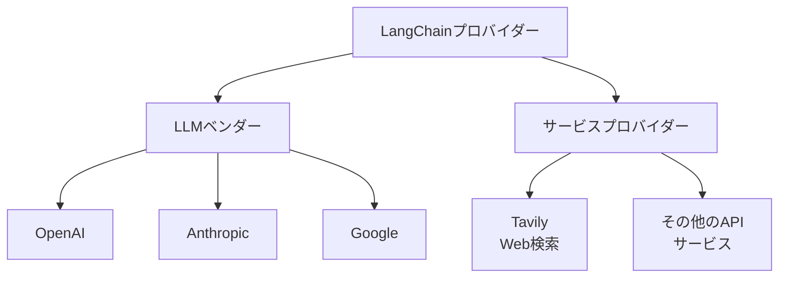

import Quiz from '@/components/content/Quiz.astro'

## 概要

このレクチャーでは，検索エージェントを構築するための環境セットアップを行います．Tavily APIの設定，必要なパッケージのインストール，環境変数の構成について学びます．

## 依存関係のインストール

```bash
uv init
uv add langchain langchain-openai langchain-tavily tavily-python python-dotenv black isort
```

### パッケージの説明

- `langchain`: コアフレームワーク
- `langchain-openai`: OpenAI統合
- `langchain-tavily`: Tavily のLangChain統合パッケージ
- `tavily-python`: Tavily のオリジナルSDK
- `python-dotenv`: 環境変数の読み込み

## Tavilyとは

TavilyはAIエージェントにWeb検索能力を提供するサードパーティサービスです．

- エージェントにWeb検索能力を付与する最も一般的な選択肢
- LangChain公式ドキュメントでデフォルトの検索サービスとして紹介されている
- 月1,000リクエストの無料ティアあり（コースに十分）
- Tavily Crawl，Tavily Map，Tavily Extractなどの追加API も提供

### LangChainプロバイダーとしてのTavily



LangChainのプロバイダーはLLMベンダーだけではありません．APIで公開されるサービスもプロバイダーになれます．Tavilyの検索・スクレイピング機能がLangChainのツールとして統合されています．

## 環境変数の設定

`.env`ファイルに以下を設定します．

```bash
OPENAI_API_KEY=sk-...
LANGCHAIN_TRACING_V2=true
LANGSMITH_API_KEY=lsv2_...
LANGSMITH_PROJECT=search-agent
TAVILY_API_KEY=tvly-...
```

Tavily APIキーは[Tavily公式サイト](https://tavily.com)でアカウントを作成し，ダッシュボードから生成します．環境変数名は`TAVILY_API_KEY`にする必要があります．LangChainがこの名前で認証情報を検索するためです．

## まとめ

- TavilyはAIエージェントのWeb検索に最も広く使われるサービス
- 月1,000リクエストの無料ティアでコースに十分
- `langchain-tavily`パッケージでLangChainと統合
- 環境変数名は`TAVILY_API_KEY`にする必要がある
- LangChainプロバイダーはLLMベンダー以外のサービスも含む

<Quiz questions={[
  {
    question: "Tavilyの無料ティアで月に何リクエストまで使用できますか？",
    options: [
      "100リクエスト",
      "500リクエスト",
      "1,000リクエスト",
      "10,000リクエスト"
    ],
    answer: 2,
    explanation: "Tavilyは月1,000リクエストの無料ティアを提供しており，コースの学習には十分な量です．"
  },
  {
    question: "Tavilyの主な役割は何ですか？",
    options: [
      "LLMモデルの提供",
      "AIエージェントにWeb検索能力を提供する",
      "データベースの管理",
      "コードの自動生成"
    ],
    answer: 1,
    explanation: "TavilyはAIエージェントにWeb検索能力を提供するサードパーティサービスです．"
  },
  {
    question: "TAVILY_API_KEYの環境変数名を正確に設定する理由は何ですか？",
    options: [
      "セキュリティのため",
      "LangChainがこの名前で認証情報を検索するため",
      "Tavilyの規約で決められているため",
      "特に理由はない"
    ],
    answer: 1,
    explanation: "環境変数名はTAVILY_API_KEYにする必要があります．LangChainがこの名前で認証情報を検索するためです．"
  },
  {
    question: "LangChainプロバイダーに関して正しい記述はどれですか？",
    options: [
      "LLMベンダーのみがプロバイダーになれる",
      "APIで公開されるサービスもプロバイダーになれる",
      "無料のサービスだけがプロバイダーになれる",
      "Pythonライブラリのみがプロバイダーになれる"
    ],
    answer: 1,
    explanation: "LangChainのプロバイダーはLLMベンダーだけでなく，APIで公開されるサービスもプロバイダーになれます．"
  },
  {
    question: "検索エージェントのセットアップで必要ないパッケージはどれですか？",
    options: [
      "langchain-tavily",
      "langchain-openai",
      "langchain-ollama",
      "python-dotenv"
    ],
    answer: 2,
    explanation: "検索エージェントのセットアップにはlangchain，langchain-openai，langchain-tavily，tavily-python，python-dotenvが必要ですが，langchain-ollamaは含まれていません．"
  }
]} />
