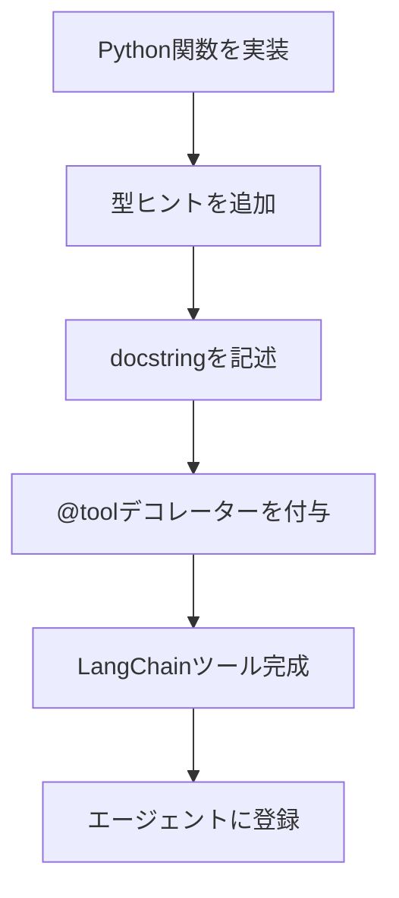

import Quiz from '@/components/content/Quiz.astro'

## 概要

このレクチャーでは，`create_agent`関数を使って初めてのLangChainエージェントを作成します．ツールの概念，`@tool`デコレーターによるカスタムツールの作成，エージェントの実行方法を学びます．

## LangChainツールとは

ツールとは，エージェントが実行できる関数です．API呼び出し，データベース検索，コード実行など，任意のPython関数をツールとして定義できます．

### ツールの作成方法



1. 型ヒント付きの通常のPython関数を実装する
2. docstringで関数の説明，引数，出力を記述する
3. `@tool`デコレーターを付与してLangChainツールに変換する

```python
from langchain_core.tools import tool

@tool
def search(query: str) -> str:
    """A tool that searches over the internet.

    Args:
        query: The search query.

    Returns:
        The search result.
    """
    print(query)
    return "Tokyo weather is sunny right now"
```

### 重要なポイント

- 型ヒント，引数名，docstringはLLMがツールを使うかどうかの判断に使用される
- Function Callingにより，LLMはテキストだけでなく「呼び出すべき関数」を返すことができる
- 説明は明示的で曖昧さのないものにする

## エージェントの作成

エージェントの作成に最低限必要なものは2つです．

- ツール: エージェントが実行できる能力
- LLM: 推論エンジン

```python
from langchain.agents import create_agent
from langchain_openai import ChatOpenAI
from langchain_core.messages import HumanMessage

llm = ChatOpenAI()
tools = [search]
agent = create_agent(model=llm, tools=tools)
```

## エージェントの実行

```python
result = agent.invoke({
    "messages": HumanMessage(content="What's the weather in Tokyo?")
})
print(result)
```

`messages`キーに`HumanMessage`を渡してエージェントを実行します．LangChainは単一のメッセージを自動的にリストにキャストします．

## まとめ

- ツールは`@tool`デコレーターでPython関数から作成できる
- docstringと型ヒントはLLMのツール選択に重要
- `create_agent`はLLMとツールのリストを受け取ってエージェントを作成
- `invoke`メソッドに`messages`を渡してエージェントを実行
- Function Callingにより，LLMがどのツールを呼ぶかを判断する

<Quiz questions={[
  {
    question: "LangChainツールの作成に必要な3つの要素はどれですか？",
    options: [
      "関数名，戻り値，コメント",
      "型ヒント，docstring，@toolデコレーター",
      "クラス定義，コンストラクタ，メソッド",
      "インポート文，変数，ループ"
    ],
    answer: 1,
    explanation: "型ヒント付きのPython関数にdocstringを記述し，@toolデコレーターを付与してLangChainツールに変換します．"
  },
  {
    question: "LLMがツールを使うかどうかの判断に使用される情報はどれですか？",
    options: [
      "関数のファイル名",
      "型ヒント，引数名，docstring",
      "関数の行数",
      "関数の実行速度"
    ],
    answer: 1,
    explanation: "型ヒント，引数名，docstringはLLMがツールを使うかどうかの判断に使用されます．"
  },
  {
    question: "create_agent関数に最低限必要な引数は何ですか？",
    options: [
      "modelとprompt",
      "modelとtools",
      "toolsとprompt",
      "modelとmemory"
    ],
    answer: 1,
    explanation: "エージェントの作成に最低限必要なのはLLM（model）とツール（tools）の2つです．"
  },
  {
    question: "エージェントのinvokeメソッドに渡すキーは何ですか？",
    options: [
      "query",
      "input",
      "messages",
      "prompt"
    ],
    answer: 2,
    explanation: "messagesキーにHumanMessageを渡してエージェントを実行します．"
  },
  {
    question: "Function Callingによりlangchainのエージェントが実現できることは何ですか？",
    options: [
      "LLMの訓練",
      "LLMがテキストだけでなく呼び出すべき関数を返すこと",
      "自動的にコードを修正すること",
      "画像の生成"
    ],
    answer: 1,
    explanation: "Function Callingにより，LLMはテキストだけでなく呼び出すべき関数（ツール）を返すことができます．"
  }
]} />
