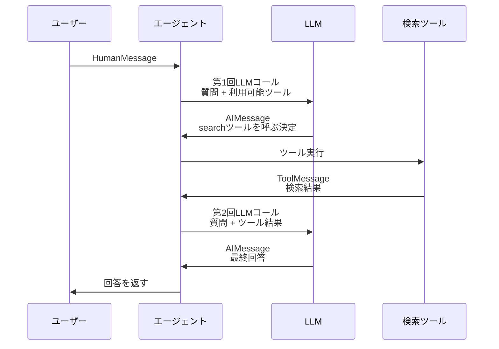

import Quiz from '@/components/content/Quiz.astro'

## 概要

このレクチャーでは，エージェントの実行結果をデバッガーとLangSmithで詳細に確認し，エージェントがクエリを受けてから回答を返すまでの思考プロセスを理解します．

## エージェントの実行フロー

エージェントに「What is the weather in Tokyo?」と質問した場合の実行フローを追跡します．

### 結果の構造

`result`は`messages`キーを持つ辞書で，以下のメッセージが順番に含まれます．

1. HumanMessage: ユーザーの入力（「What is the weather in Tokyo?」）
2. AIMessage: LLMがsearchツールを呼び出す決定（tool call付き）
3. ToolMessage: searchツールの実行結果
4. AIMessage: 最終回答

### LangSmithでの詳細確認

LangSmithのトレースで以下を確認できます．

- 第1のLLMコール: ユーザーの質問と利用可能なツール情報を送信．LLMがsearchツールを「weather in Tokyo」というクエリで呼び出すことを決定
- ツール実行: LangChainがsearchツールを実行し，結果を取得
- 第2のLLMコール: 元の質問 + LLMのツール選択 + ツール実行結果を送信．LLMが最終回答を生成

### 推論エンジンと実行ランタイムの分離

エージェントには2つの重要な役割があります．

- 推論エンジン（Reasoning Engine）: LLMがどのツールをどの引数で呼ぶかを決定
- 実行ランタイム（Agent Execution Runtime）: 決定されたツールを実際に実行し，結果を取得

LLMは「ツールを呼ぶべきだ」と判断するだけで，実際のAPI呼び出しはLangChainが行います．

## 複数のツール呼び出し

より複雑なクエリ（例: 求人検索）では，LLMが複数のツール呼び出しを並列で行うことがあります．GPTのFunction Callingは複数の関数呼び出しをサポートしています．

## まとめ

- エージェントの実行はメッセージのリストとして記録される
- LLMはツールの選択と引数を決定するだけで，実行はLangChainが担当
- LangSmithでエージェントの各ステップを詳細に追跡できる
- 2回のLLMコール（ツール選択 → 最終回答）でタスクが完了する
- Function Callingにより，複数のツール呼び出しを並列で実行可能

<Quiz questions={[
  {
    question: "エージェントの実行結果に含まれるメッセージの順序として正しいものはどれですか？",
    options: [
      "AIMessage → HumanMessage → ToolMessage → AIMessage",
      "HumanMessage → AIMessage → ToolMessage → AIMessage",
      "ToolMessage → HumanMessage → AIMessage → AIMessage",
      "HumanMessage → ToolMessage → AIMessage → AIMessage"
    ],
    answer: 1,
    explanation: "HumanMessage（ユーザー入力）→ AIMessage（ツール呼出決定）→ ToolMessage（実行結果）→ AIMessage（最終回答）の順です．"
  },
  {
    question: "推論エンジンと実行ランタイムの役割分担で正しいものはどれですか？",
    options: [
      "LLMがツールを実行し，LangChainが判断する",
      "LLMがどのツールを呼ぶか判断し，LangChainが実際に実行する",
      "LLMとLangChainが同時にツールを実行する",
      "ユーザーがツールの実行を指示する"
    ],
    answer: 1,
    explanation: "LLMは推論エンジンとしてツールの選択と引数を決定し，実行ランタイムのLangChainが実際のAPI呼び出しを行います．"
  },
  {
    question: "1回のタスク完了に通常何回のLLMコールが必要ですか？",
    options: [
      "1回",
      "2回",
      "3回",
      "5回"
    ],
    answer: 1,
    explanation: "通常は2回のLLMコール（ツール選択のための1回目と，最終回答生成のための2回目）でタスクが完了します．"
  },
  {
    question: "GPTのFunction Callingがサポートしている機能はどれですか？",
    options: [
      "単一のツール呼び出しのみ",
      "複数の関数呼び出しを並列で実行",
      "ツール呼び出しは不可",
      "テキスト生成のみ"
    ],
    answer: 1,
    explanation: "GPTのFunction Callingは複数の関数呼び出しを並列でサポートしています．"
  },
  {
    question: "LangSmithでエージェントのトレースを確認する際に見られない情報はどれですか？",
    options: [
      "各LLMコールの入出力",
      "ツール実行の結果",
      "ユーザーのパスワード",
      "LLMのツール選択の決定"
    ],
    answer: 2,
    explanation: "LangSmithではLLMコールの入出力，ツール実行結果，ツール選択の決定などが確認できますが，ユーザーのパスワードは含まれません．"
  }
]} />
