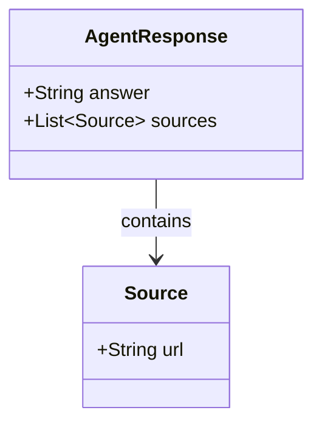

import Quiz from '@/components/content/Quiz.astro'

## 概要

このレクチャーでは，Pydanticモデルと`response_format`引数を使用して，エージェントからテキストではなく構造化されたデータを取得する方法を学びます．ネストされたPydanticオブジェクトも扱います．

## 構造化出力の必要性

エージェントやAIアプリケーションでは，LLMの応答をテキストではなく，JSONオブジェクトやPydanticオブジェクトとして取得したい場面が多くあります．

- フロントエンドでの表示
- APIレスポンスとしてのシリアライズ
- アプリケーション内での後続処理

## Pydanticモデルの定義



```python
from typing import List
from pydantic import BaseModel, Field

class Source(BaseModel):
    """Schema for a source used by the agent."""
    url: str = Field(description="The URL of the source")

class AgentResponse(BaseModel):
    """Schema for the agent response."""
    answer: str = Field(description="The agent's answer to the query")
    sources: List[Source] = Field(
        default_factory=list,
        description="The list of sources used to generate the answer"
    )
```

`Source`クラスを`AgentResponse`内にネストすることで，回答と情報源を構造化して取得できます．

## response_formatの使用

`create_agent`関数に`response_format`引数を追加するだけです．

```python
agent = create_agent(
    model=llm,
    tools=tools,
    response_format=AgentResponse
)
```

結果は`structured_response`キーから取得できます．

```python
result = agent.invoke({"messages": HumanMessage(content="...")})
structured = result["structured_response"]
print(structured.answer)
print(structured.sources[0].url)
```

## LangSmithでの確認

トレースで`structured_response`フィールドを確認でき，`AgentResponse`型のオブジェクトが`answer`と`sources`フィールドを持っていることが分かります．

内部的にはFunction Callingを活用していますが，詳細は後のセクションで扱います．

## まとめ

- `response_format`引数にPydanticモデルを渡すだけで構造化出力を取得可能
- ネストされたPydanticモデルも問題なく処理できる
- `structured_response`キーから結果を取得
- 内部的にはFunction Callingを活用（詳細は後のセクション）
- 構造化出力により，アプリケーションでの後続処理が容易になる

<Quiz questions={[
  {
    question: "エージェントから構造化出力を取得するために使用するのはどれですか？",
    options: [
      "output_parser引数",
      "response_format引数にPydanticモデルを渡す",
      "json_mode引数",
      "structured引数"
    ],
    answer: 1,
    explanation: "create_agent関数にresponse_format引数としてPydanticモデルを渡すだけで構造化出力を取得できます．"
  },
  {
    question: "構造化出力の結果はどのキーから取得できますか？",
    options: [
      "output",
      "response",
      "structured_response",
      "result"
    ],
    answer: 2,
    explanation: "構造化出力の結果はstructured_responseキーから取得できます．"
  },
  {
    question: "Pydanticモデルのネストが可能な理由は何ですか？",
    options: [
      "特別なプラグインが必要",
      "Pydanticがネストされたオブジェクトを標準でサポートしているから",
      "LangChain独自の拡張機能",
      "JSONの制限を回避するため"
    ],
    answer: 1,
    explanation: "Pydanticモデルはネストされたオブジェクトをネイティブにサポートしており，Sourceクラスの中にAgentResponseクラスの中にネストできます．"
  },
  {
    question: "構造化出力が必要な場面として正しくないものはどれですか？",
    options: [
      "フロントエンドでの表示",
      "APIレスポンスとしてのシリアライズ",
      "LLMモデルの再訓練",
      "アプリケーション内での後続処理"
    ],
    answer: 2,
    explanation: "構造化出力はフロントエンド表示，APIレスポンスのシリアライズ，後続処理に必要ですが，LLMモデルの再訓練には使用しません．"
  },
  {
    question: "構造化出力の内部実装で活用されている技術は何ですか？",
    options: [
      "テキストパースing",
      "正規表現マッチング",
      "Function Calling",
      "XML変換"
    ],
    answer: 2,
    explanation: "構造化出力は内部的にFunction Callingを活用して実現されています．"
  }
]} />
