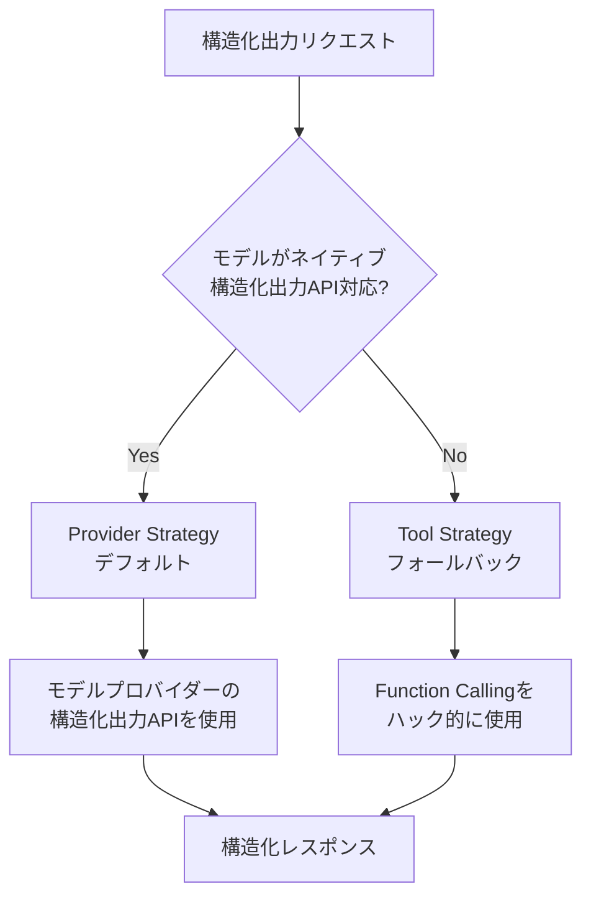

import Quiz from '@/components/content/Quiz.astro'

## 概要

このレクチャーでは，LangChainにおける構造化出力の2つの実装方式（Provider StrategyとTool Strategy）を理論的に解説します．それぞれの仕組みとLangChainの選択ロジックを理解します．

## 構造化出力の2つの実装方式

### Provider Strategy（デフォルト）

トップティアのLLMの多くは，ネイティブに構造化出力APIをサポートしています．LangChainはデフォルトでこの方式を使用し，構造化の責任をモデルプロバイダーに委譲します．

サポートされるスキーマ形式:
- Pydanticモデル
- dataclass
- TypedDict
- JSONスキーマ

### Tool Strategy（フォールバック）

構造化出力APIをサポートしていないモデルの場合，Tool Callingを代替手段として使用します．LangChainが内部でスキーマをツールとしてLLMに提供し，LLMが常にそのツールを選択するよう強制することで，スキーマの遵守を実現します．

この方式は歴史的にはメインの方法でした．Function Callingをハック的に使用して構造化出力を得る手法です．

## LangChainの選択ロジック

1. モデルがネイティブ構造化出力をサポートしている場合 → Provider Strategy
2. サポートしていない場合 → Tool Callingを使ったTool Strategy

現在のトップティアモデル（GPT-4，Claude，Gemini等）はすべてFunction Callingをサポートしているため，実際にはどちらの方式でも動作します．

## まとめ

- 構造化出力にはProvider StrategyとTool Strategyの2つの実装方式がある
- LangChainはデフォルトでProvider Strategyを使用
- モデルが構造化出力APIをサポートしない場合はTool Strategyにフォールバック
- 現在のトップティアモデルはすべてFunction Callingをサポート
- Pydantic，dataclass，TypedDict，JSONスキーマの4形式がサポートされる

<Quiz questions={[
  {
    question: "LangChainがデフォルトで使用する構造化出力の実装方式はどれですか？",
    options: [
      "Tool Strategy",
      "Provider Strategy",
      "Prompt Strategy",
      "Parser Strategy"
    ],
    answer: 1,
    explanation: "LangChainはデフォルトでProvider Strategyを使用し，構造化の責任をモデルプロバイダーに委譲します．"
  },
  {
    question: "Tool Strategyが使用されるのはどのような場合ですか？",
    options: [
      "常に使用される",
      "モデルが構造化出力APIをサポートしていない場合",
      "開発者が明示的に指定した場合のみ",
      "Pydanticモデルを使用する場合"
    ],
    answer: 1,
    explanation: "モデルがネイティブ構造化出力APIをサポートしていない場合に，Tool Callingを代替手段として使用するTool Strategyにフォールバックします．"
  },
  {
    question: "Provider Strategyでサポートされるスキーマ形式に含まれないものはどれですか？",
    options: [
      "Pydanticモデル",
      "TypedDict",
      "XML Schema",
      "JSONスキーマ"
    ],
    answer: 2,
    explanation: "サポートされるスキーマ形式はPydanticモデル，dataclass，TypedDict，JSONスキーマの4つで，XML Schemaは含まれません．"
  },
  {
    question: "Tool Strategyの歴史的な位置づけはどれですか？",
    options: [
      "最新の方法として登場した",
      "歴史的にはメインの方法で，Function Callingをハック的に使用する手法だった",
      "まだ実験段階の方法",
      "廃止された古い方法"
    ],
    answer: 1,
    explanation: "Tool Strategyは歴史的にはメインの方法でした．Function Callingをハック的に使用して構造化出力を得る手法です．"
  },
  {
    question: "現在のトップティアモデル（GPT-4，Claude，Gemini等）に共通する機能は何ですか？",
    options: [
      "テキスト生成のみ",
      "画像生成",
      "Function Callingのサポート",
      "音声認識"
    ],
    answer: 2,
    explanation: "現在のトップティアモデルはすべてFunction Callingをサポートしているため，Provider StrategyとTool Strategyのどちらでも動作します．"
  }
]} />
