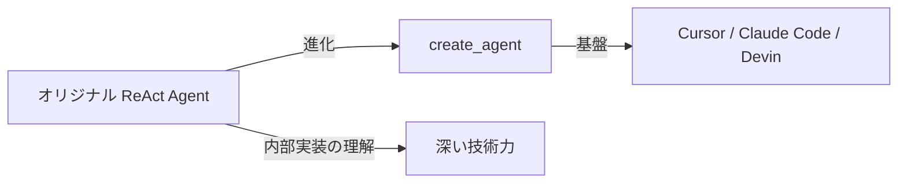
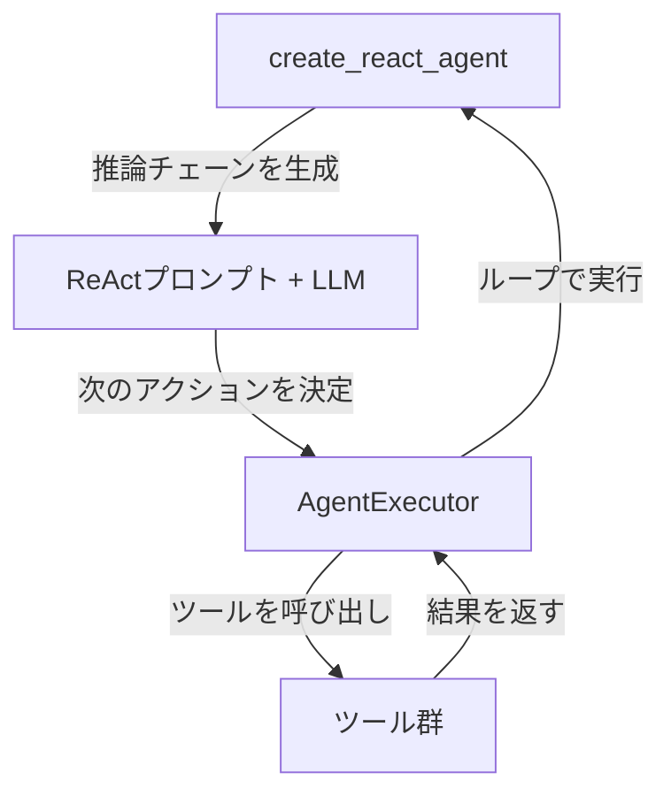

import Quiz from '@/components/content/Quiz.astro'

## 概要

このレクチャーでは，オリジナルのLangChain ReActエージェントの歴史的背景を説明し，なぜ時間を遡って古い実装を学ぶ必要があるのかを解説します．深い理解を得るために，インターフェースだけでなく内部実装を知ることの重要性が強調されます．

## なぜ過去に遡るのか

前セクションでは`create_agent`関数のインターフェースを学びました．このセクションでは一歩後退し，オリジナルのLangChain ReActエージェント（最初のバージョン）を学びます．

### 学ぶ理由

- 現在は推奨されない方法だが，多くの企業がまだプロダクションで使用している
- 技術を「使う」だけでなく「理解する」ことが重要
- 内部実装を知ることで，現在のアーキテクチャの動機と改善点を理解できる
- Cursor，Claude Code，Devinなどの現代のAI技術すべての基盤となっている

## セクションの学習方針

このセクションでもまずインターフェース（使い方）を学びます．次のセクションで完全にゼロから内部実装を構築し，ReActアルゴリズムの全体を深く理解します．

### オリジナルReActエージェントの構成要素

- `create_react_agent`: 推論エンジンを作成する関数（チェーンを返す）
- AgentExecutor: ツールの実行を担当するランタイム（実質的にはforループ）
- ReActプロンプト: エージェントの推論を可能にする特別なプロンプトテンプレート

## まとめ

- オリジナルReActエージェントは現在推奨されないが，理解は必須
- 多くの企業がまだプロダクションで使用している
- インターフェースの学習後に内部実装を深掘りする
- すべての現代AIエージェント技術の基盤となっている
- 次のセクションでゼロからReActアルゴリズムを実装する

<Quiz questions={[
  {
    question: "オリジナルのLangChain ReActエージェントの現在の推奨状況はどれですか？",
    options: [
      "現在も公式に推奨されている唯一の方法である",
      "現在は推奨されないが，多くの企業がまだプロダクションで使用している",
      "完全に廃止され，コードベースから削除されている",
      "LangChain v2でのみ使用可能な方法である"
    ],
    answer: 1,
    explanation: "オリジナルReActエージェントは現在推奨されていませんが，多くの企業がバージョンアップせずにプロダクションで使い続けています．"
  },
  {
    question: "create_react_agent関数が返すオブジェクトは何ですか？",
    options: [
      "完全なエージェント",
      "AgentExecutor",
      "推論エンジンとなるチェーン（Runnable）",
      "ReActプロンプトテンプレート"
    ],
    answer: 2,
    explanation: "create_react_agentはエージェントではなく，推論エンジンとなるチェーン（Runnable）を返します．ツール実行はAgentExecutorが担当します．"
  },
  {
    question: "AgentExecutorの内部実装は本質的に何ですか？",
    options: [
      "再帰関数",
      "ニューラルネットワーク",
      "forループ（whileループ）",
      "イベント駆動アーキテクチャ"
    ],
    answer: 2,
    explanation: "AgentExecutorは名前こそ高度に聞こえますが，内部的にはforループ（whileループ）で推論チェーンを繰り返し実行する仕組みです．"
  },
  {
    question: "このセクションでの学習方針として正しいものはどれですか？",
    options: [
      "最初に内部実装を学び，次にインターフェースを学ぶ",
      "インターフェースと内部実装を同時に学ぶ",
      "まずインターフェースを学び，次のセクションで内部実装をゼロから構築する",
      "インターフェースのみを学び，内部実装は学ばない"
    ],
    answer: 2,
    explanation: "このセクションではインターフェース（使い方）に集中し，次のセクションでゼロから内部実装を構築してReActアルゴリズムの全体を深く理解します．"
  },
  {
    question: "オリジナルReActエージェントを学ぶ主な目的として最も適切なものはどれですか？",
    options: [
      "最新のAPI仕様を覚えるため",
      "現代のAIエージェント技術の基盤を深く理解するため",
      "パフォーマンスの最適化手法を学ぶため",
      "特定のプログラミング言語の文法を習得するため"
    ],
    answer: 1,
    explanation: "オリジナルReActエージェントはCursor，Claude Code，DevinなどすべてのモダンAIエージェント技術の基盤であり，これを理解することで深い技術力が得られます．"
  }
]} />

