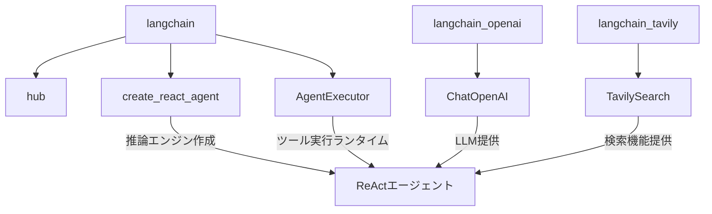

import Quiz from '@/components/content/Quiz.astro'

## 概要

このレクチャーでは，オリジナルReActエージェントの環境をセットアップします．LangChain Hub，create_react_agent，AgentExecutorなどの必要なインポートと，LangChain v1との互換性に関する注意点を学びます．

## 依存関係のインストール

前セクションと同じパッケージに加え，LangChain Hubを使用します．

```bash
uv add langchain langchain-openai langchain-tavily python-dotenv black isort
```

## 重要なインポート



```python
from langchain import hub
from langchain.agents import create_react_agent, AgentExecutor
from langchain_openai import ChatOpenAI
from langchain_tavily import TavilySearch
```

### LangChain Hub

LangChain Hubは，コミュニティで作成されたプロンプト，チェーン，エージェントを共有・探索するためのプラットフォームです．ReActプロンプトをダウンロードするために使用します．

### create_react_agent

推論エンジン（Runnableチェーン）を作成する関数です．LLM，ツールのリスト，ReActプロンプトを受け取り，推論チェーンを返します．この関数が返すのは「エージェント」ではなく「チェーン」である点に注意が必要です．

### AgentExecutor

エージェントの実行ランタイムです．推論エンジンが「次に何をすべきか」を決定し，AgentExecutorがそのツール呼び出しを実際に実行します．内部的にはwhileループで実装されています．

```text
┌─────────────────────────────────────────────┐
│ create_react_agent                          │
│  入力: LLM + Tools + ReAct Prompt           │
│  出力: Runnable（チェーン） ← エージェントではない │
├─────────────────────────────────────────────┤
│ AgentExecutor                               │
│  入力: チェーン + Tools                       │
│  動作: while ループでツール実行を繰り返す        │
│  出力: 最終回答                               │
└─────────────────────────────────────────────┘
```

## LangChain v1の互換性

LangChain v1にはインポートに関する破壊的変更があります．互換性の問題がある場合は，`langchain-classic`パッケージの使用が推奨されます．

## まとめ

- `create_react_agent`は推論エンジン（チェーン）を作成する関数
- `AgentExecutor`はツールの実行を担当するランタイム（whileループ）
- LangChain Hubからコミュニティ作成のプロンプトをダウンロード可能
- LangChain v1のインポート互換性に注意が必要
- このセクションではインターフェースの学習に集中し，内部実装は次セクションで

<Quiz questions={[
  {
    question: "create_react_agent関数が返すオブジェクトの種類として正しいものはどれですか？",
    options: [
      "AgentExecutor",
      "Runnable（チェーン）",
      "LangChain Hub",
      "PromptTemplate"
    ],
    answer: 1,
    explanation: "create_react_agentはRunnableオブジェクト（チェーン）を返します．これは推論エンジンであり，エージェント全体ではありません．"
  },
  {
    question: "AgentExecutorの内部動作として正しい説明はどれですか？",
    options: [
      "再帰的にLLMを呼び出す関数型パイプライン",
      "whileループでツールの実行と結果フィードバックを繰り返す",
      "一度だけLLMを呼び出して結果を返す",
      "非同期イベントキューでツールを管理する"
    ],
    answer: 1,
    explanation: "AgentExecutorはwhileループで推論チェーンを繰り返し実行し，ツール呼び出しと結果のフィードバックを管理するランタイムです．"
  },
  {
    question: "LangChain Hubの主な用途は何ですか？",
    options: [
      "LLMモデルをトレーニングするためのプラットフォーム",
      "コミュニティ作成のプロンプト・チェーン・エージェントを共有・探索するプラットフォーム",
      "Pythonパッケージをインストールするためのリポジトリ",
      "APIキーを管理するためのサービス"
    ],
    answer: 1,
    explanation: "LangChain Hubはコミュニティで作成されたプロンプト，チェーン，エージェントを共有・探索するためのプラットフォームで，ReActプロンプトのダウンロードにも使用します．"
  },
  {
    question: "TavilySearchがLangChainのエコシステムで果たす役割は何ですか？",
    options: [
      "LLMモデルのファインチューニング",
      "エージェントにWeb検索機能を提供するツール",
      "プロンプトのテンプレートを生成する",
      "データベースへの接続を管理する"
    ],
    answer: 1,
    explanation: "TavilySearchはエージェントにWeb検索機能を提供するLangChainツールで，Tavily SDKをLangChainツールとしてラップしたものです．"
  },
  {
    question: "LangChain v1に関する注意点として正しいものはどれですか？",
    options: [
      "v1は完全に後方互換性を維持している",
      "v1にはインポートに関する破壊的変更がある",
      "v1ではPythonのみサポートされる",
      "v1ではAgentExecutorが廃止された"
    ],
    answer: 1,
    explanation: "LangChain v1にはインポートに関する破壊的変更があり，互換性の問題がある場合はlangchain-classicパッケージの使用が推奨されます．"
  }
]} />

