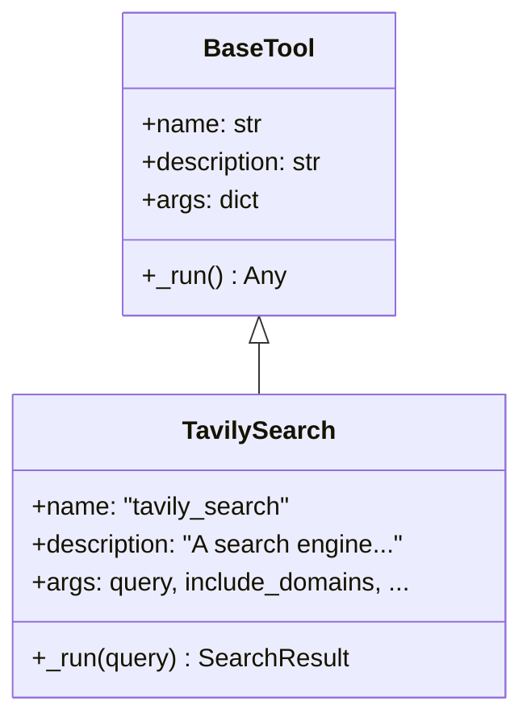
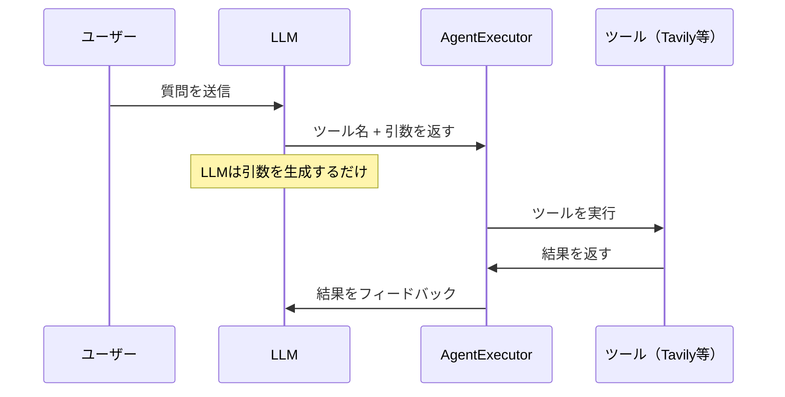

import Quiz from '@/components/content/Quiz.astro'

## 概要

このレクチャーでは，LangChainツールオブジェクトの内部構造を詳細に確認します．TavilySearchツールのdescription，arguments，nameなどの属性がLLMにどのように伝達されるかを理解します．

## LangChainツールの構造



LangChainツールは，LLMが外部APIやユーティリティとインタラクションするためのコンポーネントです．以下のスキーマで定義されます．

- name: ツール名（例: `tavily_search`）
- description: ツールの説明文（LLMがツールを使うかどうかの判断に使用）
- arguments: 引数のスキーマ（名前，型，説明）

### ツールの役割



LLMはツール自体を実行しません．代わりに，ツール呼び出しの引数を生成するだけです．実際のツール実行はLangChain（AgentExecutor）が行います．

## TavilySearchツールの確認

デバッガーでTavilySearchツールオブジェクトを確認すると，以下が分かります．

```python
tools = [TavilySearch()]

# ツールの属性を確認
print(tools[0].name)          # "tavily_search"
print(tools[0].description)   # "A search engine optimized for..."
print(tools[0].args)          # {"query": ..., "include_domains": ..., ...}
```

### description属性

検索エンジンとしての機能説明が詳細に記述されています．この説明がLLMにとって明確で曖昧さがないことが重要です．

### args属性

`query`，`include_domains`，`exclude_domains`などのパラメータとその説明が定義されています．

## BaseToolクラス

TavilySearchは`BaseTool`を継承しています．`BaseTool`はLangChainのツールインターフェースで，name，description，argsなどの属性と，実際の実行を行う`_run`メソッドを持ちます．

```python
class TavilySearch(BaseTool):
    name = "tavily_search"
    description = "A search engine optimized for..."

    def _run(self, query: str, **kwargs):
        # Tavily SDKを使用してAPI呼び出し
        return self.client.search(query=query, **kwargs)
```

## LangChain統合ツールを使う理由

ベンダー提供の統合ツールを使う理由は以下の通りです．

- ベンダーが自社製品の最適な説明と引数定義を提供
- カスタムツールよりも正確でLLMが使いやすい
- SDKの全APIを開発者が把握する必要がない

## まとめ

- LangChainツールはname，description，argsで構成される
- LLMはツールを実行せず，引数を生成するだけ
- ツールのdescriptionはLLMの判断に極めて重要
- `BaseTool`クラスがツールの標準インターフェースを提供
- ベンダー提供の統合ツールが最もベストプラクティス

<Quiz questions={[
  {
    question: "LangChainツールを構成する3つの主要な属性はどれですか？",
    options: [
      "input，output，callback",
      "name，description，arguments",
      "model，prompt，chain",
      "query，response，metadata"
    ],
    answer: 1,
    explanation: "LangChainツールはname（ツール名），description（説明文），arguments（引数のスキーマ）の3つの主要属性で構成されます．"
  },
  {
    question: "LLMがツールに対して行う役割は何ですか？",
    options: [
      "ツールのAPIを直接呼び出す",
      "ツール呼び出しの引数を生成するだけ",
      "ツールの実行結果を検証する",
      "ツールのソースコードを解釈して実行する"
    ],
    answer: 1,
    explanation: "LLMはツール自体を実行しません．ツール呼び出しの引数を生成するだけで，実際のツール実行はAgentExecutorが行います．"
  },
  {
    question: "TavilySearchクラスが継承している基底クラスはどれですか？",
    options: [
      "BaseModel",
      "BaseTool",
      "BaseAgent",
      "BaseRunnable"
    ],
    answer: 1,
    explanation: "TavilySearchはBaseToolを継承しています．BaseToolはLangChainのツールインターフェースで，name，description，argsなどの属性と_runメソッドを提供します．"
  },
  {
    question: "ツールのdescription属性が重要な理由は何ですか？",
    options: [
      "ユーザーに表示されるUIテキストだから",
      "LLMがそのツールをいつ使うか判断する材料になるから",
      "デバッグログに出力される唯一の情報だから",
      "LangSmithのトレースに必要だから"
    ],
    answer: 1,
    explanation: "ツールのdescriptionはLLMがそのツールを使うかどうかの判断材料として使用されます．曖昧な説明だとLLMが適切にツールを選択できません．"
  },
  {
    question: "ベンダー提供のLangChain統合ツールを使う利点として正しくないものはどれですか？",
    options: [
      "ベンダーが自社製品に最適な説明と引数定義を提供している",
      "SDKの全APIを開発者が把握する必要がない",
      "統合ツールはカスタムツールよりも実行速度が速い",
      "LLMが使いやすい正確なスキーマが定義されている"
    ],
    answer: 2,
    explanation: "統合ツールの利点は説明の正確さやスキーマの品質であり，実行速度の向上は利点として挙げられていません．"
  }
]} />

