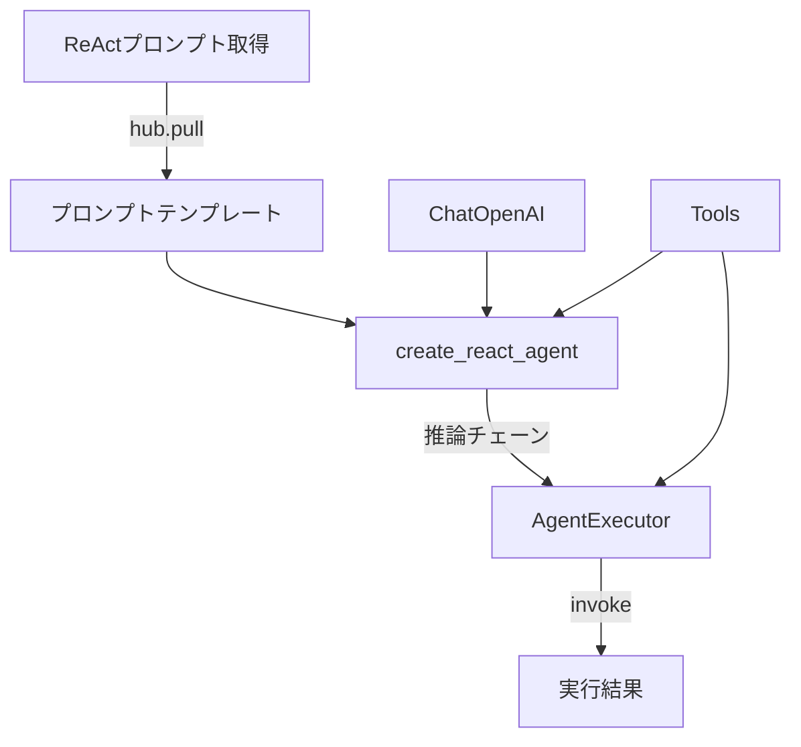

import Quiz from '@/components/content/Quiz.astro'

## 概要

このレクチャーでは，ReActプロンプトの取得から，推論エンジンの作成，AgentExecutorの設定，エージェントの実行までの全工程を実装します．

## ReActプロンプトの取得

LangChain Hubから特別なReActプロンプトをダウンロードします．

```python
react_prompt = hub.pull("hwchase17/react")
```

### ReActプロンプトの構造

```text
┌─────────────────────────────────────┐
│ ReActプロンプトテンプレート           │
├─────────────────────────────────────┤
│ 入力変数:                            │
│   {tools}        ... ツール説明      │
│   {tool_names}   ... ツール名リスト   │
│   {input}        ... ユーザーの質問   │
│   {agent_scratchpad} ... 作業メモ    │
├─────────────────────────────────────┤
│ フォーマット指示:                     │
│   Thought → Action → Action Input   │
│   → Observation → ... → Final Answer│
└─────────────────────────────────────┘
```

ReActプロンプトには以下の入力変数があります．

- `input`: ユーザーの質問
- `tools`: ツールの説明
- `tool_names`: ツール名のリスト
- `agent_scratchpad`: エージェントの作業メモ（次セクションで詳細）

プロンプトの核心部分は，LLMに対して特定のフォーマット（Thought/Action/Action Input/Observation）で推論と行動を記述させる指示です．これがReActの「秘密のソース」であり，すべての現代AIエージェント技術の基盤です．

## 推論エンジンの作成

```python
agent = create_react_agent(
    llm=ChatOpenAI(model="gpt-4o"),
    tools=tools,
    prompt=react_prompt
)
```

`create_react_agent`はRunnableを返します．これはLLMにReActプロンプトを送信するチェーンで，出力パーサーも含まれています．

## AgentExecutorの設定

```python
agent_executor = AgentExecutor(
    agent=agent,
    tools=tools,
    verbose=True
)
```

AgentExecutorは推論チェーンをwhileループで繰り返し実行し，ツールの呼び出しと結果のフィードバックを管理します．



## エージェントの実行

```python
result = agent_executor.invoke({
    "input": "Search for three job postings for an AI engineer "
             "using LangChain in the Bay area on LinkedIn "
             "and list their details"
})
```

入力は`input`キーの辞書で渡します（`create_agent`の`messages`キーとは異なる点に注意）．

## まとめ

- ReActプロンプトはLangChain Hubからダウンロードする特別なプロンプト
- `create_react_agent`で推論エンジン（チェーン）を作成
- `AgentExecutor`がwhileループでツール実行と結果フィードバックを管理
- すべてはプロンプトに帰着する - これが現代AI技術の基盤
- `verbose=True`で推論プロセスのログを確認できる

<Quiz questions={[
  {
    question: "ReActプロンプトをダウンロードするために使用するコードはどれですか？",
    options: [
      "hub.download('hwchase17/react')",
      "hub.pull('hwchase17/react')",
      "hub.get('hwchase17/react')",
      "hub.fetch('hwchase17/react')"
    ],
    answer: 1,
    explanation: "LangChain Hubからプロンプトをダウンロードするにはhub.pull()メソッドを使用します．"
  },
  {
    question: "ReActプロンプトの入力変数に含まれないものはどれですか？",
    options: [
      "input",
      "tools",
      "agent_scratchpad",
      "model_name"
    ],
    answer: 3,
    explanation: "ReActプロンプトの入力変数はinput，tools，tool_names，agent_scratchpadです．model_nameは含まれません．"
  },
  {
    question: "AgentExecutorにverbose=Trueを設定する目的は何ですか？",
    options: [
      "エージェントの実行速度を上げる",
      "推論プロセスのログを確認できるようにする",
      "エラーハンドリングを有効にする",
      "トレーシングをLangSmithに送信する"
    ],
    answer: 1,
    explanation: "verbose=Trueを設定すると，エージェントの推論プロセス（Thought/Action/Observation）のログが出力され，動作を確認できます．"
  },
  {
    question: "AgentExecutor.invoke()に渡す入力のキー名は何ですか？",
    options: [
      "messages",
      "query",
      "input",
      "prompt"
    ],
    answer: 2,
    explanation: "オリジナルReActエージェントでは入力はinputキーの辞書で渡します．create_agentのmessagesキーとは異なる点に注意が必要です．"
  },
  {
    question: "ReActプロンプトにおけるThought/Action/Action Input/Observationフォーマットの役割は何ですか？",
    options: [
      "APIのレスポンス形式を定義する",
      "LLMに推論と行動を特定の形式で記述させ，パース可能にする",
      "データベースのスキーマを定義する",
      "ユーザーインターフェースのレイアウトを決める"
    ],
    answer: 1,
    explanation: "ReActプロンプトの核心部分は，LLMに推論と行動を特定のフォーマットで記述させることで，LangChainがテキストをパースしてツール名と引数を抽出できるようにする仕組みです．"
  }
]} />

