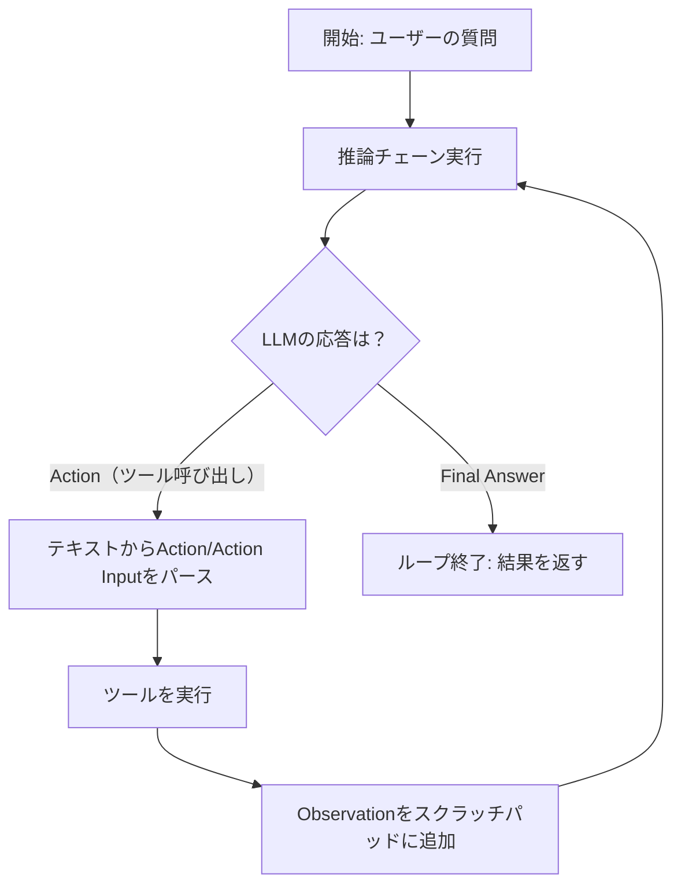

import Quiz from '@/components/content/Quiz.astro'

## 概要

このレクチャーでは，エージェントの実行ログとLangSmithのトレースを使い，ReActエージェントの動作フローを詳細に確認します．Thought/Action/Observationのサイクルを理解します．

## 実行ログの分析

`verbose=True`で実行すると，以下のフローが確認できます．

### 第1イテレーション

1. ReActプロンプト（ツール説明+ユーザー質問）がLLMに送信される
2. LLMが推論を返す（緑色のテキスト）:
   - Thought: 「求人を見つけるためにsearchツールを使う必要がある」
   - Action: `tavily_search`
   - Action Input: `AI engineer LangChain job Bay Area LinkedIn`
3. LangChainが上記のテキストをパースし，ツール名と入力を抽出
4. AgentExecutorがsearchツールを実行し，結果（Observation）を取得

### 第2イテレーション

1. 元の質問 + 前回の推論 + ツール実行結果がLLMに送信される
2. LLMが十分な情報を持っていると判断し，Final Answerを返す

## LangSmithトレースの確認

トレースでは以下を確認できます．

- Prompt Template: ツール説明とユーザー質問が埋め込まれたプロンプト
- LLMコール: プロンプトの送信とLLMの推論結果
- Output Parser: LLMのテキスト応答からAction/Action Inputを抽出（AgentAction型）
- ツール実行: searchツールの入力と出力
- 第2イテレーション: 全履歴を含むプロンプトとFinal Answer

## AgentExecutorの動作

AgentExecutorは以下のサイクルを繰り返します．

1. 推論チェーン（ReActプロンプト → LLM → Output Parser）を実行
2. LLMがAction（ツール呼び出し）を返した場合 → ツールを実行し，Observationを取得
3. LLMがFinal Answerを返した場合 → ループ終了
4. Observationをスクラッチパッドに追加し，次のイテレーションへ

結果は`input`（元のクエリ）と`output`（最終回答）をキーに持つ辞書として返されます．

## まとめ

- ReActエージェントはThought → Action → Observationの反復ループ
- LLMの応答テキストからAction/Action Inputをパースして抽出
- AgentExecutorがツール実行とフィードバックのサイクルを管理
- スクラッチパッドに過去の推論・ツール結果を蓄積
- LangSmithで各ステップの入出力を詳細に確認可能

<Quiz questions={[
  {
    question: "ReActエージェントの1回のイテレーションで行われる推論の流れとして正しい順序はどれですか？",
    options: [
      "Observation → Thought → Action → Final Answer",
      "Action → Thought → Observation → Final Answer",
      "Thought → Action → Action Input → Observation",
      "Final Answer → Action → Thought → Observation"
    ],
    answer: 2,
    explanation: "ReActエージェントの推論フローはThought（思考）→ Action（アクション）→ Action Input（引数）→ Observation（観察結果）の順で行われます．"
  },
  {
    question: "AgentExecutorがループを終了する条件は何ですか？",
    options: [
      "一定回数のイテレーションが完了した時",
      "ツールの実行でエラーが発生した時",
      "LLMがFinal Answerを返した時",
      "スクラッチパッドが容量上限に達した時"
    ],
    answer: 2,
    explanation: "AgentExecutorはLLMがFinal Answerを返した時にループを終了します．Action（ツール呼び出し）が返される限りループは継続します．"
  },
  {
    question: "LLMの応答テキストからAction/Action Inputを抽出する役割を担うのは何ですか？",
    options: [
      "ReActプロンプト",
      "Output Parser",
      "LangChain Hub",
      "TavilySearch"
    ],
    answer: 1,
    explanation: "Output ParserがLLMのテキスト応答からAction/Action Inputを抽出し，AgentAction型のオブジェクトに変換します．"
  },
  {
    question: "agent_scratchpadの役割は何ですか？",
    options: [
      "ユーザーの入力を一時保存する領域",
      "過去の推論とツール実行結果を蓄積する領域",
      "LLMのモデルパラメータを保存する領域",
      "プロンプトテンプレートを保存するキャッシュ"
    ],
    answer: 1,
    explanation: "agent_scratchpadは過去の推論（Thought/Action）とツール実行結果（Observation）を蓄積する領域で，次のイテレーションでLLMに渡されます．"
  },
  {
    question: "AgentExecutorの実行結果として返される辞書のキーはどれですか？",
    options: [
      "query と answer",
      "input と output",
      "messages と response",
      "prompt と result"
    ],
    answer: 1,
    explanation: "結果はinput（元のクエリ）とoutput（最終回答）をキーに持つ辞書として返されます．"
  }
]} />

