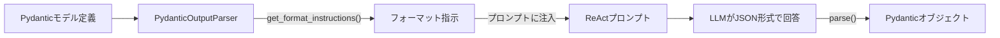

import Quiz from '@/components/content/Quiz.astro'

## 概要

このレクチャーでは，PydanticOutputParserを使ってエージェントの出力を構造化する方法を学びます．Pydanticモデルの定義，フォーマット指示のプロンプトへの注入，JSONからPydanticオブジェクトへの変換を実装します．

## Pydanticモデルの定義

`schemas.py`ファイルにPydanticモデルを定義します．

```python
from typing import List
from pydantic import BaseModel, Field

class Source(BaseModel):
    """Schema for a source used by the agent."""
    url: str = Field(description="The URL of the source")

class AgentResponse(BaseModel):
    """Schema for the agent response with answer and sources."""
    answer: str = Field(description="The agent's answer to the query")
    sources: List[Source] = Field(
        default_factory=list,
        description="The list of sources used to generate the answer"
    )
```

## ReActプロンプトの修正

ReActプロンプトのFinal Answer部分にフォーマット指示を追加します．

```python
# prompt.py
react_prompt_with_format_instructions = """
Answer the following questions as best you can...
...
Final Answer: the final answer to the original input question,
formatted according to the format instructions:
{format_instructions}
"""
```



## PydanticOutputParserの使用

```python
from langchain.output_parsers import PydanticOutputParser

output_parser = PydanticOutputParser(pydantic_object=AgentResponse)
```

`get_format_instructions()`メソッドでフォーマット指示を取得し，プロンプトに注入します．

```python
prompt_with_format = PromptTemplate(
    template=react_prompt_with_format_instructions,
    input_variables=["tool_names", "input", "agent_scratchpad"]
).partial(
    format_instructions=output_parser.get_format_instructions()
)
```

`partial`メソッドは，プロンプトテンプレートの一部の変数を事前に埋めるために使用します．

## フォーマット指示の内容

`get_format_instructions()`が返す内容の例:

```
The output should be formatted as a JSON instance that conforms
to the JSON schema below.
...
{
  "answer": {"type": "string", "description": "The agent's answer"},
  "sources": [{"url": {"type": "string", "description": "The URL"}}]
}
```

LLMはこの指示に従い，JSON形式で回答を返します．その後，`output_parser.parse()`でPydanticオブジェクトに変換します．

```python
parsed = output_parser.parse(result["output"])
print(parsed.answer)
print(parsed.sources[0].url)
```

## まとめ

- PydanticOutputParserはLLMの応答をPydanticオブジェクトに変換する
- フォーマット指示をプロンプトに注入してLLMに出力形式を指定
- `partial`メソッドでプロンプトの一部を事前に埋められる
- LLMがJSON形式で応答し，パーサーがPydanticオブジェクトに変換
- すべてはプロンプトに帰着する - 構造化出力もプロンプトエンジニアリング

<Quiz questions={[
  {
    question: "PydanticOutputParserの主な役割は何ですか？",
    options: [
      "LLMのトレーニングデータを生成する",
      "LLMの応答をPydanticオブジェクトに変換する",
      "プロンプトテンプレートを自動生成する",
      "APIリクエストのバリデーションを行う"
    ],
    answer: 1,
    explanation: "PydanticOutputParserはLLMの応答（JSON文字列）をPydanticオブジェクトに変換するパーサーです．"
  },
  {
    question: "get_format_instructions()メソッドが返す内容は何ですか？",
    options: [
      "Pydanticモデルのソースコード",
      "LLMに出力形式を指定するためのJSONスキーマの指示文",
      "LangSmithのトレース設定",
      "ツールの引数定義"
    ],
    answer: 1,
    explanation: "get_format_instructions()はLLMに対してJSONスキーマに準拠した形式で出力するよう指示する文字列を返します．"
  },
  {
    question: "PromptTemplateのpartialメソッドの用途は何ですか？",
    options: [
      "プロンプトを複数のLLMに分散送信する",
      "プロンプトテンプレートの一部の変数を事前に埋める",
      "プロンプトのトークン数を削減する",
      "プロンプトの実行をキャンセルする"
    ],
    answer: 1,
    explanation: "partialメソッドはプロンプトテンプレートの一部の変数を事前に埋めるために使用します．format_instructionsなどの固定値を先に設定できます．"
  },
  {
    question: "AgentResponseモデルに含まれるフィールドはどれですか？",
    options: [
      "query と results",
      "answer と sources",
      "input と output",
      "prompt と response"
    ],
    answer: 1,
    explanation: "AgentResponseモデルにはanswer（エージェントの回答）とsources（回答に使用したソースのリスト）が定義されています．"
  },
  {
    question: "ReActプロンプトのFinal Answer部分を修正する理由は何ですか？",
    options: [
      "ツールの呼び出し回数を制限するため",
      "LLMの推論速度を向上させるため",
      "LLMに構造化されたJSON形式で回答させるため",
      "エージェントのメモリ使用量を削減するため"
    ],
    answer: 2,
    explanation: "Final Answer部分にフォーマット指示を追加することで，LLMが構造化されたJSON形式で回答を返すようになり，パーサーでPydanticオブジェクトに変換できます．"
  }
]} />

