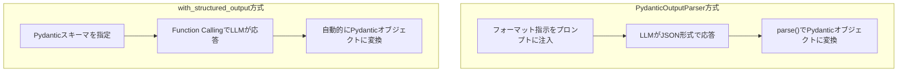

import Quiz from '@/components/content/Quiz.astro'

## 概要

このレクチャーでは，`.with_structured_output()`メソッドを紹介し，PydanticOutputParserとの違いを比較します．Function Callingを活用したより信頼性の高い構造化出力の取得方法を学びます．

## with_structured_outputメソッド

```python
structured_llm = llm.with_structured_output(AgentResponse)
```

このメソッドは，モデルの新しいインスタンスを作成し，指定されたPydanticスキーマに準拠した構造化出力を常に返すよう設定します．

### 実装の変更点

```python
# フォーマット指示はもう不要
# PydanticOutputParserも不要

# チェーンの最後にstructured_llmを追加
chain = agent_executor | extract_output | structured_llm
```

重要なポイントとして，推論エンジン（`create_react_agent`）には通常のLLMを使用し，`structured_llm`は最終回答の構造化のみに使用します．

## LangSmithでの確認

トレースで以下の違いを確認できます．

- フォーマット指示がプロンプトに含まれない（トークン節約）
- 最後のステップで追加のLLMコールが行われる
- そのLLMコールにはツール（agent_responseスキーマ）が添付されている
- LLMがFunction Callingでスキーマに準拠した応答を返す
- LangChainが内部でPydanticOutputParserを使用してオブジェクトに変換



## 2つの方法の比較

| 観点 | PydanticOutputParser | with_structured_output |
|------|---------------------|----------------------|
| 使いやすさ | プロンプト注入+パース実装が必要 | 1行で完了 |
| 信頼性 | LLMのフォーマット遵守に依存 | Function Callingで高信頼 |
| モデル対応 | 全モデル対応 | Function Calling対応モデルのみ |
| プロンプト制御 | 完全制御可能 | LangChainに委譲 |
| トークン効率 | フォーマット指示分のトークン消費 | 効率的（指示不要） |

## 推奨される方法

`with_structured_output`が推奨される方法です．理由は以下の通りです．

- Function Callingを活用するため信頼性が高い
- 現在のトップティアモデルはすべてFunction Callingをサポート
- コードがシンプル
- トークン効率が良い

## まとめ

- `with_structured_output()`はFunction Callingを活用した信頼性の高い方法
- PydanticOutputParserよりもシンプルで信頼性が高い
- 推論エンジンには通常のLLM，構造化出力にはstructured_llmを使用
- プロンプトにフォーマット指示を注入する必要がない
- Function Callingの詳細は後続のセクションで深掘りする

<Quiz questions={[
  {
    question: "with_structured_output()メソッドが内部的に活用する技術は何ですか？",
    options: [
      "プロンプトエンジニアリング",
      "Function Calling",
      "ファインチューニング",
      "RAG（検索拡張生成）"
    ],
    answer: 1,
    explanation: "with_structured_output()はFunction Callingを活用して，LLMがPydanticスキーマに準拠した構造化出力を返すようにします．"
  },
  {
    question: "PydanticOutputParserと比較したwith_structured_outputの利点として正しくないものはどれですか？",
    options: [
      "コードがシンプル",
      "Function Callingで信頼性が高い",
      "すべてのLLMモデルで使用可能",
      "トークン効率が良い"
    ],
    answer: 2,
    explanation: "with_structured_outputはFunction Calling対応モデルでのみ使用可能です．PydanticOutputParserの方がモデル対応範囲は広くなります．"
  },
  {
    question: "推論エンジンとstructured_llmの使い分けとして正しいものはどれですか？",
    options: [
      "両方とも通常のLLMを使用する",
      "推論エンジンには通常のLLM，構造化出力にはstructured_llmを使用する",
      "推論エンジンにstructured_llm，構造化出力には通常のLLMを使用する",
      "両方ともstructured_llmを使用する"
    ],
    answer: 1,
    explanation: "推論エンジン（create_react_agent）には通常のLLMを使用し，structured_llmは最終回答の構造化のみに使用します．"
  },
  {
    question: "with_structured_outputがトークン効率に優れている理由は何ですか？",
    options: [
      "モデルのパラメータ数が少ないから",
      "プロンプトにフォーマット指示を注入する必要がないから",
      "応答が短くなるから",
      "バッチ処理で実行されるから"
    ],
    answer: 1,
    explanation: "with_structured_outputはFunction Callingを使用するため，プロンプトにフォーマット指示を追加する必要がなく，その分のトークンを節約できます．"
  },
  {
    question: "LangSmithのトレースでwith_structured_outputを確認した場合，最後のステップで何が確認できますか？",
    options: [
      "プロンプトテンプレートの生成",
      "ツール（agent_responseスキーマ）が添付されたLLMコール",
      "PydanticOutputParserによるパース処理",
      "AgentExecutorのwhileループ"
    ],
    answer: 1,
    explanation: "with_structured_outputを使用すると，最後のステップで追加のLLMコールが行われ，そのコールにはツール（agent_responseスキーマ）が添付されています．"
  }
]} />

