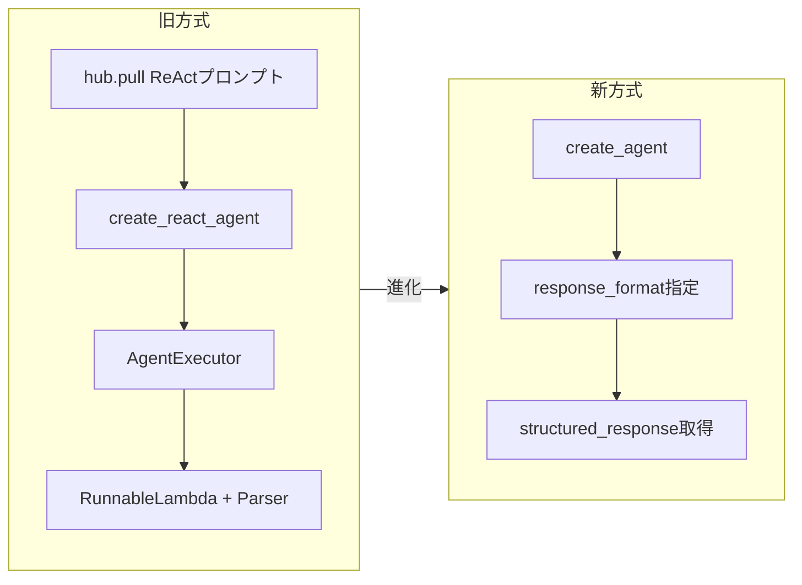

import Quiz from '@/components/content/Quiz.astro'

## 概要

このレクチャーでは，オリジナルのReActエージェント実装からモダンな`create_agent`関数への移行を行います．LangChain v1のドキュメントを活用し，変更点を詳細に確認します．

## ドキュメントの活用

LangChainの最新ドキュメントには「ドキュメントをテキストとしてコピー」するボタンがあります．これにより，AI搭載のコードエディタ（Cursor，Claude Code等）にコンテキストとして渡すことができます．これは`llm.txt`という革新的な概念の一部で，コースのMCPセクションでも扱います．

## 主な変更点

### 不要になったインポート

- `hub`: ReActプロンプトのダウンロードが不要に
- `AgentExecutor`: LangGraphに抽象化
- `create_react_agent`: `create_agent`に置き換え
- `PromptTemplate`: カスタムReActプロンプトが不要に
- `RunnableLambda`: 構造化出力の組み込みサポートにより不要

### 新しいコード

```python
from langchain.agents import create_agent
from langchain_openai import ChatOpenAI
from langchain_tavily import TavilySearch

model = ChatOpenAI(model="gpt-4o")
tools = [TavilySearch()]

agent = create_agent(
    model=model,
    tools=tools,
    response_format=AgentResponse
)

result = agent.invoke({
    "messages": [{"role": "user", "content": "Search for..."}]
})

structured = result["structured_response"]
```

### inputからmessagesへの変更

入力形式が`input`キーの文字列から`messages`キーのメッセージリストに変更されています．この変更の理由は，後続セクションで詳しく解説されます．



## 進化のまとめ

- ReActプロンプトが不要になった（Function Callingで推論が行われる）
- AgentExecutorがLangGraphに抽象化された
- `response_format`引数で構造化出力が組み込みサポート
- コードが大幅にシンプルになった

## まとめ

- `create_agent`はオリジナルReActエージェントの全進化を内包
- ReActプロンプト，AgentExecutor，Output Parserがすべて抽象化
- `response_format`で簡単に構造化出力を取得
- 入力形式が`input`から`messages`に変更
- 内部的にはLangGraphが動作しており，後続セクションで詳細を学ぶ

<Quiz questions={[
  {
    question: "create_agentへの移行で不要になったものはどれですか？",
    options: [
      "ChatOpenAI",
      "TavilySearch",
      "ReActプロンプトのダウンロード",
      "Pydantic BaseModel"
    ],
    answer: 2,
    explanation: "create_agentではFunction Callingで推論が行われるため，LangChain HubからのReActプロンプトダウンロードが不要になりました．"
  },
  {
    question: "create_agentの入力形式として正しいものはどれですか？",
    options: [
      "inputキーの文字列",
      "queryキーの辞書",
      "messagesキーのメッセージリスト",
      "promptキーのテンプレート"
    ],
    answer: 2,
    explanation: "create_agentでは入力形式がinputキーの文字列からmessagesキーのメッセージリストに変更されています．"
  },
  {
    question: "create_agentで構造化出力を取得するために使用する引数は何ですか？",
    options: [
      "output_parser",
      "structured_output",
      "response_format",
      "pydantic_schema"
    ],
    answer: 2,
    explanation: "create_agentではresponse_format引数にPydanticモデルを指定することで，構造化出力の組み込みサポートを利用できます．"
  },
  {
    question: "create_agentが内部的に使用しているフレームワークは何ですか？",
    options: [
      "LangChain Classic",
      "LangGraph",
      "LangServe",
      "LangSmith"
    ],
    answer: 1,
    explanation: "create_agentは内部的にLangGraphを使用しており，AgentExecutorがLangGraphに抽象化されています．"
  },
  {
    question: "llm.txtという概念に関連する機能は何ですか？",
    options: [
      "LLMのファインチューニングデータ形式",
      "ドキュメントをテキストとしてコピーしAIエディタにコンテキストとして渡す機能",
      "LLMの設定ファイル形式",
      "トレーニングログの出力形式"
    ],
    answer: 1,
    explanation: "llm.txtはドキュメントをテキストとしてコピーし，AI搭載のコードエディタにコンテキストとして渡すことを可能にする革新的な概念です．"
  }
]} />

