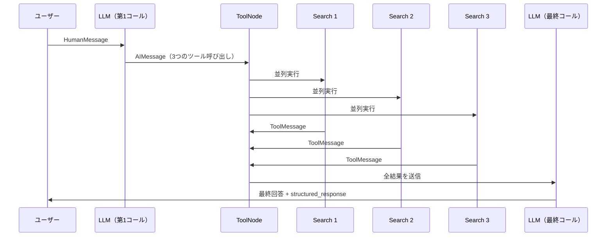

import Quiz from '@/components/content/Quiz.astro'

## 概要

このレクチャーでは，`create_agent`で作成したエージェントの実行をデバッガーとLangSmithで確認します．LangGraphベースの新しいトレース構造と，Function Callingによるツール呼び出しの仕組みを垣間見ます．

## デバッガーでの確認

実行結果にはメッセージのリストが含まれます．

1. HumanMessage: ユーザーの質問
2. AIMessage: LLMがFunction Callingで3つのツール呼び出しを決定
3. ToolMessage x3: 3つの検索ツールの並列実行結果
4. AIMessage: 最終回答（structured_response付き）

`structured_response`キーに`AgentResponse`型のPydanticオブジェクトが格納されています．

## LangSmithトレースの構造

### LangGraphベースのトレース

`create_agent`はLangGraphをベースにしているため，トレースにはLangGraphのコンポーネントが表示されます．

- 第1のLLMコール: ツール情報（searchとagent_response）を添付してLLMに送信
- ToolNode: LangGraphのオーケストレーションで，各ツール呼び出しを別々のノードに分配
- 並列ツール実行: 3つの検索クエリが並列で実行される
- 最終LLMコール: 全ツール結果を含めてLLMが回答を生成

### Function Callingの活用

- ツール選択: LLMがFunction Callingで呼び出すべきツールと引数を返す
- 構造化出力: 最終回答もFunction Callingを使って`AgentResponse`スキーマに準拠

## 今後の学習

現時点ではLangGraphの各コンポーネントの詳細な理解は求められません．今後のセクションで以下を順番に学びます．

1. ReActアルゴリズムの内部実装（ゼロから構築）
2. Function Callingの仕組み
3. LangGraphのコンポーネントと動作

## まとめ

- `create_agent`はLangGraphベースで動作し，トレースにグラフコンポーネントが表示される
- Function Callingでツール選択と構造化出力の両方を実現
- 複数のツール呼び出しが並列実行される
- LangGraphの詳細は後続セクションで学ぶ
- トレースのブックマークを推奨（後で理解が深まった時に再確認）

<Quiz questions={[
  {
    question: "create_agentの実行結果に含まれるメッセージの種類として正しくないものはどれですか？",
    options: [
      "HumanMessage",
      "AIMessage",
      "ToolMessage",
      "SystemMessage"
    ],
    answer: 3,
    explanation: "create_agentの実行結果にはHumanMessage，AIMessage，ToolMessageが含まれます．SystemMessageは結果のメッセージリストには含まれません．"
  },
  {
    question: "LangGraphのToolNodeが実行する役割は何ですか？",
    options: [
      "LLMへのプロンプト送信",
      "各ツール呼び出しを別々のノードに分配して実行する",
      "ユーザーの入力をバリデーションする",
      "Pydanticオブジェクトを生成する"
    ],
    answer: 1,
    explanation: "ToolNodeはLangGraphのオーケストレーションコンポーネントで，各ツール呼び出しを別々のノードに分配して並列実行を管理します．"
  },
  {
    question: "create_agentでFunction Callingが使用されている場面はどれですか？",
    options: [
      "ツール選択のみ",
      "構造化出力のみ",
      "ツール選択と構造化出力の両方",
      "プロンプトの生成のみ"
    ],
    answer: 2,
    explanation: "create_agentではFunction Callingがツール選択（呼び出すべきツールと引数の決定）と構造化出力（AgentResponseスキーマへの準拠）の両方で活用されています．"
  },
  {
    question: "structured_responseキーに格納されるオブジェクトの型は何ですか？",
    options: [
      "辞書（dict）",
      "JSON文字列",
      "Pydanticオブジェクト（AgentResponse）",
      "リスト（list）"
    ],
    answer: 2,
    explanation: "structured_responseキーにはAgentResponse型のPydanticオブジェクトが格納されています．"
  },
  {
    question: "複数の検索クエリがどのように実行されますか？",
    options: [
      "順番に1つずつ実行される",
      "並列で同時に実行される",
      "ランダムな順序で実行される",
      "バッチ処理で一括実行される"
    ],
    answer: 1,
    explanation: "LangGraphのToolNodeにより，複数の検索クエリは並列で同時に実行されます．トレースでも並列実行が確認できます．"
  }
]} />

