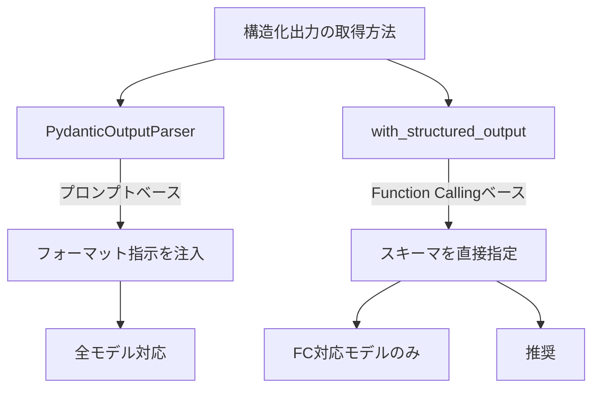

import Quiz from '@/components/content/Quiz.astro'

## 概要

このクイズでは，LangChainエージェントにおける構造化出力（Output Parsing）の取得方法に関する理解度を確認します．PydanticOutputParserと`with_structured_output`メソッドの違い，Function Callingとの関係を問います．

## 学習ポイント

クイズに取り組む前に，以下のポイントを復習しておくことを推奨します．

- PydanticOutputParserの仕組み（プロンプトへのフォーマット指示注入+パース）
- `with_structured_output()`メソッドの仕組み（Function Calling活用）
- 2つの方法の信頼性，使いやすさ，モデル対応の違い
- Pydantic BaseModelの定義とField descriptionsの重要性
- LCELのパイプ演算子によるチェーン構成
- `response_format`引数による`create_agent`での構造化出力

## まとめ

- PydanticOutputParserはプロンプトベース，with_structured_outputはFunction Callingベース
- with_structured_outputが推奨される方法（より信頼性が高い）
- 現代のトップティアモデルはすべてFunction Callingをサポート
- Pydanticモデルの説明文がLLMの出力品質に影響する

<Quiz questions={[
  {
    question: "PydanticOutputParserが構造化出力を実現する仕組みとして正しいものはどれですか？",
    options: [
      "Function Callingを使用してスキーマを強制する",
      "プロンプトにフォーマット指示を注入してLLMにJSON形式で回答させる",
      "LLMのファインチューニングで出力形式を固定する",
      "後処理で正規表現を使ってテキストから構造を抽出する"
    ],
    answer: 1,
    explanation: "PydanticOutputParserはプロンプトにフォーマット指示を注入してLLMにJSON形式で回答させ，その応答をパースしてPydanticオブジェクトに変換します．"
  },
  {
    question: "with_structured_outputが推奨される最大の理由は何ですか？",
    options: [
      "すべてのLLMモデルで使用できるから",
      "プロンプトの完全な制御が可能だから",
      "Function Callingを活用するため信頼性が高いから",
      "トレーニングデータが不要だから"
    ],
    answer: 2,
    explanation: "with_structured_outputはFunction Callingを活用するため，プロンプトベースの方法より信頼性が高く，LLMがスキーマに準拠した出力を返す確率が大幅に向上します．"
  },
  {
    question: "Pydantic FieldのdescriptionパラメータがLLMの出力品質に影響する理由は何ですか？",
    options: [
      "Pythonの型チェックに使用されるから",
      "LLMがフィールドの意味を理解して適切な値を生成する手がかりになるから",
      "データベースのカラム名として使用されるから",
      "APIドキュメントの自動生成に使用されるから"
    ],
    answer: 1,
    explanation: "Fieldのdescriptionは最終的にLLMに渡される情報の一部となり，LLMがフィールドの意味を理解して適切な値を生成するための手がかりになります．"
  },
  {
    question: "create_agentでresponse_format引数を使用する場合，結果のどこにPydanticオブジェクトが格納されますか？",
    options: [
      "result['output']",
      "result['parsed']",
      "result['structured_response']",
      "result['response']"
    ],
    answer: 2,
    explanation: "create_agentでresponse_formatを指定した場合，構造化されたPydanticオブジェクトはresult['structured_response']キーに格納されます．"
  },
  {
    question: "LCELのパイプ演算子でチェーンを構成する際の実行順序はどうなりますか？",
    options: [
      "右から左に実行される",
      "並列に実行される",
      "左から右に順番に実行される",
      "ランダムな順序で実行される"
    ],
    answer: 2,
    explanation: "LCELのパイプ演算子によるチェーンは左から右に順番に実行されます．各ステップの出力が次のステップの入力になります．"
  }
]} />

