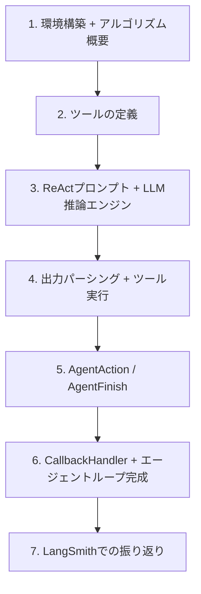

import Quiz from '@/components/content/Quiz.astro'

## 概要

このレクチャーでは，これまでブラックボックスとして扱ってきたReActエージェントの内部構造を深掘りし，自分たちでReActエージェントをゼロから実装するセクションの導入を行います．LLMアプリケーション開発における最も重要な概念を学びます．

## ReActエージェントの深掘りの必要性

これまでのセクションでは，`create_react_agent`関数を使ってエージェントを作成し，ツールの選択や実行は「魔法」のように自動的に行われていました．しかし，その内部で何が起きているのかは理解していませんでした．

このセクションでは，以下の内容を学びます:

- ReActアルゴリズムの完全な実装
- ツール選択のメカニズム
- LLMの推論エンジンとしての役割
- エージェントループの仕組み

## なぜLangGraphの前にこれを学ぶのか

LangChainチームはLangGraphを使ったエージェント開発を推奨しています．しかし，LangGraphを理解するためには，その前身であるReActエージェントの歴史と進化を理解することが重要です．

抽象化されたLangGraphの実装をいきなり見ても，なぜそのように実装されているのかの深い理解は得られません．ゼロからの構築は，物事がなぜ今のように実装されているのかを理解するための最良の方法です．

## このセクションの構成

1. 環境構築とReActアルゴリズムの概要
2. ツールの定義
3. ReActプロンプトとLLM推論エンジン
4. 出力パーシングとツール実行
5. AgentAction，AgentFinish，エージェントステップ
6. CallbackHandlerとエージェントループの完成
7. LangSmithでの振り返り

## まとめ

- ReActエージェントの内部構造を理解することは，全てのエージェントアプリケーションの基盤となる
- LangGraphを理解するための前提知識として，ReActの歴史と実装を学ぶことが重要
- このセクションはLangChainフレームワークを使った実装だが，フレームワークに依存しない普遍的な知識を提供する

<Quiz questions={[
  {
    question: "このセクションでReActエージェントをゼロから実装する目的として最も適切なものはどれですか？",
    options: [
      "LangChainのAPIドキュメントを暗記するため",
      "内部構造を理解し，抽象化されたフレームワークの動機を深く理解するため",
      "パフォーマンスを最適化するため",
      "新しいプログラミング言語を学ぶため"
    ],
    answer: 1,
    explanation: "ゼロからの構築は，物事がなぜ今のように実装されているのかを理解するための最良の方法であり，LangGraphなどの抽象化の動機を深く理解できます．"
  },
  {
    question: "LangGraphを学ぶ前にReActエージェントを学ぶ理由は何ですか？",
    options: [
      "LangGraphよりReActの方が新しいから",
      "ReActはLangGraphの前身であり，その歴史と進化を理解することが重要だから",
      "LangGraphは使用が推奨されていないから",
      "ReActの方が実装が簡単だから"
    ],
    answer: 1,
    explanation: "LangGraphを理解するためには，その前身であるReActエージェントの歴史と進化を理解することが重要です．抽象化されたLangGraphの実装をいきなり見ても深い理解は得られません．"
  },
  {
    question: "このセクションで学ぶ知識の特徴として正しいものはどれですか？",
    options: [
      "LangChainフレームワーク固有の知識のみ",
      "Python言語に限定された知識",
      "フレームワークに依存しない普遍的な知識",
      "OpenAIモデル専用の知識"
    ],
    answer: 2,
    explanation: "このセクションはLangChainフレームワークを使った実装ですが，提供される知識はフレームワークに依存しない普遍的なもので，全てのエージェントアプリケーションの基盤となります．"
  },
  {
    question: "これまでのセクションでcreate_react_agent関数はどのように扱われていましたか？",
    options: [
      "内部実装を詳細に分析していた",
      "ブラックボックスとして扱い，インターフェースのみを学んでいた",
      "使用せず，代わりにLangGraphを使っていた",
      "カスタム実装と比較していた"
    ],
    answer: 1,
    explanation: "これまでのセクションではcreate_react_agentをブラックボックスとして扱い，ツールの選択や実行は魔法のように自動的に行われていました．内部で何が起きているかは理解していませんでした．"
  },
  {
    question: "ReActエージェントの内部構造を理解することの意義は何ですか？",
    options: [
      "コードの行数を減らせること",
      "全てのエージェントアプリケーションの基盤となる知識を得られること",
      "特定のAPIの使用方法を覚えられること",
      "テストの自動化ができること"
    ],
    answer: 1,
    explanation: "ReActエージェントの内部構造を理解することは，全てのエージェントアプリケーションの基盤となる知識を提供し，LangGraphなど現代のフレームワークの理解にも繋がります．"
  }
]} />

