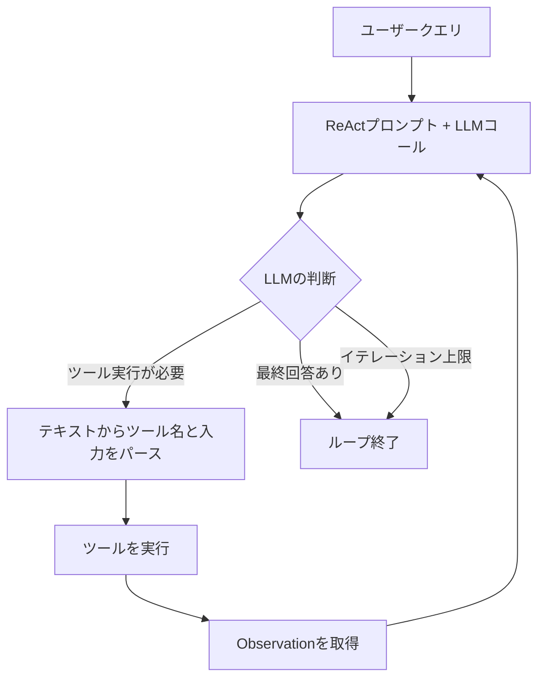

import Quiz from '@/components/content/Quiz.astro'

## 概要

このレクチャーでは，ReActエージェントの開発環境をセットアップし，AgentExecutorの本質が「Whileループ」であることを理解します．疑似コードを通じてReActアルゴリズム全体の流れを俯瞰します．

## AgentExecutorの正体

AgentExecutorという名前は高度に聞こえますが，本質的には「Whileループ」です．

```python
# AgentExecutorの疑似コード
while True:
    # 1. ユーザー入力とツール情報をプロンプトに組み込む
    # 2. LLMに送信
    # 3. LLMの応答を解析
    # 4. ツール実行が必要な場合 -> ツールを実行して次のイテレーションへ
    # 5. 最終回答が得られた場合 -> ループを終了
    # 6. イテレーション制限に達した場合 -> ループを終了
    pass
```



## ReActアルゴリズムの流れ

1. ユーザーのクエリをエージェントに渡す
2. 特別なLLMコール（ReActプロンプト）を実行する
3. LLMが使用すべきツールを決定する（テキストとして返す）
4. テキストをパースしてツール名と入力を抽出する
5. 該当するツールを実行し，結果（Observation）を得る
6. クエリと結果を合わせて次のイテレーションを実行する
7. LLMが最終回答を持つと判断するまで繰り返す

## 環境構築

```python
# プロジェクトのセットアップ
# pipenv shell で仮想環境を作成
# 必要なパッケージをインストール

from dotenv import load_dotenv
load_dotenv()

if __name__ == "__main__":
    print("Hello ReAct LangChain!")
```

## 最初のツールの定義

```python
def get_text_length(text: str) -> int:
    """Returns the length of a text by characters."""
    return len(text)

# サニティチェック
print(get_text_length("dog"))  # 出力: 3
```

ツールの説明文（docstring）はLLMの推論エンジンがツールを選択する際に使用されるため，非常に重要です．

## まとめ

- AgentExecutorの本質は，LLMコールを繰り返すWhileループ
- 各イテレーションでは，LLMの応答を解析し，適切なツールを選択・実行する
- ツールの説明文は，LLMがツール選択を行う上で重要な役割を果たす
- 環境構築は`pipenv`（またはお好みのパッケージマネージャー）で行う

<Quiz questions={[
  {
    question: "AgentExecutorの本質は何ですか？",
    options: [
      "ニューラルネットワーク",
      "Whileループ",
      "再帰関数",
      "イベントキュー"
    ],
    answer: 1,
    explanation: "AgentExecutorという名前は高度に聞こえますが，本質的にはLLMコールを繰り返すWhileループです．"
  },
  {
    question: "ReActアルゴリズムでLLMがツール選択を返す形式は何ですか？",
    options: [
      "JSON形式のFunction Call",
      "バイナリデータ",
      "テキスト（Thought/Action/Action Inputの形式）",
      "XMLフォーマット"
    ],
    answer: 2,
    explanation: "オリジナルのReActアルゴリズムでは，LLMはテキストとしてThought/Action/Action Inputの形式でツール選択を返し，それをパースして実行します．"
  },
  {
    question: "ツールの説明文（docstring）が重要な理由は何ですか？",
    options: [
      "Pythonのドキュメント生成ツールが使用するから",
      "LLMの推論エンジンがツール選択の判断に使用するから",
      "コンパイラが型チェックに使用するから",
      "ユーザーインターフェースに表示されるから"
    ],
    answer: 1,
    explanation: "ツールの説明文はLLMの推論エンジンがツールを選択する際に使用されるため，明確で曖昧さのない記述が重要です．"
  },
  {
    question: "AgentExecutorのWhileループが終了する条件として正しくないものはどれですか？",
    options: [
      "最終回答が得られた場合",
      "イテレーション制限に達した場合",
      "ツール実行が成功した場合",
      "LLMがFinal Answerを返した場合"
    ],
    answer: 2,
    explanation: "ツール実行が成功しただけではループは終了しません．ループが終了するのは最終回答が得られた場合，またはイテレーション制限に達した場合です．"
  },
  {
    question: "get_text_length関数の戻り値の型は何ですか？",
    options: [
      "str",
      "float",
      "int",
      "bool"
    ],
    answer: 2,
    explanation: "get_text_length関数はテキストの文字数を返すため，戻り値の型はintです．len()関数は整数を返します．"
  }
]} />

