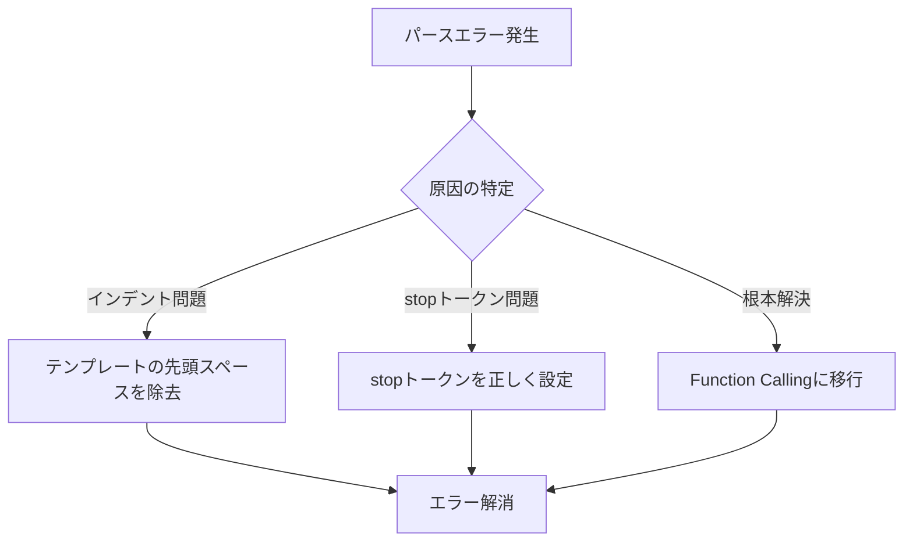

import Quiz from '@/components/content/Quiz.astro'

## 概要

このレクチャーでは，異なるLLMプロバイダーを使用する際のstopトークンの設定方法と，テンプレートのインデントに起因するパースエラーの解決方法を解説します．

## stopトークンの重要性

パースエラーを防ぐためには，以下の2点を常に確認する必要があります:

1. テンプレートがインデントされていないこと
2. LLMに対して正しいstopトークンが設定されていること



## LLMプロバイダー別のstop設定

使用するモデルによって，stopトークンの設定方法が異なります．

```python
# ChatOpenAIの場合（新しいバージョン）
llm = ChatOpenAI(temperature=0)
llm = llm.bind(stop=["\nObservation"])

# Geminiの場合
llm = ChatGoogleGenerativeAI(
    model_kwargs={"stop": ["\nObservation"]}
)
```

安全のために，複数のstopトークンを設定することも有効です:

```python
stop_tokens = ["\nObservation", "Observation", "Observation:"]
```

## よくあるパースエラー

「Final AnswerとParseable Actionの両方が含まれている」というエラーが発生する場合，原因はほぼ以下のいずれかです:

- プロンプトテンプレート自体のインデント
- stopトークンの設定が不正

## Function Callingへの進化

このセクションの後，Function Calling（Tool Calling）への移行演習があります．Function Callingを使うことで，ツール呼び出しの責任をLLM側に移譲でき，stopトークンやパースエラーの問題を根本的に解決できます．

## まとめ

- stopトークンの設定はLLMプロバイダーごとに異なる
- テンプレートのインデントはパースエラーの主要な原因
- 安全策として複数のstopトークンバリエーションを設定する
- Function Callingはこれらの問題をエレガントに解決する進化形

<Quiz questions={[
  {
    question: "ChatOpenAIの新しいバージョンでstopトークンを設定する方法は何ですか？",
    options: [
      "コンストラクタのstopパラメータに直接設定する",
      "llm.bind(stop=[...])メソッドを使用する",
      "環境変数で設定する",
      "プロンプトテンプレートに埋め込む"
    ],
    answer: 1,
    explanation: "ChatOpenAIの新しいバージョンでは，llm.bind(stop=['\\nObservation'])のようにbindメソッドを使用してstopトークンを設定します．"
  },
  {
    question: "パースエラー「Final AnswerとParseable Actionの両方が含まれている」の主な原因は何ですか？",
    options: [
      "LLMモデルのバージョンが古い",
      "プロンプトのインデントまたはstopトークンの設定不備",
      "ネットワーク接続の問題",
      "Pythonのバージョンの互換性"
    ],
    answer: 1,
    explanation: "このパースエラーの原因はほぼプロンプトテンプレート自体のインデント，またはstopトークンの設定が不正のいずれかです．"
  },
  {
    question: "安全策として推奨されるstopトークンの設定方法はどれですか？",
    options: [
      "1つのstopトークンのみ設定する",
      "stopトークンを設定しない",
      "複数のstopトークンバリエーションを設定する",
      "stopトークンの代わりにmax_tokensを使う"
    ],
    answer: 2,
    explanation: "安全策として，'\\nObservation'，'Observation'，'Observation:'など複数のstopトークンバリエーションを設定することが推奨されます．"
  },
  {
    question: "Function Callingがパースエラー問題を解決できる理由は何ですか？",
    options: [
      "LLMの精度が向上するから",
      "ツール呼び出しの責任をLLM側に移譲し，正規表現によるパースが不要になるから",
      "エラーが自動的にリトライされるから",
      "プロンプトが短くなるから"
    ],
    answer: 1,
    explanation: "Function Callingを使うと，ツール呼び出しの責任をLLM側に移譲でき，テキストの正規表現によるパースが不要になるため，パースエラーの問題を根本的に解決できます．"
  },
  {
    question: "Geminiモデルでstopトークンを設定する方法はどれですか？",
    options: [
      "llm.bind(stop=[...])を使用する",
      "model_kwargsパラメータにstopを設定する",
      "コンストラクタのstopパラメータに直接設定する",
      "環境変数GEMINI_STOPに設定する"
    ],
    answer: 1,
    explanation: "Geminiの場合はChatGoogleGenerativeAIのmodel_kwargsパラメータにstopを設定します．プロバイダーによってstopトークンの設定方法が異なります．"
  }
]} />

