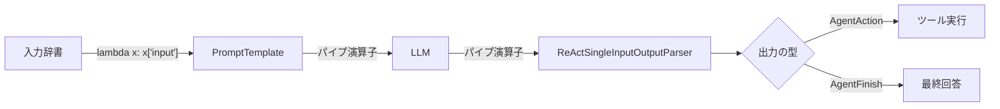

import Quiz from '@/components/content/Quiz.astro'

## 概要

このレクチャーでは，LangChain Expression Language（LCEL）を使ってエージェントを構築し，LLMの出力をパースしてツールを実行する一連の流れを実装します．ReActアルゴリズムの核心部分です．

## LCELでエージェントチェーンを構築

LangChain Expression Language（LCEL）のパイプ演算子`|`を使って，プロンプトとLLMをチェーンとして接続します．

```python
agent = (
    {"input": lambda x: x["input"]}
    | prompt
    | llm
)
```

パイプ演算子は，左側の出力を右側の入力に渡します．

## エージェントの実行と出力

```python
result = agent.invoke(
    {"input": "What is the length in characters of the text dog?"}
)
```

LLMは以下のような応答を返します:

```
Thought: I should use the get_text_length tool to determine the length of the text "dog".
Action: get_text_length
Action Input: dog
```

これがLLMの推論エンジンの出力であり，使用すべきツールとその入力を指定しています．

## ReActSingleInputOutputParserによる出力パーシング

LangChainには，ReActエージェントの出力をパースする専用クラスがあります．

```python
from langchain.agents.output_parsers import ReActSingleInputOutputParser

agent = (
    {"input": lambda x: x["input"]}
    | prompt
    | llm
    | ReActSingleInputOutputParser()
)
```

パーサーは正規表現を使って，LLMの出力から`Action`と`Action Input`を抽出し，`AgentAction`オブジェクトを返します．

## ツールの実行

```python
from langchain.schema import AgentAction, AgentFinish

def find_tool_by_name(tools, tool_name: str):
    for tool in tools:
        if tool.name == tool_name:
            return tool
    raise ValueError(f"Tool with name {tool_name} not found")

# AgentActionからツール情報を抽出
if isinstance(agent_step, AgentAction):
    tool_name = agent_step.tool
    tool_to_use = find_tool_by_name(tools, tool_name)
    tool_input = agent_step.tool_input
    observation = tool_to_use.func(str(tool_input))
    print(f"Observation: {observation}")
```



## 実行の流れ

1. ユーザークエリ → エージェント（プロンプト + LLM）
2. LLMが推論してツール選択を返す
3. 出力パーサーが`AgentAction`オブジェクトを生成
4. ツール名からツールを検索
5. ツールを実行し，Observation（結果）を得る

## まとめ

- LCELのパイプ演算子でプロンプト，LLM，パーサーをチェーンに接続できる
- `ReActSingleInputOutputParser`はLLM出力から正規表現でAction/ActionInputを抽出する
- `AgentAction`オブジェクトにはツール名とツール入力が格納される
- プロンプトの書き方がLLMの推論精度とパーシングの成否に大きく影響する

<Quiz questions={[
  {
    question: "LCELのパイプ演算子 | が行うことは何ですか？",
    options: [
      "両側の処理を並列実行する",
      "左側の出力を右側の入力に渡す",
      "条件分岐を行う",
      "エラーハンドリングを行う"
    ],
    answer: 1,
    explanation: "LCELのパイプ演算子は，左側の出力を右側の入力に渡します．これにより，プロンプト → LLM → パーサーのチェーンを構成できます．"
  },
  {
    question: "ReActSingleInputOutputParserがLLMの出力から抽出する情報は何ですか？",
    options: [
      "Thought のみ",
      "ActionとAction Input",
      "Observation のみ",
      "Final Answer のみ"
    ],
    answer: 1,
    explanation: "ReActSingleInputOutputParserは正規表現を使って，LLMの出力からActionとAction Inputを抽出し，AgentActionオブジェクトを返します．"
  },
  {
    question: "AgentActionオブジェクトに格納される情報はどれですか？",
    options: [
      "ツール名とツール入力",
      "最終回答のみ",
      "プロンプトテンプレート",
      "LLMのモデル名"
    ],
    answer: 0,
    explanation: "AgentActionオブジェクトにはtool（ツール名）とtool_input（ツール入力）が格納されます．"
  },
  {
    question: "find_tool_by_name関数の役割は何ですか？",
    options: [
      "ツールを自動的に作成する",
      "ツールリストからツール名に一致するツールを検索する",
      "ツールの説明文を更新する",
      "ツールの実行結果を検証する"
    ],
    answer: 1,
    explanation: "find_tool_by_name関数はツールリストをイテレートし，指定されたツール名に一致するツールを検索して返します．見つからない場合はValueErrorを発生させます．"
  },
  {
    question: "エージェントチェーンの入力として渡す辞書のキーは何ですか？",
    options: [
      "query",
      "input",
      "messages",
      "prompt"
    ],
    answer: 1,
    explanation: "エージェントチェーンの入力は'input'キーの辞書で渡します．lambda x: x['input']でプロンプトテンプレートに値を埋め込みます．"
  }
]} />

