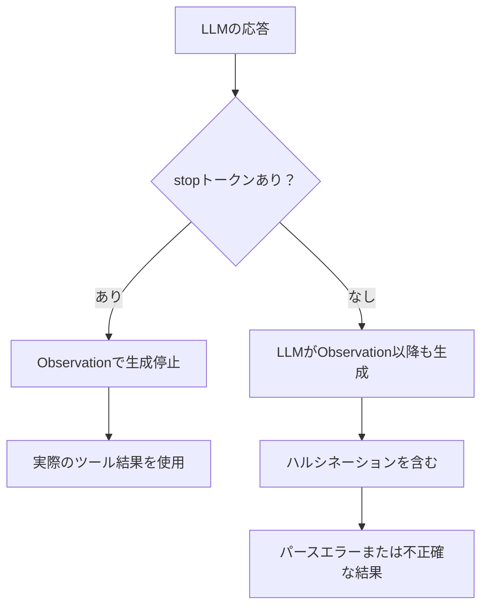

import Quiz from '@/components/content/Quiz.astro'

## 概要

このレクチャーでは，ReActエージェントで頻発するパースエラーの原因を特定し，具体的な対処法を学びます．stopトークンの設定とプロンプトのインデントが鍵となります．

## パースエラーの主な原因

ReActエージェントを使用する際に最もよく遭遇するエラーは，LLMの出力がパーサーの期待するフォーマットと一致しないことです．

主な原因は以下の2つです:

1. プロンプトテンプレートの不適切なインデント
2. stopトークンの設定不備



## stopトークンの役割

stopトークンがないと，LLMは`Observation`の後も文章を生成し続け，実際のツール実行結果ではなくLLM自身の推測（ハルシネーション）を含めてしまいます．

## 対処法

### プロンプトテンプレートの確認

```python
# 不正: インデントがある
template = """
    Answer the following questions...
"""

# 正しい: インデントなし
template = """Answer the following questions..."""
```

### stopトークンの適切な設定

```python
# 複数のバリエーションを設定
llm = ChatOpenAI(temperature=0).bind(
    stop=["\nObservation", "Observation", "Observation:"]
)
```

## Function Callingによる根本解決

ReActプロンプトに基づくパース処理は本質的に不安定です．Function Calling（Tool Calling）に移行することで，正規表現によるパースが不要になり，信頼性が大幅に向上します．

## まとめ

- パースエラーは主にインデントとstopトークンが原因
- stopトークンの複数バリエーション設定が推奨される
- Function Callingへの移行がパースエラーの根本的な解決策

<Quiz questions={[
  {
    question: "ReActエージェントでパースエラーが最も頻発する原因の2つは何ですか？",
    options: [
      "メモリ不足とネットワークエラー",
      "プロンプトテンプレートのインデントとstopトークンの設定不備",
      "LLMモデルの精度不足とAPI制限",
      "Pythonバージョンとライブラリの互換性"
    ],
    answer: 1,
    explanation: "パースエラーの主な原因はプロンプトテンプレートの不適切なインデントとstopトークンの設定不備の2つです．"
  },
  {
    question: "stopトークンがない場合に発生する問題は何ですか？",
    options: [
      "LLMが応答を返さなくなる",
      "LLMがObservation以降も文章を生成し，ハルシネーションを含めてしまう",
      "ツールが実行されなくなる",
      "プロンプトが送信されなくなる"
    ],
    answer: 1,
    explanation: "stopトークンがないと，LLMはObservationの後も文章を生成し続け，実際のツール実行結果ではなくLLM自身の推測（ハルシネーション）を含めてしまいます．"
  },
  {
    question: "プロンプトテンプレートのインデントが問題を引き起こす理由は何ですか？",
    options: [
      "Pythonの文法エラーになるから",
      "余分なスペースがLLMの出力フォーマットを乱し，パーサーが期待する形式と一致しなくなるから",
      "メモリ消費が増えるから",
      "APIの文字数制限を超えるから"
    ],
    answer: 1,
    explanation: "プロンプトのインデントは余分なスペースとしてLLMに渡され，LLMの出力フォーマットを乱す原因となり，パーサーが期待する形式と一致しなくなります．"
  },
  {
    question: "ReActプロンプトに基づくパース処理の本質的な問題点は何ですか？",
    options: [
      "実行速度が遅い",
      "正規表現によるテキストパースが本質的に不安定である",
      "対応するLLMモデルが少ない",
      "メモリ消費量が大きい"
    ],
    answer: 1,
    explanation: "ReActプロンプトに基づくパース処理は正規表現を使ったテキストパースに依存しており，LLMの出力がわずかでも期待フォーマットから逸脱するとエラーになるため，本質的に不安定です．"
  },
  {
    question: "不正なプロンプトテンプレートの例として正しいものはどれですか？",
    options: [
      "template = 'Answer the following...'（引用符で直接記述）",
      "template = \"\"\"\\n    Answer the following...\"\"\"（インデント付き三重引用符）",
      "template = \"\"\"Answer the following...\"\"\"（インデントなし三重引用符）",
      "template = PromptTemplate.from_template(...)（メソッド呼び出し）"
    ],
    answer: 1,
    explanation: "三重引用符内でインデントがあるテンプレートは不正です．インデントなしで記述する必要があります．"
  }
]} />

