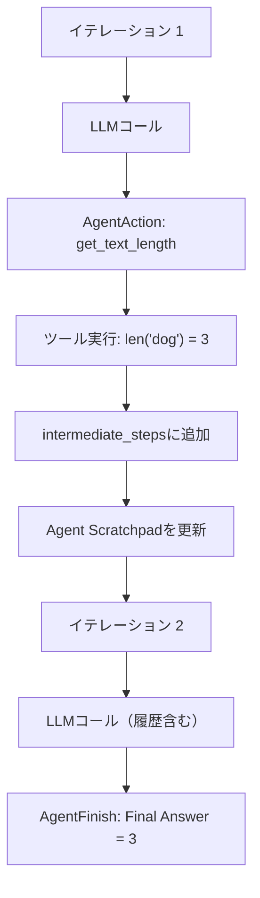

import Quiz from '@/components/content/Quiz.astro'

## 概要

このレクチャーでは，AgentActionとAgentFinishの概念を理解し，Agent Scratchpad（エージェントの作業メモ）を使ってReActループの複数イテレーションを実装します．

## Agent Scratchpadの導入

Agent Scratchpadは，ReActエージェントの実行履歴を保持する仕組みです．各イテレーションで「何をしたか」「結果は何だったか」をLLMに伝えることで，冗長な処理を避けます．

```python
# プロンプトにagent_scratchpadプレースホルダーを追加
template = """...(ReActプロンプト)...
Question: {input}
Thought: {agent_scratchpad}"""

# 中間ステップのリスト（空のリストで初期化）
intermediate_steps = []
```

## 中間ステップの管理

```python
from langchain.agents.format_scratchpad import format_log_to_str

# ツール実行後，結果を中間ステップに追加
intermediate_steps.append((agent_step, observation))

# 次のイテレーションでは，フォーマットされた履歴をLLMに渡す
agent = (
    {
        "input": lambda x: x["input"],
        "agent_scratchpad": lambda x: format_log_to_str(
            x["agent_scratchpad"]
        ),
    }
    | prompt
    | llm
    | ReActSingleInputOutputParser()
)
```

`format_log_to_str`関数は，`AgentAction`オブジェクトとObservationのタプルを，LLMが理解できる文字列にフォーマットします．



## AgentActionとAgentFinishの判定

出力パーサーは2種類のオブジェクトを返します:

- `AgentAction`: ツール実行が必要な場合（ツール名とツール入力を含む）
- `AgentFinish`: 最終回答が得られた場合（回答を含む）

```python
if isinstance(agent_step, AgentAction):
    # ツールを実行し，中間ステップに追加
    tool_name = agent_step.tool
    tool_to_use = find_tool_by_name(tools, tool_name)
    observation = tool_to_use.func(str(agent_step.tool_input))
    intermediate_steps.append((agent_step, observation))

elif isinstance(agent_step, AgentFinish):
    # 最終回答を出力
    print(agent_step.return_values)
```

## 2回目のイテレーション

2回目のイテレーションでは，Agent Scratchpadに前回のAction/Observationが含まれます．LLMはこの履歴を見て「最終回答がわかった」と判断し，`AgentFinish`を返します．

## プロンプトの精度

プロンプトの末尾にスペースがあるだけでもパースエラーが発生することがあります．プロンプトの細部まで注意を払う必要があります．

## まとめ

- Agent Scratchpadはエージェントの実行履歴を保持する仕組み
- `format_log_to_str`で履歴をLLMが理解できる文字列に変換する
- `AgentAction`はツール実行の指示，`AgentFinish`は最終回答を表す
- 出力パーサーはLLMの応答フォーマットに基づいてどちらのオブジェクトを返すか判定する

<Quiz questions={[
  {
    question: "Agent Scratchpadの役割は何ですか？",
    options: [
      "ツールのソースコードを保存する",
      "エージェントの実行履歴を保持し，LLMに伝える仕組み",
      "ユーザーの入力をキャッシュする",
      "LLMのパラメータを一時保存する"
    ],
    answer: 1,
    explanation: "Agent Scratchpadはエージェントの実行履歴（何をしたか，結果は何だったか）を保持し，次のイテレーションでLLMに伝えることで冗長な処理を避ける仕組みです．"
  },
  {
    question: "format_log_to_str関数の入力は何ですか？",
    options: [
      "LLMの応答テキスト",
      "AgentActionとObservationのタプルのリスト",
      "プロンプトテンプレート",
      "ツールの説明文"
    ],
    answer: 1,
    explanation: "format_log_to_str関数はAgentActionオブジェクトとObservation（ツール実行結果）のタプルのリストを受け取り，LLMが理解できる文字列にフォーマットします．"
  },
  {
    question: "AgentActionオブジェクトが返される条件は何ですか？",
    options: [
      "LLMが最終回答を持っていると判断した場合",
      "LLMがツール実行が必要だと判断した場合",
      "エラーが発生した場合",
      "イテレーション上限に達した場合"
    ],
    answer: 1,
    explanation: "AgentActionはLLMがツール実行が必要だと判断した場合に返され，ツール名とツール入力を含みます．"
  },
  {
    question: "intermediate_stepsリストに追加されるデータの形式は何ですか？",
    options: [
      "文字列のリスト",
      "辞書のリスト",
      "(AgentAction, observation)のタプル",
      "AgentFinishオブジェクト"
    ],
    answer: 2,
    explanation: "intermediate_stepsにはAgentActionオブジェクトとobservation（ツール実行結果）のタプルが追加されます．"
  },
  {
    question: "2回目のイテレーションでLLMがAgentFinishを返す理由は何ですか？",
    options: [
      "イテレーション回数の上限に達したから",
      "Agent Scratchpadに前回の結果が含まれ，十分な情報があると判断したから",
      "stopトークンが検出されたから",
      "ツールが見つからなかったから"
    ],
    answer: 1,
    explanation: "2回目のイテレーションではAgent Scratchpadに前回のAction/Observationが含まれており，LLMはこの履歴を見て最終回答がわかったと判断し，AgentFinishを返します．"
  }
]} />

