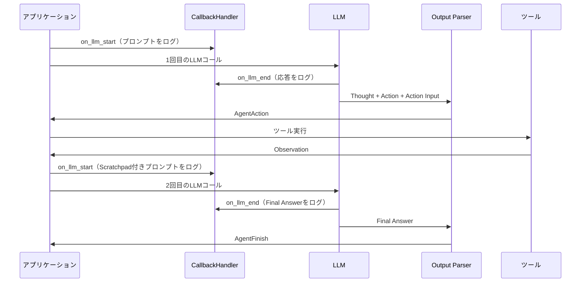

import Quiz from '@/components/content/Quiz.astro'

## 概要

このレクチャーでは，CallbackHandlerを使ってLLMへの送受信を可視化し，stopトークンの重要性をOpenAI Playgroundで実証します．最終的にWhileループでエージェントを完成させます．

## CallbackHandlerの実装

LangChainの`BaseCallbackHandler`を継承して，LLMコールのログを取ります．

```python
from langchain.callbacks.base import BaseCallbackHandler

class AgentCallbackHandler(BaseCallbackHandler):
    def on_llm_start(self, serialized, prompts, **kwargs):
        print(f"*** Prompt to LLM ***")
        print(prompts[0])
        print("***")

    def on_llm_end(self, response, **kwargs):
        print(f"*** LLM Response ***")
        print(response.generations[0][0].text)
        print("***")
```

このCallbackHandlerをLLMに注入します:

```python
llm = ChatOpenAI(
    temperature=0,
    callbacks=[AgentCallbackHandler()]
)
```

## stopトークンの実証

OpenAI Playgroundでstopトークンの有無による違いを確認できます:

- stopトークンなし: LLMが`Observation`以降も推測で文章を生成（ハルシネーション）
- stopトークンあり: `\nObservation`で生成が停止し，必要な部分だけ取得

## Whileループでエージェントを完成

```python
agent_step = ""
while not isinstance(agent_step, AgentFinish):
    agent_step = agent.invoke({
        "input": "What is the length in characters of the text dog?",
        "agent_scratchpad": format_log_to_str(intermediate_steps),
    })

    if isinstance(agent_step, AgentAction):
        tool_name = agent_step.tool
        tool_to_use = find_tool_by_name(tools, tool_name)
        tool_input = agent_step.tool_input
        observation = tool_to_use.func(str(tool_input))
        intermediate_steps.append((agent_step, observation))

# ループ終了後，最終回答を出力
print(agent_step.return_values)
```



## LLMコールの流れ

CallbackHandlerのログで確認できる流れ:

1. 1回目のLLMコール: ReActプロンプト + ツール情報 + ユーザーの質問
2. LLMの応答: ツール選択（Action + Action Input）
3. ツール実行 → Observation取得
4. 2回目のLLMコール: 履歴（Scratchpad）を含むプロンプト
5. LLMの応答: 最終回答（Final Answer）

これがまさに`create_react_agent`とAgentExecutorが内部で行っていることです．

## まとめ

- CallbackHandlerでLLMへのプロンプトと応答をログに記録できる
- stopトークンはLLMのハルシネーションを防ぐために必須
- ReActエージェントの本質は，`AgentFinish`が返されるまで繰り返すWhileループ
- LangChainの`create_react_agent`はこのWhileループを抽象化したもの

<Quiz questions={[
  {
    question: "CallbackHandlerのon_llm_startメソッドが受け取る情報は何ですか？",
    options: [
      "LLMの応答テキスト",
      "LLMに送信されるプロンプト",
      "ツールの実行結果",
      "エラーメッセージ"
    ],
    answer: 1,
    explanation: "on_llm_startメソッドはLLMに送信される前のプロンプトを受け取ります．prompts[0]でプロンプトの内容を確認できます．"
  },
  {
    question: "Whileループの終了条件として正しいものはどれですか？",
    options: [
      "AgentActionが返された時",
      "AgentFinishが返された時",
      "ツール実行が完了した時",
      "CallbackHandlerがエラーをログした時"
    ],
    answer: 1,
    explanation: "Whileループはnot isinstance(agent_step, AgentFinish)が条件なので，AgentFinishが返された時にループが終了します．"
  },
  {
    question: "OpenAI Playgroundでstopトークンなしの場合に確認できる問題は何ですか？",
    options: [
      "LLMが応答を返さない",
      "LLMがObservation以降も推測で文章を生成する（ハルシネーション）",
      "APIレート制限に引っかかる",
      "トークン数が上限を超える"
    ],
    answer: 1,
    explanation: "stopトークンなしの場合，LLMはObservation以降も推測で文章を生成し続け，実際のツール実行結果ではない情報を含めてしまいます．"
  },
  {
    question: "CallbackHandlerをLLMに注入する方法はどれですか？",
    options: [
      "ChatOpenAIのcallbacksパラメータにリストとして渡す",
      "環境変数で設定する",
      "プロンプトテンプレートに埋め込む",
      "agent.invoke()の引数として渡す"
    ],
    answer: 0,
    explanation: "CallbackHandlerはChatOpenAIのcallbacksパラメータにリストとして渡します．例: ChatOpenAI(callbacks=[AgentCallbackHandler()])"
  },
  {
    question: "create_react_agentとAgentExecutorが内部で行っていることの本質は何ですか？",
    options: [
      "ニューラルネットワークのトレーニング",
      "AgentFinishが返されるまで繰り返すWhileループ",
      "データベースのCRUD操作",
      "非同期イベント処理"
    ],
    answer: 1,
    explanation: "create_react_agentとAgentExecutorが内部で行っていることの本質は，AgentFinishが返されるまで推論チェーンを繰り返すWhileループです．"
  }
]} />

