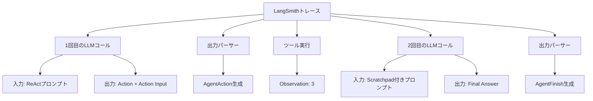

import Quiz from '@/components/content/Quiz.astro'

## 概要

このレクチャーでは，LangSmithを使ってReActエージェントの全実行フローをトレースし，各ステップを視覚的に確認します．

## LangSmithの設定

```python
# .envファイルに以下を追加
LANGSMITH_API_KEY=your_api_key
LANGSMITH_PROJECT=ReAct
LANGCHAIN_TRACING_V2=true
```



## トレースの確認

LangSmithのUIで以下の内容を確認できます:

### 1回目のLLMコール

- 入力: ReActプロンプト（ツール情報 + ユーザーの質問が埋め込まれている）
- 出力: ツール選択の推論結果（Action: get_text_length，Action Input: dog）

### 出力パーサーの動作

- 入力: LLMのテキスト応答
- 出力: `AgentAction`オブジェクト（tool: get_text_length，tool_input: dog）

### ツール実行

- ツール`get_text_length`を実行
- 結果（Observation）: 3

### 2回目のLLMコール

- 入力: Agent Scratchpadに前回のAction/Observationが追加されたプロンプト
- 出力: "I now know the final answer. Final Answer: 3"

### 出力パーサーの動作（2回目）

- `AgentFinish`オブジェクトを返す
- return_values: `{"output": "3"}`

## LangSmithの利点

- 各ステップの入出力を視覚的に確認できる
- 推論過程を追跡してデバッグに活用できる
- パフォーマンスのボトルネックを特定できる
- チーム間でトレースを共有できる

## まとめ

- LangSmithでReActエージェントの全実行フローを可視化できる
- LLMコール，出力パーシング，ツール実行の各ステップが明確に追跡される
- トレースはデバッグ，最適化，チーム共有に非常に有用
- 本番環境でのエージェント監視にもLangSmithは活用される

<Quiz questions={[
  {
    question: "LangSmithのトレーシングを有効にするために必要な環境変数はどれですか？",
    options: [
      "LANGSMITH_ENABLED=true",
      "LANGCHAIN_TRACING_V2=true",
      "LANGSMITH_TRACE=on",
      "LANGCHAIN_DEBUG=true"
    ],
    answer: 1,
    explanation: "LangSmithのトレーシングを有効にするには，LANGCHAIN_TRACING_V2=trueを環境変数に設定する必要があります．"
  },
  {
    question: "LangSmithのトレースで確認できない情報はどれですか？",
    options: [
      "LLMに送信されたプロンプトの内容",
      "出力パーサーの入出力",
      "LLMのモデルの重みパラメータ",
      "ツール実行の結果"
    ],
    answer: 2,
    explanation: "LangSmithのトレースではプロンプト，LLMの応答，パーサーの動作，ツール実行の結果は確認できますが，LLMの内部的なモデル重みパラメータは確認できません．"
  },
  {
    question: "1回目のLLMコールのトレースで確認できる出力は何ですか？",
    options: [
      "最終回答（Final Answer）",
      "ツール選択の推論結果（Action + Action Input）",
      "エラーメッセージ",
      "ユーザーの質問の要約"
    ],
    answer: 1,
    explanation: "1回目のLLMコールではツール選択の推論結果（Action: get_text_length，Action Input: dog）がトレースに記録されます．"
  },
  {
    question: "LangSmithが本番環境で活用される理由として正しくないものはどれですか？",
    options: [
      "推論過程を追跡してデバッグに活用できる",
      "パフォーマンスのボトルネックを特定できる",
      "LLMのモデルを自動的にファインチューニングできる",
      "チーム間でトレースを共有できる"
    ],
    answer: 2,
    explanation: "LangSmithはデバッグ，パフォーマンス分析，チーム間共有に活用されますが，LLMのモデルの自動ファインチューニング機能は提供していません．"
  },
  {
    question: "2回目のLLMコールの入力に含まれる追加情報は何ですか？",
    options: [
      "新しいツール定義",
      "Agent Scratchpadに蓄積された前回のAction/Observation",
      "ユーザーの追加質問",
      "システムプロンプトの変更"
    ],
    answer: 1,
    explanation: "2回目のLLMコールではAgent Scratchpadに前回のAction/Observation（ツール選択とその実行結果）が追加されたプロンプトが送信されます．"
  }
]} />

