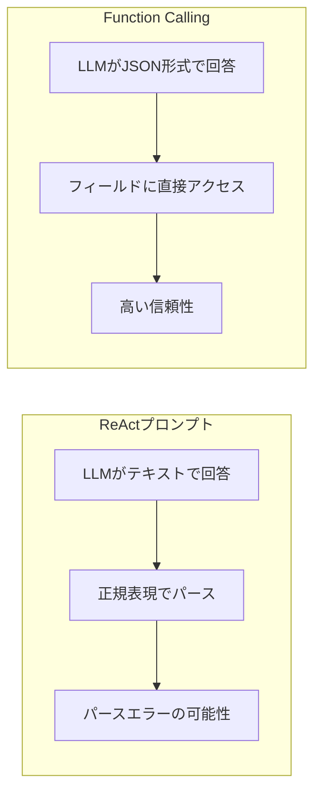

import Quiz from '@/components/content/Quiz.astro'

## 概要

このレクチャーでは，ReActプロンプトの限界を認識し，その自然な進化形であるFunction Calling（Tool Calling）の概要を紹介します．Function Callingが現在のAIエージェント開発のベストプラクティスである理由を理解します．

## ReActプロンプトの限界

ReActプロンプトは素晴らしい技術ですが，本番環境で使うには信頼性が不十分です:

- LLMが1つの不正なトークンを生成するだけで，レスポンス全体が壊れる
- LangChainは正規表現でパースするため，フォーマットのずれに弱い
- stopトークンの設定やプロンプトのインデントに神経を使う必要がある

## Function Callingとは

Function Calling（Tool Calling）は，ReActプロンプトの信頼性の問題を根本的に解決します:

- LLMの応答内の特別な場所に，関数呼び出し情報がJSON形式で返される
- 正規表現によるパースが不要になる
- JSON形式なのでフィールドに簡単にアクセスできる

```json
{
  "function_name": "get_text_length",
  "arguments": {
    "text": "dog"
  }
}
```



## ReActプロンプト vs Function Calling

| 項目 | ReActプロンプト | Function Calling |
|------|---------------|-----------------|
| 信頼性 | 低い | 高い |
| パース方法 | 正規表現 | JSONアクセス |
| ツール選択の責任 | プロンプト設計者 | LLMベンダー |
| 推論の透明性 | 高い（Chain of Thought） | 低い（ブラックボックス） |

## まとめ

- ReActプロンプトはAIエージェントの基盤だが，本番利用には信頼性が課題
- Function CallingはLLMベンダーが提供する信頼性の高いツール呼び出し機能
- 現在のベストプラクティスはFunction Callingを使ったエージェント開発

<Quiz questions={[
  {
    question: "ReActプロンプトの本番環境での最大の課題は何ですか？",
    options: [
      "トークン消費量が多すぎること",
      "LLMが1つの不正なトークンを生成するだけでレスポンス全体が壊れる信頼性の低さ",
      "LLMの推論速度が遅いこと",
      "複数のツールを同時に使えないこと"
    ],
    answer: 1,
    explanation: "ReActプロンプトは正規表現でパースするため，LLMが1つの不正なトークンを生成するだけでレスポンス全体が壊れてしまう信頼性の低さが最大の課題です．"
  },
  {
    question: "Function Callingでツール呼び出し情報が返される形式は何ですか？",
    options: [
      "プレーンテキスト",
      "XML形式",
      "JSON形式",
      "YAML形式"
    ],
    answer: 2,
    explanation: "Function Callingでは，LLMの応答内の特別な場所にツール呼び出し情報がJSON形式で返されるため，フィールドに簡単にアクセスできます．"
  },
  {
    question: "Function Callingの導入により不要になるものはどれですか？",
    options: [
      "LLMへのプロンプト送信",
      "正規表現によるパース処理",
      "ツールの定義",
      "LangSmithでのトレース"
    ],
    answer: 1,
    explanation: "Function Callingを使うとJSON形式でツール情報が返されるため，正規表現によるパース処理が不要になります．"
  },
  {
    question: "ReActプロンプトがFunction Callingより優れている点は何ですか？",
    options: [
      "信頼性が高い",
      "コードが簡潔",
      "推論の透明性が高い（Chain of Thought）",
      "トークン効率が良い"
    ],
    answer: 2,
    explanation: "ReActプロンプトはChain of Thoughtにより推論過程が可視化されるため，透明性が高いという利点があります．Function Callingでは推論過程がブラックボックスになります．"
  },
  {
    question: "現在のAIエージェント開発におけるベストプラクティスはどれですか？",
    options: [
      "ReActプロンプトのみを使用する",
      "ReActとFunction Callingを組み合わせる",
      "Function Callingを使ったエージェント開発",
      "パース処理を手動で実装する"
    ],
    answer: 2,
    explanation: "現在のベストプラクティスはFunction Callingを使ったエージェント開発です．信頼性が高く，コードもシンプルになります．"
  }
]} />

