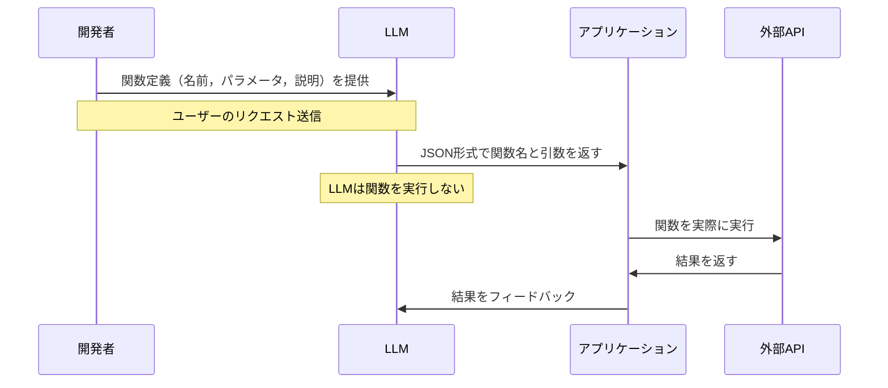

import Quiz from '@/components/content/Quiz.astro'

## 概要

このレクチャーでは，Function Calling（Tool Calling）の理論的な背景を深く掘り下げます．なぜこの機能が生まれたのか，どのように動作するのか，そのメリットとデメリットを理解します．

## Function Callingとは

Function Callingとは，モデルが外部関数への構造化された関数呼び出しを引数付きで生成する能力です．プレーンテキストの代わりに，パースしやすい構造化された応答を生成します．

全てのLLMがFunction Callingをサポートしているわけではありませんが，現在の最先端モデル（OpenAI，Anthropic，Google）ではほぼ標準機能です．



## 動作の仕組み

2023年にOpenAIによって導入されました:

1. 開発者がモデルに関数定義（名前，パラメータ，説明）のリストを提供
2. ユーザーのリクエストに基づき，LLMがどの関数をどの引数で呼ぶかをJSON形式で返す
3. アプリケーションがそのJSONをパースし，実際に関数を実行する

```python
# ユーザー: "パリの天気は?"

# LLMの応答（tool_calls内）:
{
    "name": "get_current_weather",
    "arguments": {
        "location": "Paris",
        "unit": "Celsius"
    }
}
```

## Function Callingの利点

### 構造化された信頼性の高い統合
- JSON形式で返されるため，パースが容易で誤解釈が少ない
- モデルはFunction Schemaに厳密に従うよう微調整されている
- ReActプロンプトのようなランダムなフォーマットエラーが発生しない

### トークン効率が良い
- Chain of Thoughtの冗長な説明が不要
- モデルは関数呼び出しのみを直接返すことができる

## 唯一の欠点: 不透明な推論過程

- モデルが関数を選択する際，思考過程が公開されない
- 推論はLLM内部に留まり，開発者は最終結果のみを見る
- デバッグや監査が困難になる場合がある

## Function Callingの2つの主要用途

1. LLMを外部ツールに接続する
2. LLMから構造化された出力（Structured Output）を得る

## まとめ

- Function CallingはReActプロンプトの信頼性問題を解決するために生まれた
- JSON形式の構造化出力により，パースの信頼性が大幅に向上
- トークン効率が良く，コストと遅延を削減できる
- 推論過程が不透明になるトレードオフがあるが，実用上は十分に価値がある

<Quiz questions={[
  {
    question: "Function Callingが最初に導入されたのはいつ，どのベンダーですか？",
    options: [
      "2022年にGoogleによって",
      "2023年にOpenAIによって",
      "2024年にAnthropicによって",
      "2021年にMicrosoftによって"
    ],
    answer: 1,
    explanation: "Function Callingは2023年にOpenAIによって導入されました．現在は他の主要ベンダーも同様の機能を提供しています．"
  },
  {
    question: "Function Callingの2つの主要用途は何ですか？",
    options: [
      "モデルのトレーニングとデプロイ",
      "LLMを外部ツールに接続することと構造化された出力を得ること",
      "データの前処理と後処理",
      "テストの自動化とデバッグ"
    ],
    answer: 1,
    explanation: "Function Callingの2つの主要用途は，LLMを外部ツールに接続することと，LLMから構造化された出力（Structured Output）を得ることです．"
  },
  {
    question: "Function Callingの唯一の欠点は何ですか？",
    options: [
      "対応するモデルが少ない",
      "トークン消費量が多い",
      "推論過程が不透明で，モデルの思考過程が公開されない",
      "実装が複雑で開発コストが高い"
    ],
    answer: 2,
    explanation: "Function Callingの唯一の欠点は推論過程が不透明なことです．モデルが関数を選択する際の思考過程がLLM内部に留まり，開発者は最終結果のみを見ます．"
  },
  {
    question: "Function Callingがトークン効率に優れている理由は何ですか？",
    options: [
      "モデルのサイズが小さいから",
      "Chain of Thoughtの冗長な説明が不要で，関数呼び出しのみを返せるから",
      "圧縮アルゴリズムが使用されるから",
      "バッチ処理で複数の呼び出しをまとめるから"
    ],
    answer: 1,
    explanation: "Function CallingではChain of Thoughtの冗長な説明が不要になり，モデルは関数呼び出しのみを直接返すことができるため，トークン効率が良くなります．"
  },
  {
    question: "Function Callingにおける開発者の役割として正しいものはどれですか？",
    options: [
      "LLMの内部ロジックを実装する",
      "関数定義（名前，パラメータ，説明）を提供し，返されたJSONで実際の関数を実行する",
      "正規表現でLLMの応答をパースする",
      "ReActプロンプトを設計する"
    ],
    answer: 1,
    explanation: "開発者はモデルに関数定義のリストを提供し，LLMがJSON形式で返すツール呼び出し情報に基づいて実際に関数を実行する役割を担います．"
  }
]} />

