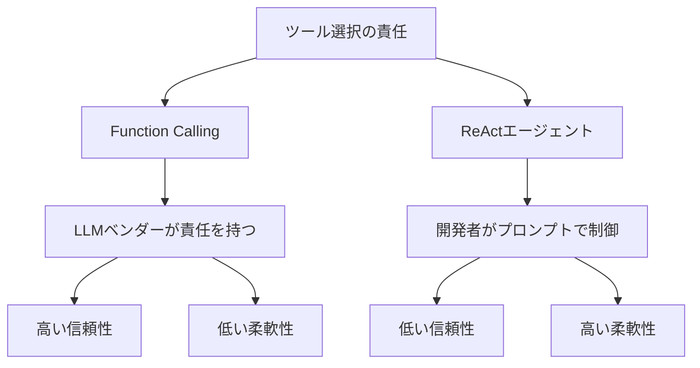

import Quiz from '@/components/content/Quiz.astro'

## 概要

このレクチャーでは，Function CallingとReActエージェントの違いを「責任の所在」という観点から比較し，それぞれの利点と欠点を理解します．

## 責任の所在: サーバーレスとの類似

ソフトウェア開発においては，「誰がツール選択の責任を負うか」が重要な判断基準です．サーバーレスで可用性やスケーラビリティの責任をクラウドプロバイダーに委譲するのと同様に，エージェント開発でもツール選択の責任を委譲できます．

## Function Calling

- ツール選択の責任は**LLMベンダー**にある
- 開発者は関数のスキーマ（名前，引数，説明）を提供する
- LLMが応答内でどのツールをどの引数で呼ぶかを決定する
- 内部のロジックは不透明（おそらく専用にファインチューニングされたモデル）
- 共有責任モデル: ツールの説明は開発者が明確に定義する必要がある

サポートするベンダー: OpenAI，Google，Anthropic，Mistral など

## ReActエージェント

- ツール選択の責任は**ReActプロンプト**（つまり開発者）にある
- ReAct論文に基づいた精巧なプロンプトがLLMを推論エンジンに変える
- Chain of ThoughtとFew-shotプロンプティングを組み合わせている
- LLMの出力をLangChainが正規表現でパースする
- 開発者がプロンプトを自由にカスタマイズできる（高い柔軟性）

## 比較表

| 項目 | Function Calling | ReAct |
|------|-----------------|-------|
| ツール選択の責任 | LLMベンダー | 開発者（プロンプト） |
| 柔軟性 | 低い | 高い |
| 信頼性 | 高い | 低い |
| 推論の透明性 | 低い | 高い |
| カスタマイズ性 | 限定的 | 自由 |
| 開発者の負担 | 少ない | 多い |

## どちらが良いか

一概にどちらが優れているとは言えません:

- 完全な制御と柔軟性が必要 → ReActプロンプト
- 信頼性と簡便さを重視 → Function Calling

実際のところ，現在のベストプラクティスはFunction Callingであり，ReActプロンプトを直接使用することは稀になっています．

## まとめ

- Function Callingはツール選択の責任をLLMベンダーに委譲する
- ReActはプロンプトを通じて開発者がツール選択を制御する
- Function Callingは信頼性が高く開発者の負担が少ない
- ReActは柔軟性が高いが信頼性とメンテナンスに課題がある

<Quiz questions={[
  {
    question: "Function Callingにおけるツール選択の責任者は誰ですか？",
    options: [
      "開発者",
      "LLMベンダー",
      "エンドユーザー",
      "LangChainフレームワーク"
    ],
    answer: 1,
    explanation: "Function Callingではツール選択の責任はLLMベンダーにあります．開発者は関数のスキーマを提供し，LLMが応答内でどのツールを呼ぶかを決定します．"
  },
  {
    question: "サーバーレスとの類似として正しい説明はどれですか？",
    options: [
      "両方ともコードを書く必要がない",
      "サーバーレスが可用性の責任をクラウドに委譲するように，Function Callingはツール選択の責任をLLMベンダーに委譲する",
      "両方ともオフラインで動作する",
      "両方とも無料で使える"
    ],
    answer: 1,
    explanation: "サーバーレスで可用性やスケーラビリティの責任をクラウドプロバイダーに委譲するのと同様に，Function Callingではツール選択の責任をLLMベンダーに委譲します．"
  },
  {
    question: "ReActエージェントのツール選択を制御する主な手段は何ですか？",
    options: [
      "Function Callingのスキーマ",
      "ReActプロンプト（開発者が設計）",
      "LLMの内部パラメータ",
      "環境変数の設定"
    ],
    answer: 1,
    explanation: "ReActエージェントではツール選択の責任はReActプロンプト，つまり開発者にあります．ReAct論文に基づいた精巧なプロンプトがLLMを推論エンジンに変えます．"
  },
  {
    question: "完全な制御と柔軟性が必要な場合に適しているのはどちらですか？",
    options: [
      "Function Calling",
      "ReActプロンプト",
      "どちらも同じ",
      "どちらも適さない"
    ],
    answer: 1,
    explanation: "完全な制御と柔軟性が必要な場合はReActプロンプトが適しています．開発者がプロンプトを自由にカスタマイズできるため高い柔軟性があります．"
  },
  {
    question: "Function Callingの共有責任モデルとして正しい説明はどれですか？",
    options: [
      "LLMベンダーがすべての責任を負う",
      "開発者がすべての責任を負う",
      "ツールの説明は開発者が明確に定義し，ツール選択の判断はLLMベンダーが担う",
      "ユーザーがツール選択の責任を負う"
    ],
    answer: 2,
    explanation: "共有責任モデルでは，ツールの説明は開発者が明確に定義する必要があり，その説明に基づいてツール選択の判断はLLMベンダーが担います．"
  }
]} />

