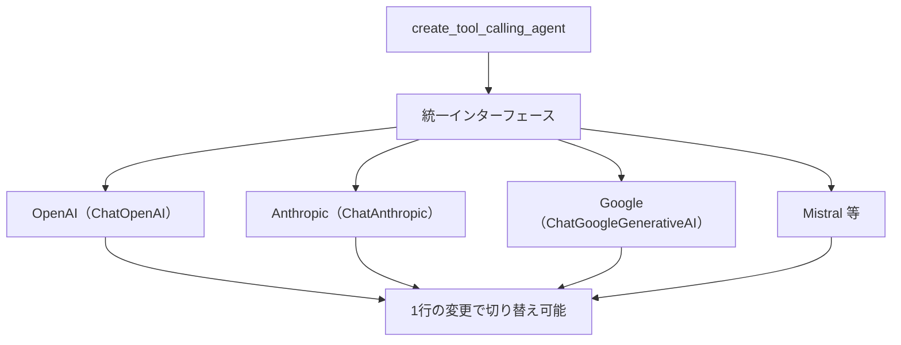

import Quiz from '@/components/content/Quiz.astro'

## 概要

このレクチャーでは，LangChainのTool Calling機能がどのようにマルチベンダー対応を実現しているかを学び，OpenAIとAnthropicを簡単に切り替えるデモを通じて実践します．

## LangChainのTool Calling統一インターフェース

以前はOpenAI専用の`function_calling_agent`しかなく，他のベンダーでFunction Callingを使うのは困難でした．現在のLangChainは全ての主要ベンダーに対して統一インターフェースを提供しています．

主要コンポーネント:
- `bind_tools`: 関数をLLMにバインドする
- `tool_calls`: LLMのレスポンスに含まれるツール呼び出し情報
- `tool_calling_agent`: ベンダーに依存しないエージェント作成関数

## デモ: OpenAI vs Anthropic

```python
from langchain.agents import create_tool_calling_agent
from langchain_openai import ChatOpenAI
from langchain_anthropic import ChatAnthropic

# ツール定義
tools = [multiply_tool, tavily_search_tool]

# OpenAIで実行
llm_openai = ChatOpenAI(model="gpt-4")
agent_openai = create_tool_calling_agent(llm_openai, tools, prompt)

# Anthropicで実行（たった1行の変更）
llm_anthropic = ChatAnthropic(model="claude-sonnet")
agent_anthropic = create_tool_calling_agent(llm_anthropic, tools, prompt)
```

## LangSmithでの比較

- OpenAI: 2回のLLMコール（1回目でツール2つを並列呼び出し，2回目で要約）
- Anthropic: 3回のLLMコール（1回目でツール1つ，2回目でもう1つ，3回目で要約）

モデルによってツール呼び出しの戦略が異なりますが，最終結果は同等です．



## マルチベンダー対応の重要性

- ベンダーロックインを避けられる
- 各ベンダーの最新・最強モデルを柔軟に試せる
- コスト最適化のためにモデルを切り替えられる
- 「靴下を履き替えるように」モデルを切り替えられる

## まとめ

- LangChainはTool Callingの統一インターフェースを提供している
- `create_tool_calling_agent`でベンダーに依存しないエージェントを作成できる
- LLMの切り替えは1行の変更で可能
- LangSmithで各ベンダーのトレースを比較・分析できる

<Quiz questions={[
  {
    question: "LangChainのTool Calling統一インターフェースの主要コンポーネントに含まれないものはどれですか？",
    options: [
      "bind_tools",
      "tool_calls",
      "tool_calling_agent",
      "react_prompt"
    ],
    answer: 3,
    explanation: "統一インターフェースの主要コンポーネントはbind_tools，tool_calls，tool_calling_agentです．react_promptはReActエージェント固有のもので，Tool Callingでは不要です．"
  },
  {
    question: "OpenAIとAnthropicでLLMを切り替える際に必要な変更は何ですか？",
    options: [
      "プロンプトテンプレート全体の書き換え",
      "LLMインスタンスの初期化1行の変更",
      "ツール定義の再設計",
      "AgentExecutorの再実装"
    ],
    answer: 1,
    explanation: "LangChainの統一インターフェースにより，LLMの切り替えはLLMインスタンスの初期化1行の変更で可能です．"
  },
  {
    question: "LangSmithでOpenAIとAnthropicのトレースを比較した結果，何が分かりましたか？",
    options: [
      "両方とも全く同じ数のLLMコールを行う",
      "モデルによってツール呼び出しの戦略が異なるが，最終結果は同等",
      "Anthropicの方が常に高速",
      "OpenAIの方が常に正確"
    ],
    answer: 1,
    explanation: "OpenAIは2回のLLMコールでツール2つを並列呼び出しし，Anthropicは3回のLLMコールで1つずつ呼び出すなど，戦略は異なりますが最終結果は同等です．"
  },
  {
    question: "マルチベンダー対応が重要な理由として正しくないものはどれですか？",
    options: [
      "ベンダーロックインを避けられる",
      "各ベンダーの最新モデルを柔軟に試せる",
      "すべてのベンダーで完全に同じ結果が保証される",
      "コスト最適化のためにモデルを切り替えられる"
    ],
    answer: 2,
    explanation: "マルチベンダー対応の利点はベンダーロックイン回避やコスト最適化ですが，すべてのベンダーで完全に同じ結果が保証されるわけではありません．"
  },
  {
    question: "以前のLangChainでFunction Callingを使う際の課題は何でしたか？",
    options: [
      "Function Calling自体が存在しなかった",
      "OpenAI専用のfunction_calling_agentしかなく，他のベンダーでは困難だった",
      "パフォーマンスが低すぎた",
      "コストが高すぎた"
    ],
    answer: 1,
    explanation: "以前はOpenAI専用のfunction_calling_agentしかなく，他のベンダーでFunction Callingを使うのは困難でした．現在は統一インターフェースが提供されています．"
  }
]} />

