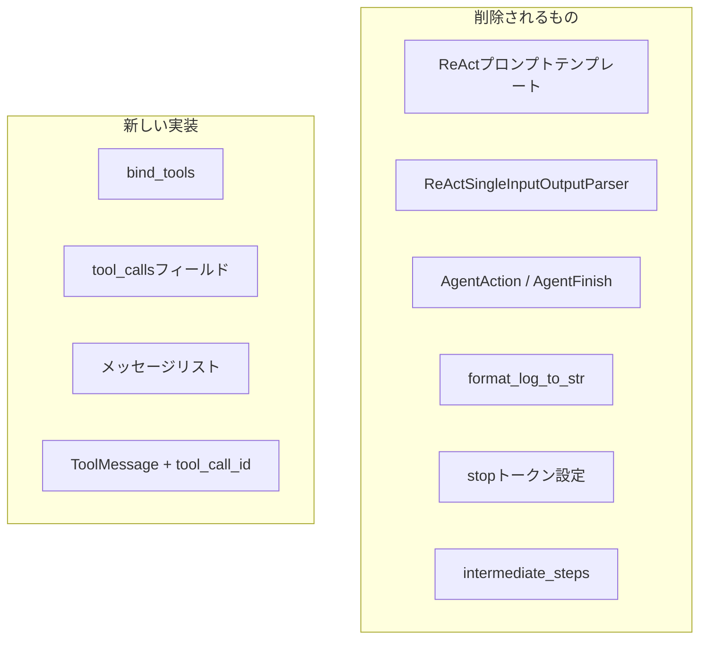

import Quiz from '@/components/content/Quiz.astro'

## 概要

このレクチャーでは，前のセクションで構築したReActエージェントをTool Callingに移行します．Cursorを使ったコーディングでdiffを確認しながら，どれだけのコードが簡略化されるかを実感します．

## 削除されるもの

Tool Callingへの移行で，以下が不要になります:

- `format_log_to_str`: 推論履歴のフォーマット関数
- `ReActSingleInputOutputParser`: 正規表現による出力パーサー
- `AgentAction` / `AgentFinish`: 判定用クラス
- ReActプロンプトテンプレート全体
- `render_text_description`: ツール説明の文字列化
- `stop`トークンの設定
- `intermediate_steps`: 中間ステップの管理

## Tool Callingの実装

```python
from langchain_openai import ChatOpenAI
from langchain_core.messages import HumanMessage, ToolMessage

# LLMにツールをバインド
llm = ChatOpenAI(temperature=0)
llm_with_tools = llm.bind_tools(tools)

# メッセージリスト（Agent Scratchpadの代わり）
messages = [HumanMessage(content=user_input)]

while True:
    ai_message = llm_with_tools.invoke(messages)
    tool_calls = ai_message.tool_calls

    if not tool_calls:
        # ツール呼び出しなし → 最終回答
        print(ai_message.content)
        break

    # ツール呼び出しあり → 実行
    messages.append(ai_message)

    for tool_call in tool_calls:
        tool_name = tool_call["name"]
        tool_args = tool_call["args"]
        tool_call_id = tool_call["id"]

        tool_to_use = find_tool_by_name(tools, tool_name)
        observation = tool_to_use.invoke(tool_args)

        # ToolMessageとして結果を追加
        messages.append(
            ToolMessage(
                content=str(observation),
                tool_call_id=tool_call_id
            )
        )
```



## 主な変更点

### Agent Scratchpad → メッセージリスト
`intermediate_steps`の代わりに，メッセージリストに全履歴を保持します．LLMはこのメッセージ履歴から推論を行います．

### 出力パーサー → tool_callsフィールド
正規表現パースの代わりに，LLMレスポンスの`tool_calls`フィールドから直接ツール情報を取得します．

### AgentAction/AgentFinish → tool_callsの有無
`tool_calls`が空リストなら最終回答，要素があればツール実行が必要です．

### tool_call_id
ToolMessageには`tool_call_id`を含めることで，どのツール呼び出しに対する結果かをLLMが正しくマッチングできます．並列ツール呼び出しの際に特に重要です．

## まとめ

- Tool CallingはReActプロンプトの大量のボイラープレートコードを削除できる
- 正規表現パースが不要になり，信頼性が大幅に向上する
- メッセージベースの会話フローで履歴を管理する
- `bind_tools`で簡単にLLMにツールをバインドできる
- `tool_call_id`で並列ツール呼び出しにも対応できる

<Quiz questions={[
  {
    question: "Tool Callingへの移行で不要になるものとして正しくないものはどれですか？",
    options: [
      "ReActプロンプトテンプレート",
      "ReActSingleInputOutputParser",
      "find_tool_by_name関数",
      "stopトークンの設定"
    ],
    answer: 2,
    explanation: "find_tool_by_name関数はTool Callingでもツール名からツールを検索するために引き続き必要です．削除されるのはReActプロンプト，パーサー，stopトークン等です．"
  },
  {
    question: "Tool CallingでAgent Scratchpadの代わりに使用するものは何ですか？",
    options: [
      "データベース",
      "メッセージリスト",
      "ファイルシステム",
      "キャッシュ"
    ],
    answer: 1,
    explanation: "Tool Callingではintermediate_stepsとAgent Scratchpadの代わりに，メッセージリストに全履歴を保持し，LLMはこのメッセージ履歴から推論を行います．"
  },
  {
    question: "tool_call_idが特に重要になるのはどのような場面ですか？",
    options: [
      "単一のツール呼び出しの場合",
      "並列ツール呼び出しの場合",
      "ツールがエラーを返す場合",
      "LLMが最終回答を返す場合"
    ],
    answer: 1,
    explanation: "tool_call_idは並列ツール呼び出しの際に特に重要です．どのツール呼び出しに対する結果かをLLMが正しくマッチングするために必要です．"
  },
  {
    question: "Tool Callingでツール実行が必要かどうかを判定する方法は何ですか？",
    options: [
      "AgentActionかAgentFinishかをisinstanceで判定する",
      "ai_message.tool_callsが空リストかどうかを確認する",
      "LLMの応答テキストを正規表現でパースする",
      "stopトークンが含まれているか確認する"
    ],
    answer: 1,
    explanation: "Tool Callingではtool_callsが空リストなら最終回答，要素があればツール実行が必要です．AgentAction/AgentFinishの判定は不要になりました．"
  },
  {
    question: "ツール実行結果をLLMに返す際に使用するメッセージ型は何ですか？",
    options: [
      "HumanMessage",
      "AIMessage",
      "ToolMessage",
      "SystemMessage"
    ],
    answer: 2,
    explanation: "ツール実行結果はToolMessageとしてメッセージリストに追加します．ToolMessageにはcontent（実行結果）とtool_call_id（呼び出し元の識別子）を含めます．"
  }
]} />

