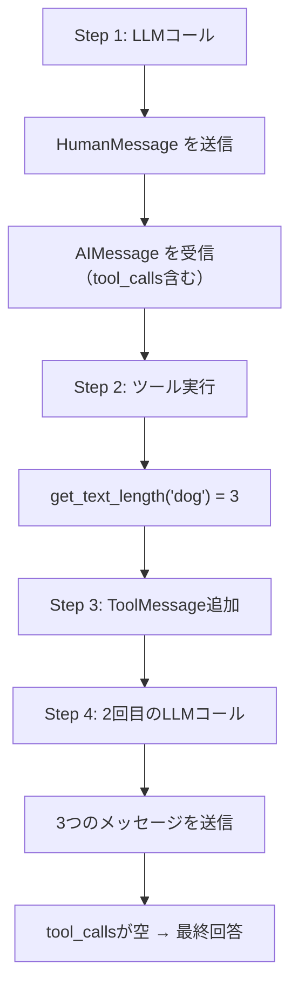

import Quiz from '@/components/content/Quiz.astro'

## 概要

このレクチャーでは，Tool Callingエージェントをデバッグモードで実行し，各ステップの中間結果を詳細に確認します．

## デバッグの流れ

### Step 1: LLMの呼び出し

ユーザーの質問「What is the length of the word dog?」をLLMに送信し，AIメッセージのレスポンスを確認します．

`tool_calls`フィールドには以下の情報が含まれています:
- 呼び出す関数名: `get_text_length`
- 引数: `{"text": "dog"}`
- ツールコールID

### Step 2: ツールの実行

`tool_calls`から情報を抽出し，`find_tool_by_name`でツールを取得して実行します．結果（observation）は`3`になります．

### Step 3: ToolMessageの追加

ツール実行結果をToolMessageとしてメッセージリストに追加します．

### Step 4: 2回目のLLMコール

メッセージリストには3つのメッセージが含まれています:
1. HumanMessage（ユーザーの質問）
2. AIMessage（ツール呼び出し情報を含む）
3. ToolMessage（ツール実行結果）

2回目のLLMコールでは`tool_calls`が空リストになり，`content`に最終回答が含まれます．



## メッセージリストの進化

```python
# 初回
messages = [HumanMessage("What is the length of the word dog?")]

# 1回目のLLMコール後
messages = [
    HumanMessage("What is the length of the word dog?"),
    AIMessage(tool_calls=[{...}]),
    ToolMessage(content="3", tool_call_id="...")
]

# 2回目のLLMコール → 最終回答
# "The length of the word 'dog' is 3 characters."
```

## まとめ

- デバッグモードで各ステップの変数を確認することで理解が深まる
- `tool_calls`フィールドの有無でツール実行か最終回答かを判定する
- メッセージリストはイテレーションごとに成長し，LLMに全履歴を提供する
- ToolMessageの`tool_call_id`でツール呼び出しと結果を正確にマッチングする

<Quiz questions={[
  {
    question: "1回目のLLMコールのAIMessageに含まれるtool_callsの情報は何ですか？",
    options: [
      "最終回答のテキスト",
      "呼び出す関数名，引数，ツールコールID",
      "プロンプトテンプレート",
      "エラーメッセージ"
    ],
    answer: 1,
    explanation: "tool_callsフィールドには呼び出す関数名（get_text_length），引数（text: 'dog'），ツールコールIDが含まれています．"
  },
  {
    question: "2回目のLLMコールの入力として渡されるメッセージの数はいくつですか？",
    options: [
      "1つ（HumanMessageのみ）",
      "2つ（HumanMessageとAIMessage）",
      "3つ（HumanMessage，AIMessage，ToolMessage）",
      "4つ以上"
    ],
    answer: 2,
    explanation: "2回目のLLMコールではHumanMessage（ユーザーの質問），AIMessage（ツール呼び出し情報），ToolMessage（ツール実行結果）の3つのメッセージが渡されます．"
  },
  {
    question: "2回目のLLMコールでtool_callsが空リストになる意味は何ですか？",
    options: [
      "エラーが発生した",
      "ツールが見つからなかった",
      "ツール呼び出しが不要で，最終回答がcontentに含まれる",
      "追加のツール実行が必要"
    ],
    answer: 2,
    explanation: "tool_callsが空リストの場合，追加のツール呼び出しは不要で，最終回答がAIMessageのcontentフィールドに含まれています．"
  },
  {
    question: "デバッグモードで各ステップの変数を確認する主な目的は何ですか？",
    options: [
      "コードの実行速度を測定するため",
      "中間結果を詳細に確認し，エージェントの動作を理解するため",
      "メモリ使用量を最適化するため",
      "テストカバレッジを計測するため"
    ],
    answer: 1,
    explanation: "デバッグモードで各ステップの変数（tool_calls，observation，メッセージリスト等）を確認することで，エージェントの動作を詳細に理解できます．"
  },
  {
    question: "メッセージリストがイテレーションごとに成長する理由は何ですか？",
    options: [
      "古いメッセージが自動的にコピーされるから",
      "各ステップのAIMessageとToolMessageが追加されることでLLMに全履歴を提供するため",
      "システムメッセージが毎回追加されるから",
      "ユーザーの追加質問が自動的に生成されるから"
    ],
    answer: 1,
    explanation: "メッセージリストはAIMessage（ツール呼び出し情報）とToolMessage（実行結果）が追加されることで成長し，LLMに全履歴を提供します．"
  }
]} />

