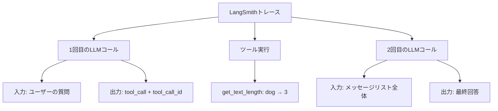

import Quiz from '@/components/content/Quiz.astro'

## 概要

このレクチャーでは，LangSmithでTool Callingエージェントのトレースを確認し，2回のLLMコールとツール実行の全体的な流れを視覚的に把握します．



## LangSmithのトレース

トレースには以下が表示されます:

### 1回目のLLMコール
- 入力: ユーザーの質問
- 結果: `get_text_length`へのtool callと，引数`text=dog`
- ツールコールIDも確認できる

### ツール実行
- `get_text_length`関数の実行
- 入力: `dog`
- 出力: `3`

### 2回目のLLMコール
- 入力: メッセージリスト全体（ユーザー入力 + ツールコール + ツール結果）
- 出力: 最終回答「The length of the word 'dog' is 3 characters.」

## tool_call_idの重要性

`tool_call_id`をライフサイクル全体で伝播させることで，LangSmithがツール実行を正しくトラッキングできます．トレース上で，ツール呼び出しとその結果が明確にリンクされて表示されます．

## Claude Codeによるコミット

Cloud Code（AIコーディングエディタ）を使ってコミットメッセージを自動生成する例も紹介されています:

```
Replace react algorithm with LangChain tool calling approach
- Remove manual react prompt template and parsing logic
- Implement binding tools for direct LLM integration
- Replace agent scratchpad tracking with message-based conversation flow
```

## まとめ

- LangSmithでTool Callingエージェントの完全なトレースを確認できる
- 2回のLLMコール（ツール選択 + 最終回答生成）とツール実行が明確に可視化される
- `tool_call_id`によりツール呼び出しと結果が正しくリンクされる
- ReActプロンプトからTool Callingへの移行は大幅なコード簡略化をもたらす

<Quiz questions={[
  {
    question: "LangSmithのトレースでtool_call_idが伝播される目的は何ですか？",
    options: [
      "認証のため",
      "ツール呼び出しとその結果を正しくリンクしてトラッキングするため",
      "課金計算のため",
      "ログのフィルタリングのため"
    ],
    answer: 1,
    explanation: "tool_call_idをライフサイクル全体で伝播させることで，LangSmithがツール呼び出しとその結果を正しくリンクしてトラッキングできます．"
  },
  {
    question: "Tool Callingエージェントのトレースで確認できるLLMコールの回数は何回ですか？",
    options: [
      "1回",
      "2回（ツール選択と最終回答生成）",
      "3回",
      "ツールの数と同じ回数"
    ],
    answer: 1,
    explanation: "この例では2回のLLMコールが行われます．1回目でツール選択（get_text_length），2回目で全結果を踏まえた最終回答の生成です．"
  },
  {
    question: "ReActプロンプトからTool Callingへの移行で得られるコード上の変化はどれですか？",
    options: [
      "コード量が増加する",
      "大幅なコード簡略化がもたらされる",
      "コード量は変わらない",
      "新しいプロンプトテンプレートが必要になる"
    ],
    answer: 1,
    explanation: "Tool Callingへの移行により，ReActプロンプト，パーサー，stopトークン設定等の大量のボイラープレートコードが削除され，大幅なコード簡略化が実現されます．"
  },
  {
    question: "コミットメッセージで要約されているTool Calling移行の3つの変更点は何ですか？",
    options: [
      "プロンプト追加，パーサー追加，ツール追加",
      "手動パースロジック削除，bind_toolsでLLM統合，メッセージベースの会話フロー",
      "テスト追加，ドキュメント更新，リファクタリング",
      "モデル変更，API変更，データベース変更"
    ],
    answer: 1,
    explanation: "コミットメッセージでは，手動のReActプロンプトとパースロジックの削除，bind_toolsでの直接LLM統合，メッセージベースの会話フローへの移行が要約されています．"
  },
  {
    question: "トレース上で1回目のLLMコールの結果に含まれるツール情報は何ですか？",
    options: [
      "ツールのソースコード",
      "get_text_lengthへのtool callと引数text=dog",
      "ツールの実行結果3",
      "最終回答テキスト"
    ],
    answer: 1,
    explanation: "1回目のLLMコールの結果にはget_text_lengthへのtool callと引数text=dog，およびツールコールIDが含まれています．"
  }
]} />

