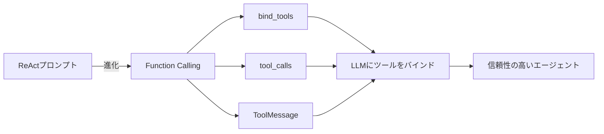

import Quiz from '@/components/content/Quiz.astro'

## 概要

このクイズでは，ReActプロンプティングからモダンなTool Callingへの進化について，これまでに学んだ内容の理解度を確認します．

## 主要なトピック

- ReActプロンプトの仕組みと限界
- Function Calling / Tool Callingの基本概念
- ReActとFunction Callingの比較（責任の所在，信頼性，柔軟性）
- LangChainにおけるTool Callingの統一インターフェース
- `bind_tools`，`tool_calls`，`ToolMessage`の役割
- stopトークンとパースエラーの関係

## 学習のポイント

このセクションで学んだ主要な概念を復習しましょう:

- Function CallingはReActプロンプトの自然な進化形である
- Tool Callingにより正規表現パースが不要になり，信頼性が向上する
- LangChainの統一インターフェースで複数のLLMベンダーを簡単に切り替えられる
- メッセージベースの会話フローでエージェントの履歴を管理する

<Quiz questions={[
  {
    question: "Function CallingがReActプロンプトの「自然な進化形」と呼ばれる理由は何ですか？",
    options: [
      "ReActプロンプトを改良して信頼性を上げたから",
      "ReActの目的（ツール選択と実行）を維持しつつ，テキストパースの問題を根本的に解決したから",
      "ReActプロンプトの上に追加レイヤーとして機能するから",
      "全く新しい概念で，ReActとは無関係だから"
    ],
    answer: 1,
    explanation: "Function CallingはReActの目的であるツール選択と実行を維持しつつ，テキストの正規表現パースという本質的な問題を根本的に解決した進化形です．"
  },
  {
    question: "bind_toolsメソッドの役割は何ですか？",
    options: [
      "ツールを実行する",
      "ツールのスキーマをLLMにバインドし，Function Callingで利用可能にする",
      "ツールの実行結果を保存する",
      "ツールの説明文を自動生成する"
    ],
    answer: 1,
    explanation: "bind_toolsはツールのスキーマ（名前，引数，説明）をLLMにバインドし，LLMがFunction Callingでそれらのツールを利用できるようにします．"
  },
  {
    question: "Tool Callingで正規表現パースが不要になる理由は何ですか？",
    options: [
      "LLMがテキストを返さなくなるから",
      "LLMがJSON形式の構造化データでツール情報を返すから",
      "パースが自動化されるから",
      "エラーハンドリングが改善されたから"
    ],
    answer: 1,
    explanation: "Tool CallingではLLMがtool_callsフィールドにJSON形式の構造化データでツール情報を返すため，テキストの正規表現パースが不要になります．"
  },
  {
    question: "LangChainの統一インターフェースが解決する問題は何ですか？",
    options: [
      "LLMの応答速度の改善",
      "複数のLLMベンダー間でのシームレスな切り替え",
      "プロンプトの自動最適化",
      "メモリ使用量の削減"
    ],
    answer: 1,
    explanation: "LangChainの統一インターフェースにより，create_tool_calling_agentで作成したエージェントは，OpenAI，Anthropic等の複数のLLMベンダー間をシームレスに切り替えることができます．"
  },
  {
    question: "stopトークンとパースエラーの関係について正しい説明はどれですか？",
    options: [
      "stopトークンはパースエラーの原因となる",
      "stopトークンの設定不備はパースエラーの主要な原因であり，Tool Callingはこの問題を解消する",
      "パースエラーはstopトークンと無関係",
      "stopトークンはTool Callingでも必要"
    ],
    answer: 1,
    explanation: "ReActプロンプトではstopトークンの設定不備がパースエラーの主要な原因の一つでした．Tool Callingに移行することで，stopトークンの設定自体が不要になり，この問題は解消されます．"
  }
]} />

