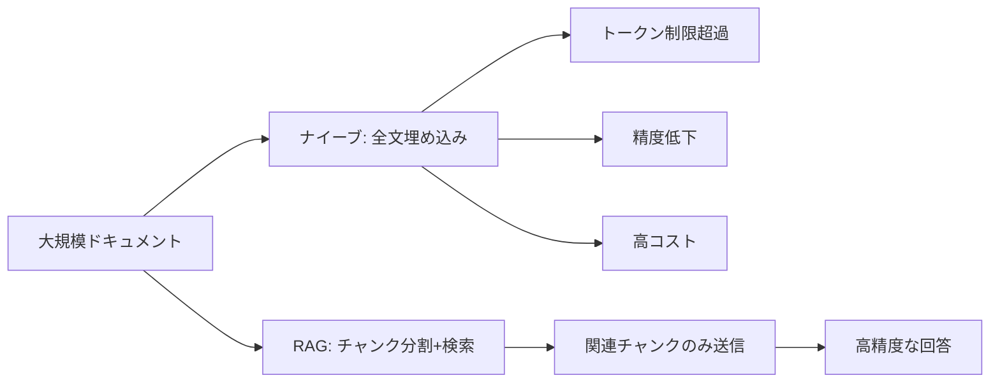
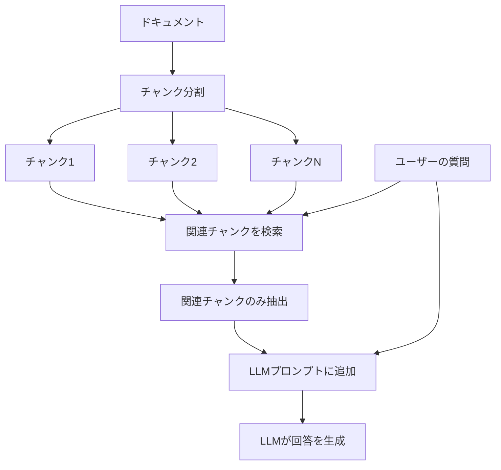

import Quiz from '@/components/content/Quiz.astro'

## 概要

このレクチャーでは，RAG（Retrieval Augmented Generation）の動機と基本概念を学びます．大規模ドキュメントに対する質問応答の課題と，その解決策としてのRAGを理解します．

## 問題設定

数百ページの大規模ドキュメント（例: 書籍，金融文書）に対してLLMに質問したい場合:
- 特定の段落に回答が存在する
- プライベートデータはLLMの学習データに含まれない
- LLMはそのデータの存在を知らない

## ナイーブな解決策（全文埋め込み）

ドキュメント全体をプロンプトに詰め込む方法:

- トークン制限を超える可能性がある
- Needle in the Haystack問題: 長いプロンプトでLLMの精度が低下する
- コストが高い（トークン数に比例）
- レイテンシが大きい（処理時間が長い）

## RAGによる解決

1. ドキュメントを小さなチャンクに分割する
2. ユーザーの質問に最も関連するチャンクを検索する
3. 関連チャンクだけをLLMのプロンプトに含める
4. LLMが関連コンテキストに基づいて回答を生成する

### RAGの意味

- Retrieval（検索）: 関連するチャンクを取得
- Augmentation（拡張）: プロンプトにコンテキストを追加
- Generation（生成）: LLMが回答を生成

## RAGの利点

- トークン制限を超えない
- Needle in the Haystack問題を回避
- コストが低い（少ないトークンで済む）
- 処理速度が速い

## RAGの課題

- 前処理（チャンキング）の深さ
- チャンクの適切なサイズと分割戦略
- 検索メカニズムの精度
- 関連チャンクの十分性

## まとめ

- RAGは大規模ドキュメントに対する質問応答の標準的な手法
- 全文埋め込みは4つの主要な問題を抱える
- RAGは関連チャンクのみをLLMに提供することで全ての問題を解決する
- チャンキングと検索の質がRAGの性能を左右する

<Quiz questions={[
  {
    question: "RAGの「R」は何を意味しますか？",
    options: [
      "Reasoning（推論）",
      "Retrieval（検索）",
      "Replication（複製）",
      "Rendering（描画）"
    ],
    answer: 1,
    explanation: "RAGはRetrieval Augmented Generationの略で，Rは関連するチャンクを「検索（Retrieval）」することを意味します．"
  },
  {
    question: "ナイーブな全文埋め込み方式の問題点として正しくないものはどれですか？",
    options: [
      "トークン制限を超える可能性がある",
      "チャンキングの前処理が必要になる",
      "Needle in the Haystack問題が発生する",
      "コストが高くなる"
    ],
    answer: 1,
    explanation: "チャンキングの前処理が必要になるのはRAG方式の特徴であり，ナイーブな全文埋め込み方式の問題点ではありません．"
  },
  {
    question: "Needle in the Haystack問題とは何ですか？",
    options: [
      "LLMがプロンプトを理解できない問題",
      "長いプロンプトでLLMの精度が低下する問題",
      "ドキュメントが見つからない問題",
      "APIレート制限に達する問題"
    ],
    answer: 1,
    explanation: "Needle in the Haystack問題は，プロンプトが長くなるほどLLMの回答精度が低下する現象を指します．"
  },
  {
    question: "RAGにおける「Augmentation」はどの処理を指しますか？",
    options: [
      "ドキュメントをチャンクに分割する",
      "ベクトルデータベースを構築する",
      "プロンプトに関連コンテキストを追加する",
      "LLMの回答を後処理する"
    ],
    answer: 2,
    explanation: "Augmentation（拡張）は，検索した関連チャンクをプロンプトに追加してコンテキストを拡張する処理を意味します．"
  },
  {
    question: "RAGが全文埋め込み方式の問題を解決できる理由は何ですか？",
    options: [
      "より高性能なLLMを使用するから",
      "ドキュメントを自動的に要約するから",
      "関連するチャンクのみをLLMに送信するから",
      "複数のLLMを並列で実行するから"
    ],
    answer: 2,
    explanation: "RAGは関連チャンクのみをLLMに送信するため，トークン制限，精度低下，コスト，レイテンシの全ての問題を解決できます．"
  }
]} />
