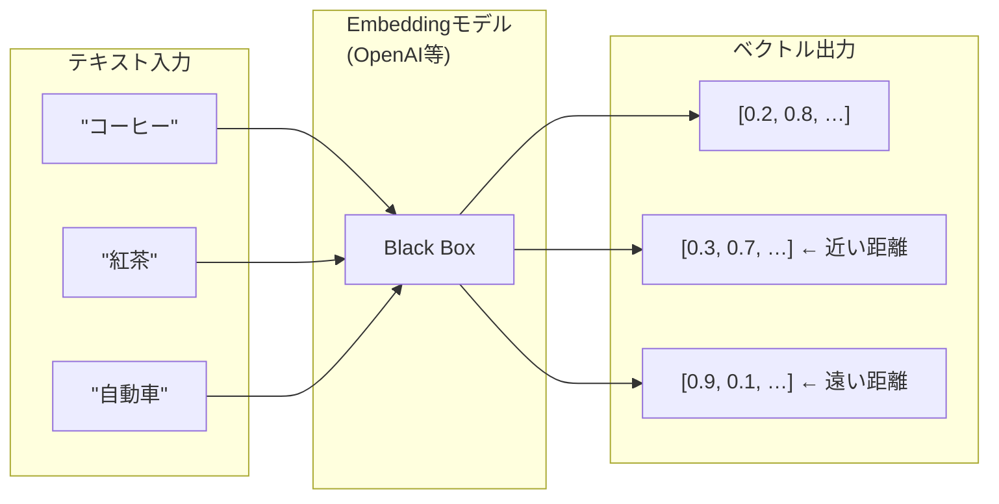
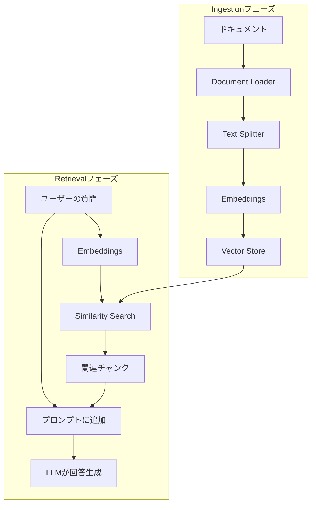

import Quiz from '@/components/content/Quiz.astro'

## 概要

このレクチャーでは，RAGを実装するために必要な主要コンポーネント（Document Loader，Text Splitter，Embeddings，Vector Store）を理論的に学びます．

## Document Loader

LangChainのDocument Loaderは，様々なデータソースからテキストデータを読み込む抽象化レイヤーです．Google Drive，Notion，PDF，WhatsAppなど，同一インターフェースで扱えます．

## Text Splitter

長いテキストを小さなチャンクに分割します．チャンクサイズとチャンクオーバーラップを設定でき，文脈を保持しながら分割します．

## Embeddings（埋め込み）

テキストをベクトル空間の数値配列に変換する技術です．

- 類似した意味のテキストは，ベクトル空間で近くに配置される
- 言語が異なっても意味が同じなら近い距離になる
- Embeddingモデルはテキストを入力し，ベクトルを出力するブラックボックス

## Vector Store（ベクトルデータベース）

ベクトルを永続化し，類似ベクトルの高速検索を可能にするデータベースです．Pineconeなどのマネージドサービスを利用できます．

## RAGの全体フロー

1. ドキュメントを読み込み（Document Loader）
2. チャンクに分割（Text Splitter）
3. 各チャンクをベクトル化（Embeddings）
4. ベクトルをデータベースに保存（Vector Store）
5. ユーザーの質問をベクトル化
6. 類似ベクトルを検索（Similarity Search）
7. 関連チャンクをプロンプトに追加
8. LLMが回答を生成

## まとめ

- RAGの実装には4つの主要コンポーネントが必要
- Document Loaderは様々なデータソースに統一インターフェースを提供する
- Embeddingsはテキストの意味を数値ベクトルで表現する
- Vector Storeはベクトルの永続化と類似検索を担当する

<Quiz questions={[
  {
    question: "Document Loaderの主な役割は何ですか？",
    options: [
      "テキストをベクトルに変換する",
      "様々なデータソースからテキストデータを統一インターフェースで読み込む",
      "テキストを小さなチャンクに分割する",
      "ベクトルの類似検索を実行する"
    ],
    answer: 1,
    explanation: "Document Loaderは，Google Drive，Notion，PDFなど様々なデータソースからテキストデータを同一インターフェースで読み込む抽象化レイヤーです．"
  },
  {
    question: "Embeddingsモデルの出力は何ですか？",
    options: [
      "テキストの要約文",
      "分類ラベル",
      "数値のベクトル配列",
      "キーワードのリスト"
    ],
    answer: 2,
    explanation: "Embeddingsモデルはテキストを入力として受け取り，ベクトル空間における数値の配列（ベクトル）を出力します．"
  },
  {
    question: "意味が似ているテキスト同士のベクトルにはどのような特徴がありますか？",
    options: [
      "ベクトルの長さが同じになる",
      "ベクトル空間で遠くに配置される",
      "ベクトル空間で近くに配置される",
      "ベクトルの次元数が変わる"
    ],
    answer: 2,
    explanation: "良いEmbeddingsモデルでは，意味が類似したテキストのベクトルはベクトル空間で近い距離に配置されます．言語が異なっても同様です．"
  },
  {
    question: "Text Splitterの「chunk_overlap」パラメータの目的は何ですか？",
    options: [
      "チャンクの最大サイズを制限する",
      "分割されたチャンク間で文脈の連続性を保つ",
      "ベクトルの次元数を調整する",
      "検索結果の数を制御する"
    ],
    answer: 1,
    explanation: "chunk_overlapはチャンク間で重複する文字数を指定し，分割時に文脈が途切れないよう連続性を保つ役割を果たします．"
  },
  {
    question: "Vector Storeが提供する主な機能はどれですか？",
    options: [
      "テキストの文法チェックと校正",
      "ベクトルの永続化と類似ベクトルの高速検索",
      "LLMの学習データの管理",
      "APIキーの暗号化と管理"
    ],
    answer: 1,
    explanation: "Vector Store（ベクトルデータベース）は，ベクトルを永続的に保存し，類似ベクトルの高速検索を可能にするデータベースです．"
  }
]} />
