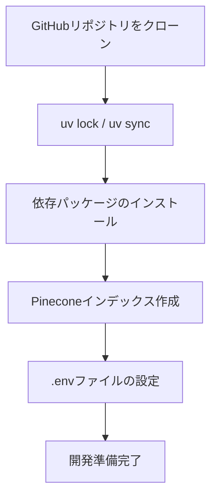

import Quiz from '@/components/content/Quiz.astro'

## 概要

このレクチャーでは，RAGプロジェクトの環境構築を行います．リポジトリのクローン，Pineconeインデックスの作成，環境変数の設定を行い，開発を始める準備を整えます．

## プロジェクトのセットアップ

GitHubリポジトリの`project/rag-gist`ブランチからプロジェクトをクローンします．

### 依存パッケージ

- `langchain`: LangChainコアパッケージ
- `langchain-community`: コミュニティ提供のDocument Loader
- `langchain-openai`: OpenAI Embeddings / LLM
- `langchain-pinecone`: Pineconeベクトルストア連携
- `python-dotenv`: 環境変数の読み込み

### 環境のセットアップ

```bash
uv lock    # 依存関係の解決
uv sync    # パッケージのインストール
```



## Pineconeインデックスの作成

1. Pinecone.ioにログイン
2. 新しいインデックスを作成
3. Embeddingsモデル: `text-embedding-3-small`（OpenAI）
4. Dimension: 1536
5. メトリクス: Cosine（デフォルト）
6. Capacity Mode: Serverless

## 環境変数の設定

```bash
# .envファイル
OPENAI_API_KEY=your_openai_key
PINECONE_API_KEY=your_pinecone_key
LANGSMITH_API_KEY=your_langsmith_key
LANGSMITH_PROJECT=RAG GIST
LANGSMITH_TRACING=true
```

## まとめ

- プロジェクトは`uv`パッケージマネージャーで管理する
- Pineconeは無料枠で十分対応可能
- Embeddingsの次元数はインデックス作成時に正しく設定する必要がある
- 環境変数には各APIキーとLangSmithの設定を含める

<Quiz questions={[
  {
    question: "このプロジェクトで使用するパッケージマネージャーはどれですか？",
    options: [
      "pip",
      "pipenv",
      "uv",
      "conda"
    ],
    answer: 2,
    explanation: "このプロジェクトではuvパッケージマネージャーを使用します．uv lockで依存関係を解決し，uv syncでインストールします．"
  },
  {
    question: "Pineconeインデックス作成時に指定するEmbeddingsモデルはどれですか？",
    options: [
      "text-embedding-ada-002",
      "text-embedding-3-small",
      "gpt-4o-mini",
      "all-MiniLM-L6-v2"
    ],
    answer: 1,
    explanation: "このプロジェクトではOpenAIのtext-embedding-3-smallモデルを使用し，Pineconeインデックスの次元数を1536に設定します．"
  },
  {
    question: "Pineconeのベクトル間距離の計算に使用するデフォルトメトリクスは何ですか？",
    options: [
      "Euclidean",
      "Dot Product",
      "Cosine",
      "Manhattan"
    ],
    answer: 2,
    explanation: "PineconeではデフォルトでCosine類似度がメトリクスとして使用されます．他にEuclideanやDot Productも選択できます．"
  },
  {
    question: "langchain-pineconeパッケージの役割は何ですか？",
    options: [
      "OpenAIのAPIクライアント",
      "Pineconeベクトルストアとの連携",
      "テキストの分割処理",
      "環境変数の読み込み"
    ],
    answer: 1,
    explanation: "langchain-pineconeはPineconeマネージドベクトルストアとLangChainを連携させるための統合パッケージです．"
  },
  {
    question: "LANGSMITH_TRACINGをtrueに設定する目的は何ですか？",
    options: [
      "LLMのコストを削減する",
      "ベクトルの次元数を増やす",
      "LangSmithでのトレーシングを有効にする",
      "Pineconeのパフォーマンスを向上させる"
    ],
    answer: 2,
    explanation: "LANGSMITH_TRACING=trueを設定すると，LangSmith UIでLLM呼び出しのトレーシング（追跡・可視化）が有効になります．"
  }
]} />
